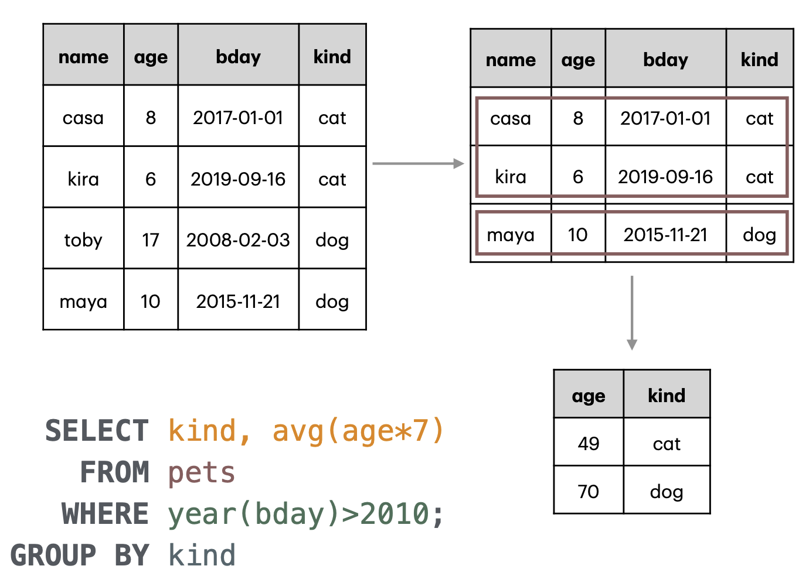
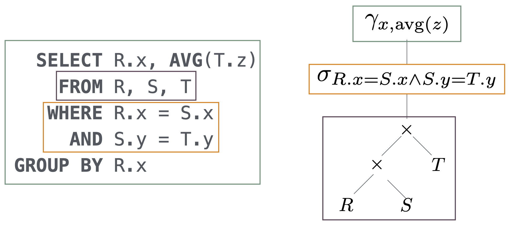
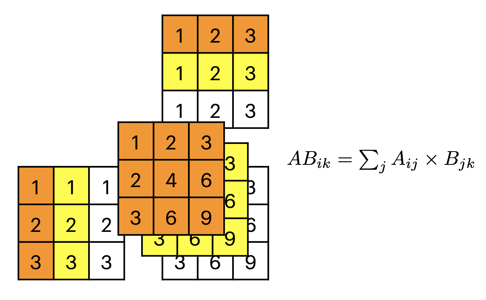

# 2025-04-03/Lecture 2: Table Decomposition and Joins

You can find all tables (unless specified otherwise) used and created in this lecture in the Lecture 2 database file shared by Professor on [the class website](https://remy.wang/cs143/), also [downloaded to this repository for your convenience](data/lec2.db).

> [!TIP]
>
> If you're using VS Code, you can also install the [SQLite Viewer extension](https://marketplace.visualstudio.com/items?itemName=qwtel.sqlite-viewer) to view the tables directly in your editor. In any case, recall how to launch SQLite at the command line with the database file:
>
> ```sh
> sqlite3 data/lec2.db
> ```

## Review

Consider this table (not in the DB file):

| name | age | bday       | kind |
| ---- | --- | ---------- | ---- |
| casa | 8   | 2017-01-01 | cat  |
| kira | 6   | 2019-09-16 | cat  |
| toby | 17  | 2008-02-03 | dog  |
| maya | 10  | 2015-11-21 | dog  |

<details>
<summary>The SQL to generate this for yourself...</summary>

```sql
CREATE TABLE pets (name TEXT, age INT, bday DATE, kind TEXT);
INSERT INTO pets VALUES
  ("casa", 8, "2017-01-01", "cat"),
  ("kira", 6, "2019-09-16", "cat"),
  ("toby", 17, "2008-02-03", "dog"),
  ("maya", 10, "2015-11-21", "dog");
```

</details>

(From the slides) What does this SQL query do?

```sql
SELECT kind, AVG(age*7)
FROM pets
WHERE YEAR(bday) > 2010
GROUP BY kind;
```

<details>
<summary>Note that there isn't actually a YEAR() function in SQL, so if you want a functional query (with equivalent intent) to copy-paste...</summary>

```sql
SELECT kind, AVG(age*7)
FROM pets
WHERE strftime("%Y", bday) > "2010"
GROUP BY kind;
```

</details>

### Breakdown

Recall it's useful to read SQL queries in the order the table gets "filtered" by each clause:

1. First, the "selection" (row filter), `WHERE`. For everything downstream, we'll only keep rows that match the condition. In this case, `casa`, `kira`, and `maya` all have a `bday` year after 2010. `toby` will not be considered henceforth.
2. Next, the "grouping", `GROUP BY`. We can imagine it as partitioning the rows of the table based on their value in the group-by column (so in this case, rows of the same `kind` go together): a sub-table with `casa` and `kira`'s rows (the `cat`s) and one with `maya`'s row (the dogs&mdash;recall that `toby` is not included anymore).
3. Finally, the "projection" (column filter), `SELECT`. Observe that this query has an **extended projection**, so we'll have to process all expressions and aggregate functions on our columns. Work from inside to outside, like in our familiar algebra/function notation:
   1. `age * 7`: Multiply all values in the `age` column by 7.
   2. `AVG(age * 7)`: Take the average of those values. This is one of the output columns.
   3. `kind`: This is just the `kind` column. However, something to note is that because we `GROUP BY` `kind`, it will automatically de-duplicate it. Thus, we'll have only one row for `cat` despite us considering two cats. In general, `GROUP BY col` will give you a result table with up to one row for each value of `col`.

As visualized in the slides:



## Table Decomposition

### Motivation

Recall that a database is a collection of tables. Why do we do that? Why not just have one "everything" table?

- Intuitively, it goes against separation of concerns: some columns may be *conceptually* independent.
- Redundancy (the bad kind): a bunch of data is duplicated. How so?

Consider the `everything` table in the DB file, which represents the combination of both pet and owner data.

```
┌──────┬───────────────┬─────┬─────────┬──────┬────────┬─────────┬───────┬──────┐
│ pet  │     breed     │ age │ origin  │ kind │ person │  addr.  │ phone │ job  │
├──────┼───────────────┼─────┼─────────┼──────┼────────┼─────────┼───────┼──────┤
│ casa │ tabby         │ 8   │ seattle │ cat  │ remy   │ LA      │ ###   │ UCLA │
│ kira │ tuxedo        │ 6   │ hawaii  │ cat  │ remy   │ LA      │ ###   │ UCLA │
│ toby │ border collie │ 17  │ seattle │ dog  │ remy   │ LA      │ ###   │ UCLA │
│ maya │ husky         │ 10  │ LA      │ dog  │ remy   │ LA      │ ###   │ UCLA │
│ casa │ tabby         │ 8   │ seattle │ cat  │ remy   │ seattle │ ###   │ UW   │
│ kira │ tuxedo        │ 6   │ hawaii  │ cat  │ remy   │ seattle │ ###   │ UW   │
│ toby │ border collie │ 17  │ seattle │ dog  │ remy   │ seattle │ ###   │ UW   │
│ maya │ husky         │ 10  │ LA      │ dog  │ remy   │ seattle │ ###   │ UW   │
└──────┴───────────────┴─────┴─────────┴──────┴────────┴─────────┴───────┴──────┘
```

- Professor `remy` is one `person` with 4 `pet`s. Because we need a row for every pet, information about `remy` is duplicated across all 4 of his pets!
- Furthermore, a `person` can have multiple `job`s. Professor `remy` has a `job` at UW in `seattle` too, and because every job needs a row too, we have to duplicate all of `remy`'s information *and* all of his `pet`s again!

We observe that with an "everything" table, when we have multiple one-to-many relationships that share the same one side, we need to duplicate our data for every instance of the many side!

This problem arises because we're combining **independent** entities. For example, pet information and the owner's job are both related to the person but directly to each other.

### Probability & Independence

What does it mean to be independent?

Depending on your background in statistics/data science, this may be review to some of you, but it is still important as we will use it in the context of databases to motivate table decomposition.

Consider these simple one-column tables in the DB file:

<table>
<tr>
<td>

```console
sqlite> SELECT * FROM c;
┌───┐
│ c │
├───┤
│ a │
│ b │
│ c │
│ d │
└───┘
```

</td>
<td>

```console
sqlite> SELECT * FROM n;
┌───┐
│ n │
├───┤
│ 1 │
│ 2 │
│ 3 │
│ 4 │
└───┘
```

</td>
</tr>
</table>

*Intuitively*, these tables are "independent" in that they have nothing to do with each other. But that does that mean mathematically? It means that the probability of choosing any element within one table is not at all influenced by the probability of an element in the other table.

If we choose any element from a table:

$$\Pr(n=1) = \frac{1}{4}$$
$$\Pr(c=a) = \frac{1}{4}$$

If we choose one element from each table, it's like drawing some 2-tuple from a bag with all possible combinations of the two tables (i.e. a Cartesian product&mdash;more on that later). There are $4 \cdot 4 = 16$ possible 2-tuples in the space of $c$ times the space of $n$, so the **joint probability** of choosing a specific element from each is:

$$\Pr(n=1 \land c=a) = \frac{1}{16}$$

What about the **conditional probability** of choosing $n=1$, **given** that we chose $c=a$? Conditional probabilities can be imagined as first constraining our possible "worlds" to only those where the condition is true, and then reasoning about the proportion of our event within that reduced space. That is:

$$\Pr(Q|E) = \frac{\Pr(Q \land E)}{\Pr(E)}$$

Thus:

$$\Pr(n=1 | c=a) = \frac{\Pr(n=1 \land c=a)}{\Pr(c=a)} = \frac{1/16}{1/4} = \frac{1}{4} = \Pr(n=1)$$

That is, conditioning on $c=a$ didn't do anything to begin with. In general, when event $A$ is independent from event $B$, that is $A \perp B$, then:

$$\Pr(A|B) = \Pr(A)$$
$$\Pr(A \land B) = \Pr(A)P(B)$$

Bringing this back to the "everything" table from before, consider these two columns:

```console
sqlite> SELECT kind, job FROM everything;
┌──────┬──────┐
│ kind │ job  │
├──────┼──────┤
│ cat  │ UCLA │
│ cat  │ UCLA │
│ dog  │ UCLA │
│ dog  │ UCLA │
│ cat  │ UW   │
│ cat  │ UW   │
│ dog  │ UW   │
│ dog  │ UW   │
└──────┴──────┘
```

$$\Pr(kind=cat) = \frac{4}{8} = \frac{1}{2}$$
$$\Pr(job=UCLA) = \frac{4}{8} = \frac{1}{2}$$
$$\Pr(cat \land UCLA) = \frac{2}{8} = \frac{1}{4} = \Pr(kind=cat)\Pr(job=UCLA)$$

Assuming this sample is representative of all data, we observe that $kind \perp job$.

Now consider what happens when we add another person (me!) and their pet (my cat):

| kind | person  | job  |
| ---- | ------- | ---- |
| cat  | remy    | UCLA |
| dog  | remy    | UCLA |
| cat  | remy    | UW   |
| dog  | remy    | UW   |
| cat  | vincent | UCLA |

$$\Pr(cat) = \frac{3}{5}$$

$$\Pr(cat|UCLA) = \frac{\Pr(cat \land UCLA)}{\Pr(UCLA)} = \frac{2}{3} \ne \Pr(cat)$$

We observe that $kind \not\perp job$ anymore! But if we break down by `person`, that is:

<table>
<tr>
<td>

| kind | person | job  |
| ---- | ------ | ---- |
| cat  | remy   | UCLA |
| dog  | remy   | UCLA |
| cat  | remy   | UW   |
| dog  | remy   | UW   |

</td>
<td>

| kind | person  | job  |
| ---- | ------- | ---- |
| cat  | vincent | UCLA |

</td>
</tr>
</table>

For `person=remy`:

$$\Pr(cat) = \frac{2}{4} = \frac{1}{2}$$
$$\Pr(cat|UCLA) = \frac{\Pr(cat \land UCLA)}{\Pr(UCLA)} = \frac{1}{2} = \Pr(cat)$$

For `person=vincent`:

$$\Pr(cat) = \frac{1}{1} = 1$$
$$\Pr(cat|UCLA) = \frac{\Pr(cat \land UCLA)}{\Pr(UCLA)} = \frac{1}{1} = \Pr(cat)$$

We observe that $kind \perp job$ again, **given** some $person$. That is:

$$kind \perp job | person$$

### SQL Challenge: Empirical Probability

Consider our `n` table from before. How would we compute the probability $\Pr(n=1)$?

```console
sqlite> SELECT * FROM n;
┌───┐
│ n │
├───┤
│ 1 │
│ 2 │
│ 3 │
│ 4 │
└───┘
```

Recall the empirical probability is just what we've been doing the whole time: counting the proportion of occurrences (relative frequency). That is, we need two things: the count of occurrences, and the total number of rows. We can get them individually using `COUNT()`:

```console
sqlite> SELECT COUNT(*) FROM n WHERE n.n=1;
┌──────────┐
│ COUNT(*) │
├──────────┤
│ 1        │
└──────────┘
sqlite> SELECT COUNT(*) FROM n;
┌──────────┐
│ COUNT(*) │
├──────────┤
│ 4        │
└──────────┘
```

Now we just have to put them together. Remember the **sub-query** sneak peak from last lecture? You can use one here to get one operand in a separate query first, then reference it in the main query. We'll go over a few incorrect attempts as demonstrated in lecture as an opportunity to introduce some important SQL concepts/pitfalls.

```sql
SELECT COUNT(*) / c
FROM n, (SELECT COUNT(*) FROM n) AS c
      -- ^ We do the sub-query and save it as a table c in
      -- our FROM clause so we can use it in our outer query.
      -- This computes the number of rows (i.e. our denominator).
WHERE n.n=1;
      -- ^ This makes our outer COUNT(*) only the occurrences
      -- of n=1 (i.e. our numerator).
```

This errors, and you might be able to tell why from the error message:

```console
Parse error: no such column: c
```

Remember the expression that appears in `SELECT` must be in terms of table *columns*. We aliased the sub-query result table as `c`, but that's a whole **table**, not a **column**. We actually want to retrieve the (sole) column from inside that table. Let's try again:

```sql
SELECT COUNT(*) / c.cnt
      --          ^ Reference sub-query table and *column* within it
FROM n, (SELECT COUNT(*) AS cnt FROM n) AS c
      --                                ^ Alias the table like before
      --                 ^ Alias the column created so we can reference it
WHERE n.n=1;
```

This doesn't error anymore, but we get an unexpected answer:

```console
0
```

This is because of another important gotcha in SQL:

> [!CAUTION]
>
> Like in other programming languages such as C/C++/Java, the `/` operator on integers performs **integer division** (rounding towards zero). We should specify one or both as floats so it does what we want. For example:
>
> ```console
> sqlite> SELECT 1/4; -- Integer division!
> 0
> sqlite> SELECT 1.0/4; -- Float division.
> 0.25
> ```

The easiest way to cast our expression to float is just multiply by `1.0`:

```sql
SELECT 1.0 * COUNT(*) / c.cnt
FROM n, (SELECT COUNT(*) AS cnt FROM n) AS c
WHERE n.n=1;
```

This finally returns what we expect:

```
0.25
```

As a final refinement, we introduce new SQL syntax to make sub-queries more readable. You can rewrite sub-queries using the `WITH` construct to place the sub-query expression at the top, which is arguably more natural to read since we mentally process the inner query first before it's made available for reference in the outer query:

```sql
WITH c AS (SELECT COUNT(*) AS cnt FROM n) -- Sub-query
SELECT 1.0 * COUNT(*) / c.cnt             -- Main query
FROM n, c
WHERE n.n=1;
```

### SQL Challenge: Empirical Probability ([Even Further Beyond](https://www.youtube.com/watch?v=8TGalu36BHA))

The above query is correct, but it's a bit naive in that we insisted on getting two numbers from two separate queries and then mashing them together. There's a cleverer way to compute relative frequency in SQL using a **boolean expression**:

```console
sqlite> SELECT AVG(n.n = 1) FROM n;
0.25
```

What's happening here? Recall that in an extended projection, we're allowed to write full-fledged *expressions* in the `SELECT` clause. You saw that when we were computing dogs' "human years" with `age * 7`.

The syntax of `LHS = RHS` is another type of expression, a **boolean expression**. This is similar to an [indicator function](https://en.wikipedia.org/wiki/Iverson_bracket) from math. The result is a column where every value is 1 in rows where the condition is satisfied and 0 otherwise (technically there's a `NULL` case too but for now, shhh).

In fact, we can take `AVG()` off and see that the syntax of `n.n=1` alone returns a kind of "mask" of the original column:

<table>
<tr>
<td>

```console
sqlite> SELECT n, n.n=1 FROM n;
┌───┬───────┐
│ n │ n.n=1 │
├───┼───────┤
│ 1 │ 1     │
│ 2 │ 0     │
│ 3 │ 0     │
│ 4 │ 0     │
└───┴───────┘
```

</td>
<td>

```console
sqlite> SELECT n, n.n=2 FROM n;
┌───┬───────┐
│ n │ n.n=2 │
├───┼───────┤
│ 1 │ 0     │
│ 2 │ 1     │
│ 3 │ 0     │
│ 4 │ 0     │
└───┴───────┘
```

</td>
</tr>
</table>

If you're familiar with statistical tools like R or Python's NumPy, this might look familiar&mdash;it's an identical concept to [boolean masking](https://www.programiz.com/python-programming/numpy/boolean-indexing)!

Thus, when we put `AVG()` back in, it's as if we're running $(1 + 0 + 0 + 0) / 4 = 0.25$, exactly equal to the proportion of occurrences of $n=1$. Neat!

### Breaking up Tables

So what can we do? We can **decompose** a table into smaller tables, each with a subset of the original columns.

First, let's finally separate our pet information from job information:

```
┌──────┬───────────────┬─────┬─────────┬──────┬────────┬─────────┬───────┬──────┐
│ pet  │     breed     │ age │ origin  │ kind │ person │  addr.  │ phone │ job  │
├──────┼───────────────┼─────┼─────────┼──────┼────────┼─────────┼───────┼──────┤
│ casa │ tabby         │ 8   │ seattle │ cat  │ remy   │ LA      │ ###   │ UCLA │
│ kira │ tuxedo        │ 6   │ hawaii  │ cat  │ remy   │ LA      │ ###   │ UCLA │
│ toby │ border collie │ 17  │ seattle │ dog  │ remy   │ LA      │ ###   │ UCLA │
│ maya │ husky         │ 10  │ LA      │ dog  │ remy   │ LA      │ ###   │ UCLA │
│ casa │ tabby         │ 8   │ seattle │ cat  │ remy   │ seattle │ ###   │ UW   │
│ kira │ tuxedo        │ 6   │ hawaii  │ cat  │ remy   │ seattle │ ###   │ UW   │
│ toby │ border collie │ 17  │ seattle │ dog  │ remy   │ seattle │ ###   │ UW   │
│ maya │ husky         │ 10  │ LA      │ dog  │ remy   │ seattle │ ###   │ UW   │
└──────┴───────────────┴─────┴─────────┴──────┴────────┴─────────┴───────┴──────┘
```

<table>
<tr>
<td>

```
┌──────┬───────────────┬─────┬─────────┬──────┬────────┐
│ pet  │     breed     │ age │ origin  │ kind │ person │
├──────┼───────────────┼─────┼─────────┼──────┼────────┤
│ casa │ tabby         │ 8   │ seattle │ cat  │ remy   │
│ kira │ tuxedo        │ 6   │ hawaii  │ cat  │ remy   │
│ toby │ border collie │ 17  │ seattle │ dog  │ remy   │
│ maya │ husky         │ 10  │ LA      │ dog  │ remy   │
└──────┴───────────────┴─────┴─────────┴──────┴────────┘
```

</td>
<td>

```
┌────────┬─────────┬───────┬──────┐
│ person │  addr.  │ phone │ job  │
├────────┼─────────┼───────┼──────┤
│ remy   │ LA      │ ###   │ UCLA │
│ remy   │ seattle │ ###   │ UW   │
└────────┴─────────┴───────┴──────┘
```

</td>
</tr>
</table>

How did we know which column to share between the decomposed tables? Recall our finding from above:

$$kind \not\perp job$$
$$kind \perp job | person$$

The common column is the one that when given makes the other rows conditionally independent (so `person` in this case). This make sense for this case since both pet information and job information are "related to" the person.

Consider another extreme: one column completely determines another column. Consider this table:

| person  | addr. | phone | job  | job addr. |
| ------- | ----- | ----- | ---- | --------- |
| remy    | ...   | 123   | UCLA | LA        |
| zifan   | ...   | 234   | UCLA | LA        |
| vincent | ...   | 345   | UCLA | LA        |
| remy    | ...   | 123   | UW   | seattle   |
| dan     | ...   | 456   | UW   | seattle   |
| magda   | ...   | 567   | UW   | seattle   |

We observe that job completely determines job address. For example:

$$\Pr(LA | UCLA) = 1$$

This is another situation where we can break up tables. Namely, we can just have a separate table for job addresses where every job is only mentioned once, along with their address (kind of like a function's input-output table):

<table>
<tr>
<td>

| person  | addr. | phone | job  |
| ------- | ----- | ----- | ---- |
| remy    | ...   | 123   | UCLA |
| zifan   | ...   | 234   | UCLA |
| vincent | ...   | 345   | UCLA |
| remy    | ...   | 123   | UW   |
| dan     | ...   | 456   | UW   |
| magda   | ...   | 567   | UW   |

</td>
<td>

| job  | job addr. |
| ---- | --------- |
| UCLA | LA        |
| UW   | seattle   |

</td>
</tr>
</table>

Consider the implications of this. If our original table was massive with some $N$ rows, we've effectively eliminated an entire column of $N$ redundant values!

### SQL Challenge: Table Decomposition

What SQL statements can take us from the "everything" table to our separated pets and jobs tables above?

What stands out most about this task is the reduction of columns in the separated tables. How do we choose a subset of columns? Projection (`SELECT`)! What's more, we use `SELECT DISTINCT` to remove the duplicated data caused by the combined table in the first place:

```sql
CREATE TABLE pets FROM
SELECT DISTINCT pet, breed, age, origin, kind, person
FROM everything;

CREATE TABLE people FROM
SELECT DISTINCT person, addr, phone, job
FROM everything;
```

> [!TIP]
>
> We can use `CREATE TABLE <name> AS (...query...)` to save the result of a query into a new table. This is like assigning to a variable in other programming languages.

## Joining Tables

Now that our tables are decomposed, we can't seem to do some queries anymore, like:

- Where's Remy's office?
- Where do cat people work?

We would have to operate on multiple tables at once. We need a way to **join** back the tables to answer queries that require information from multiple tables.

### Querying (Human Ver.)

First, some intuition: imagine querying as a human. What would you do if you had to reconcile several spreadsheets to answer some question from management? Assume we have these tables from before:

| pet  | breed         | age | origin  | kind | person |
| ---- | ------------- | --- | ------- | ---- | ------ |
| casa | tabby         | 8   | seattle | cat  | remy   |
| kira | tuxedo        | 6   | hawaii  | cat  | remy   |
| toby | border collie | 17  | seattle | dog  | remy   |
| maya | husky         | 10  | LA      | dog  | remy   |

<table>
<tr>
<td>

| person  | addr. | phone | job  |
| ------- | ----- | ----- | ---- |
| remy    | ...   | 123   | UCLA |
| zifan   | ...   | 234   | UCLA |
| vincent | ...   | 345   | UCLA |
| remy    | ...   | 123   | UW   |
| dan     | ...   | 456   | UW   |
| magda   | ...   | 567   | UW   |

</td>
<td>

| job  | job addr. |
| ---- | --------- |
| UCLA | LA        |
| UW   | seattle   |

</td>
</tr>
</table>

**"Where's Remy's office?"**

1. Scan the people table for "remy" to see which institutions he works at.
2. Then match that institutions with the addresses table to find their respective addresses.

Since `remy` has both `job=UCLA` and `job=UW`, we get our answer of `LA` and `seattle`.

**"Where do cat people work?"**

1. Scan the pets table for "cat" to see which people own cats in the first place.
2. Match those people with the people table to find their respective institutions.

`remy` is the only `cat` person in the data, and by lookup on the people table we see he works at `UCLA` and `UW`.

Congratulations, you've essentially done SQL joins in your head!

### The Join Operation

We introduce the **join** operation $\bowtie$. In SQL, we use the `JOIN` operator:

```sql
SELECT job
FROM pets   -- One table to join.
JOIN people -- Other table to join.
ON pets.person = people.name -- HOW to join the tables (the join key).
```

Let's try it out:

```console
sqlite> SELECT job FROM pets JOIN people ON pets.person = people.person;
┌──────┐
│ job  │
├──────┤
│ UCLA │
│ UW   │
│ UCLA │
│ UW   │
│ UCLA │
│ UW   │
│ UCLA │
│ UW   │
└──────┘
```

Note that we have duplicates because we get an entry for *every* match. But of course, we know by now how to remove duplicates:

```console
sqlite> SELECT DISTINCT job FROM pets
   ...> JOIN people ON pets.person = people.person;
┌──────┐
│ job  │
├──────┤
│ UCLA │
│ UW   │
└──────┘
```

### The Join Key

Focus on the `ON pets.person = people.name` clause. This is the **join key**. This is a predicate that determines which rows from each table are kept in the resulting joined table.

Recall our `for` loop analogy before. With a `JOIN` and join key, it's like we have a nested loop over both tables but only considering the combinations where our join key holds:

```python
for pet in pets:          # FROM pets
  for person in people:   # JOIN people
    if pet.person == person.name:  # ON <condition>
      print(job)          # SELECT job
```

What if our join key is the degenerate case of just keeping every single combination? That is, the equivalent of:

```python
for pet in pets:
  for person in people:
    print(job)
```

That just becomes a **Cartesian product** (every combination of rows from each table). In SQL, we can query a Cartesian product by just leaving out the `ON` clause:

```sql
SELECT job
FROM pets, people;
```

We can think of a join as a generalization of the Cartesian product. Namely, a join is a Cartesian product that's then further filtered by a selection. In relational algebra, we express that as:

$$T_1 \bowtie_p T_2 = \sigma_p(T_1 \times T_2)$$

Where $p$ represents some predicate. That is, these two queries are functionally equivalent:

```sql
-- Explicit JOIN
SELECT job FROM pets
JOIN people
ON pets.person=people.person;

-- Implicit JOIN (Cartesian product with WHERE)
SELECT job FROM pets, people
WHERE pets.person = people.person;
```

Or, in first-order logic:

$$job \in output \Longleftrightarrow$$
$$\exists a \in pets, p \in people : p.job = job \land a.person = p.name$$

### Query Order, Revisited

Our general form of a SQL query has grown once again since last lecture. Before we only considered one table in the `FROM` clause, but now we can have an arbitrarily many. We know now that that corresponds to the **Cartesian product** of tables.

Consider this query:

```sql
SELECT R.x, AVG(T.z)
FROM R, S, T
WHERE R.x = S.x AND S.y = T.y
GROUP BY R.x;
```

How do we mentally parse this?

1. We first take the Cartesian product $R \times S$.
2. We then take another Cartesian product $T \times (R \times S)$.
3. We then apply selection $\sigma_{R.x=S.x \land S.y=T.y}$.
4. We then apply aggregation $\gamma_{x,avg(z)}$.

As visualized in the slides:



## More SQL Challenges! (Linear Algebra Edition)

### Vector Inner Product

Consider the `n` table from before:

```console
sqlite> SELECT * FROM n;
┌───┐
│ n │
├───┤
│ 1 │
│ 2 │
│ 3 │
│ 4 │
└───┘
```

How would we implement the inner (dot) product $n \cdot n$? More generally, for single-column tables $u$ and $v$:

$$u \cdot v = \sum_i u_iv_i$$

First, we recognize that we need to somehow "align" the rows by some kind of index. We purposely include an "index" column:

```sql
CREATE TABLE v (x INT, i INT);
INSERT INTO v VALUES (1, 1);
INSERT INTO v VALUES (2, 2);
INSERT INTO v VALUES (3, 3);
INSERT INTO v VALUES (4, 4);
INSERT INTO v VALUES (5, 5);
-- Copy v into u.
CREATE TABLE u AS SELECT * FROM v;
```

The point-wise multiplication $u_iv_i$ would be:

```sql
SELECT u.i, u.x * v.x
FROM u, v
WHERE u.i = v.i; -- Align indices.
```

```console
┌───┬───────────┐
│ i │ u.x * v.x │
├───┼───────────┤
│ 1 │ 1         │
│ 2 │ 4         │
│ 3 │ 9         │
│ 4 │ 16        │
│ 5 │ 25        │
└───┴───────────┘
```

The dot product would then just be the sum $\sum_i u_iv_i$:

```sql
SELECT SUM(u.x * v.x)
FROM u, v
WHERE u.i = v.i;
```

```console
┌────────────────┐
│ SUM(u.x * v.x) │
├────────────────┤
│ 55             │
└────────────────┘
```

### Vector Outer Product

Recall the definition of the outer product. Given two vectors $u, v$ of dimension $N$, $u \otimes v$ would be an $N \times N$ matrix where every element is simply the product of the elements at the corresponding indices within the operand vectors:

$$(u \otimes v)_{ij} = u_iv_j$$

First, determine what our output format looks like. *Conceptually*, the outer product is an $N \times N$ matrix, but creating an $N \times N$ table wouldn't make sense&mdash;remember that tables are **bags**, so they don't have an inherent notion of row/column indices. Instead, we can just enumerate all the indices of the would-be matrix and their corresponding cell values:

| $i$ | $j$ | $(u \otimes v)_{ij}$ |
| --- | --- | -------------------- |
| 1   | 1   | 1                    |
| 2   | 1   | 2                    |
| ... | ... | ...                  |
| 4   | 5   | 20                   |
| 5   | 5   | 25                   |

We notice that the indices are just every combination of $(i, j)$&mdash;the **Cartesian product** of the space of $i$ by the space of $j$! We take the Cartesian product to enumerate all possible combinations, summing the values along the way:

```sql
SELECT v.i, u.i AS j, v.x * u.x
FROM u, v;
```

```console
┌───┬───┬───────────┐
│ i │ j │ v.x * u.x │
├───┼───┼───────────┤
│ 1 │ 1 │ 1         │
│ 2 │ 1 │ 2         │
│ 3 │ 1 │ 3         │
│ 4 │ 1 │ 4         │
│ 5 │ 1 │ 5         │
│ 1 │ 2 │ 2         │
│ 2 │ 2 │ 4         │
│ 3 │ 2 │ 6         │
│ 4 │ 2 │ 8         │
│ 5 │ 2 │ 10        │
│ 1 │ 3 │ 3         │
│ 2 │ 3 │ 6         │
│ 3 │ 3 │ 9         │
│ 4 │ 3 │ 12        │
│ 5 │ 3 │ 15        │
│ 1 │ 4 │ 4         │
│ 2 │ 4 │ 8         │
│ 3 │ 4 │ 12        │
│ 4 │ 4 │ 16        │
│ 5 │ 4 │ 20        │
│ 1 │ 5 │ 5         │
│ 2 │ 5 │ 10        │
│ 3 │ 5 │ 15        │
│ 4 │ 5 │ 20        │
│ 5 │ 5 │ 25        │
└───┴───┴───────────┘
```

### Matrix Multiplication

Recall the definition of matrix multiplication. Given an $N \times M$ matrix $A$ and $M \times K$ matrix $B$, the matrix multiplication would be an $N \times K$ matrix $AB$ where:

$$AB_{ik} = \sum_{j=1}^M A_{ij}B_{jk}$$

> [!TIP]
>
> A neat trick to visualize matrix multiplication is to first imagine them as repeated **outer products** of rows by columns to get a 3D **tensor**. Then, imagine we "squish" that 3D box back down into a 2D grid, summing the numbers over the same cell:
>
> 

Setup: first, create two new matrices `a` and `b` to serve as our operands for matrix multiplication:

```sql
CREATE TABLE a AS
SELECT v.i AS i, u.i AS j, v.x * u.x AS x FROM u, v;

CREATE TABLE b AS
SELECT v.i AS j, u.i AS k, v.x * u.x AS x FROM u, v;
```

<table>
<tr>
<td>

```console
sqlite> SELECT * FROM a;
┌───┬───┬────┐
│ i │ j │ x  │
├───┼───┼────┤
│ 1 │ 1 │ 1  │
│ 2 │ 1 │ 2  │
│ 3 │ 1 │ 3  │
│ 4 │ 1 │ 4  │
│ 5 │ 1 │ 5  │
│ 1 │ 2 │ 2  │
│ 2 │ 2 │ 4  │
│ 3 │ 2 │ 6  │
│ 4 │ 2 │ 8  │
│ 5 │ 2 │ 10 │
│ 1 │ 3 │ 3  │
│ 2 │ 3 │ 6  │
│ 3 │ 3 │ 9  │
│ 4 │ 3 │ 12 │
│ 5 │ 3 │ 15 │
│ 1 │ 4 │ 4  │
│ 2 │ 4 │ 8  │
│ 3 │ 4 │ 12 │
│ 4 │ 4 │ 16 │
│ 5 │ 4 │ 20 │
│ 1 │ 5 │ 5  │
│ 2 │ 5 │ 10 │
│ 3 │ 5 │ 15 │
│ 4 │ 5 │ 20 │
│ 5 │ 5 │ 25 │
└───┴───┴────┘
```

</td>
<td>

```console
sqlite> SELECT * FROM b;
┌───┬───┬────┐
│ j │ k │ x  │
├───┼───┼────┤
│ 1 │ 1 │ 1  │
│ 2 │ 1 │ 2  │
│ 3 │ 1 │ 3  │
│ 4 │ 1 │ 4  │
│ 5 │ 1 │ 5  │
│ 1 │ 2 │ 2  │
│ 2 │ 2 │ 4  │
│ 3 │ 2 │ 6  │
│ 4 │ 2 │ 8  │
│ 5 │ 2 │ 10 │
│ 1 │ 3 │ 3  │
│ 2 │ 3 │ 6  │
│ 3 │ 3 │ 9  │
│ 4 │ 3 │ 12 │
│ 5 │ 3 │ 15 │
│ 1 │ 4 │ 4  │
│ 2 │ 4 │ 8  │
│ 3 │ 4 │ 12 │
│ 4 │ 4 │ 16 │
│ 5 │ 4 │ 20 │
│ 1 │ 5 │ 5  │
│ 2 │ 5 │ 10 │
│ 3 │ 5 │ 15 │
│ 4 │ 5 │ 20 │
│ 5 │ 5 │ 25 │
└───┴───┴────┘
```

</td>
</tr>
</table>

For every matching $j$ (column number in `a` and row number in `b`), compute the **outer product** of that corresponding row by column:

```sql
SELECT a.i, b.k, a.x * b.x
FROM a, b
WHERE a.j = b.j;
```

Observe that we have $N^3 = 5^3 = 125$ elements in the output (replace the `SELECT` expression with `COUNT(*)` to check for yourself). This is the "3D tensor" step as visualized above.

Now, we just need to sum all the values in the same $(i, k)$ output coordinate&mdash;a perfect calling for `GROUP BY`!

```sql
SELECT a.i, b.k, SUM(a.x * b.x)
FROM a, b
WHERE a.j = b.j
GROUP BY a.i, b.k;
```

This is the "squishing" step as visualized above. We get our expected answer of $N^2 = 5^2 = 25$ elements:

```console
┌───┬───┬────────────────┐
│ i │ k │ SUM(a.x * b.x) │
├───┼───┼────────────────┤
│ 1 │ 1 │ 55             │
│ 1 │ 2 │ 110            │
│ 1 │ 3 │ 165            │
│ 1 │ 4 │ 220            │
│ 1 │ 5 │ 275            │
│ 2 │ 1 │ 110            │
│ 2 │ 2 │ 220            │
│ 2 │ 3 │ 330            │
│ 2 │ 4 │ 440            │
│ 2 │ 5 │ 550            │
│ 3 │ 1 │ 165            │
│ 3 │ 2 │ 330            │
│ 3 │ 3 │ 495            │
│ 3 │ 4 │ 660            │
│ 3 │ 5 │ 825            │
│ 4 │ 1 │ 220            │
│ 4 │ 2 │ 440            │
│ 4 │ 3 │ 660            │
│ 4 │ 4 │ 880            │
│ 4 │ 5 │ 1100           │
│ 5 │ 1 │ 275            │
│ 5 │ 2 │ 550            │
│ 5 │ 3 │ 825            │
│ 5 │ 4 │ 1100           │
│ 5 │ 5 │ 1375           │
└───┴───┴────────────────┘
```
