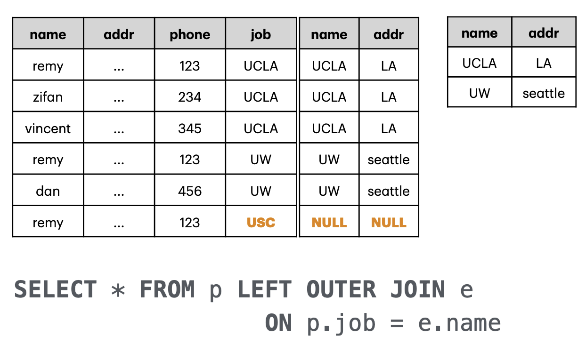
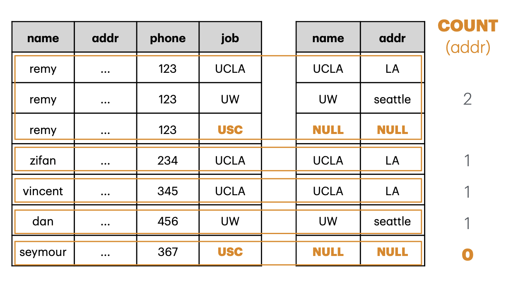

# 2025-04-10/Lecture 4: More SQL, Continued

You can find all tables (unless otherwise specified) used in this lecture in the Lecture 4 database file shared by Professor before class on [the class website](https://remy.wang/cs143/), also [downloaded to this repository for your convenience](data/lec4.db):

```sh
sqlite3 data/lec4.db
```

If you want to play around with tables (such as creating the ones introduced on-the-fly in this lecture), you can create and use a copy instead so you don't modify the handout file:

```sh
cp data/lec4.db temp.db
sqlite3 temp.db
rm temp.db
```

## More on `NULL`

### Outer Joins

Why learn about `NULL`? Well, a few reasons:
1. In the real world, data is often *incomplete*. Missing data is represented by `NULL`, and knowing how to handle it in your queries is important.
2. Some operations *introduce* `NULL`, which can actually be useful, especially in the context of aggregate functions.

An operation that introduces `NULL`s is the **outer join**.

The **joins** discussed thus far are what are known as **inner joins**: the result table only has a row for every *match* on the join key. That is, any rows in the operand tables that *don't* satisfy the join key simply get dropped.

However, what if we *want* to keep the rows from the operand tables even if they don't satisfy the join key? In an **outer join**, we simply "pad" with `NULL` the columns in the rows that don't have a match in the other table.

In a `LEFT OUTER JOIN`, we have an output row for:
- Every row where there is a match on the join key, where the row is a concatenation of the columns from both tables. This is the same as an `INNER JOIN`. But in addition:
- Every other row in the left table. They are still concatenations of the columns from both tables, but since the right table didn't have a match, its columns are filled with `NULL`.

Hopefully this example from the lecture slides makes it clear visually:



A `RIGHT OUTER JOIN` is just the symmetric version of a `LEFT OUTER JOIN`&mdash;swap left with right. `RIGHT OUTER JOIN` is pretty redundant because you can almost always just swap the two operands, so you really only have to know `LEFT OUTER JOIN`.

There also exists the `FULL OUTER JOIN`, which is like both the `LEFT OUTER JOIN` and `RIGHT OUTER JOIN` combined. We have an output row for *every* row in either table, where the unmatched side is filled with `NULL`s like before.

### Aggregates

How do aggregate functions handle `NULL`?

> [!IMPORTANT]
>
> Aggregates ignore `NULL`s.

That is the main thing you need to remember.

Suppose we have a table $R = \lbrace NULL, 1 \rbrace$. What should these return?

```sql
SELECT COUNT(x) FROM R;
SELECT SUM(x) FROM R;
SELECT AVG(x) FROM R;
SELECT MIN(x) FROM R;
```

We drop all `NULL`s, so these actually all return 1.

What if we have *nothing but `NULL`*? Suppose $R = \lbrace NULL \rbrace$.

- `COUNT(x)` returns 0 as expected.
- `SUM(x)` actually returns `NULL`.
- `AVG(x)` returns `NULL` too.
- `MIN(x)` returns `NULL` too.
- `TOTAL(x)` returns 0.0.

That is, when it "doesn't make sense" to have an aggregate value on *nothing*, the function reflects that by returning `NULL` as well. An average of nothing is undefined even in math, you can't have a minimum of an empty collection, and you can't sum nothing either (you could argue it should vacuously return 0, but that's still an assumption on what data *could* be there).

> [!WARNING]
>
> `SELECT COUNT(x)` vs. `SELECT COUNT(*)`?
>
> Before we learned about `NULL`, these look like they should do the same thing&mdash;return the number of rows in the table. However, `COUNT(x)` actually only counts the rows where the specified column `x` is NOT `NULL`. That is, this is consistent with our rule described earlier where aggregates simply ignore `NULL`s. `COUNT(*)` is an exception to this. `COUNT(*)` will count *all* rows in a table, *regardless* of any `NULL` values!

### SQL Challenge: How Many Offices?

Consider these tables:

| name    | addr | phone | job  |
| ------- | ---- | ----- | ---- |
| remy    | ...  | 123   | UCLA |
| zifan   | ...  | 234   | UCLA |
| vincent | ...  | 345   | UCLA |
| remy    | ...  | 123   | UW   |
| dan     | ...  | 456   | UW   |
| remy    | ...  | 123   | USC  |
| seymour | ...  | 367   | USC  |

| name | addr    |
| ---- | ------- |
| UCLA | LA      |
| UW   | seattle |

<details>
<summary>The SQL to generate these for yourself from within the DB file...</summary>

```sql
CREATE TABLE p (
  name TEXT,
  addr TEXT,
  phone INTEGER,
  job TEXT
);

INSERT INTO p VALUES
  ("remy",    "...", 123, "UCLA" ),
  ("zifan",   "...", 234, "UCLA" ),
  ("vincent", "...", 345, "UCLA" ),
  ("remy",    "...", 123, "UW"   ),
  ("dan",     "...", 456, "UW"   ),
  ("remy",    "...", 123, "USC"  ),
  ("seymour", "...", 367, "USC"  );

CREATE TABLE e AS SELECT * FROM employers;
```

</details>

We want to calculate how many offices each person has. Hopefully the usual alarm bells have gone off in your head:
- "each person" => `GROUP BY` people names from `p`.
- "how many offices" => `COUNT()` office addresses from `e`.
- Information from multiple tables needed => use a **join**. `p.job` conceptually references `e.name`, so that should be our join key.

```sql
SELECT p.name, COUNT(e.addr)
FROM p JOIN e
ON p.job = e.name
GROUP BY p.name;
```

However, notice that not all of the `job`s in the `p` table have a matching entry in the `e` table. Notably, `USC` is not recognized as an employer (lol). What happens if we just do an inner join like we always do?

```console
┌─────────┬───────────────┐
│  name   │ COUNT(e.addr) │
├─────────┼───────────────┤
│ dan     │ 1             │
│ remy    │ 2             │
│ vincent │ 1             │
│ zifan   │ 1             │
└─────────┴───────────────┘
```

We're missing a row for `seymour`! Even if he doesn't have a (recognized) office, we would still want him included in the output table with a count of 0. This demonstrates an example where an **outer join** is desirable.

With an **outer join** (specifically, a `p LEFT OUTER JOIN e`), we can keep *all* rows of the `p` table in the output table *regardless* of if they have a match in the `e` table. We can then leverage the fact that `COUNT(x)` skips over `NULL`s produced by the outer join anyway, resulting in a count of 0 for `seymour`:

```sql
SELECT p.name, COUNT(e.addr)
FROM p LEFT OUTER JOIN e
ON p.job = e.name
GROUP BY p.name;
```
```console
┌─────────┬───────────────┐
│  name   │ COUNT(e.addr) │
├─────────┼───────────────┤
│ dan     │ 1             │
│ remy    │ 2             │
│ seymour │ 0             │
│ vincent │ 1             │
│ zifan   │ 1             │
└─────────┴───────────────┘
```

The `GROUP BY` and `COUNT()`ing as visualized in the slides:



## More SQL Challenges

### Who's the Oldest Cat?

Consider this table in the DB file. We want to find the oldest cat among these pets:

```console
sqlite> SELECT * FROM pets;
┌──────┬───────────────┬─────┬─────────┬──────┬────────┐
│ name │     breed     │ age │ origin  │ kind │ person │
├──────┼───────────────┼─────┼─────────┼──────┼────────┤
│ casa │ tabby         │ 8   │ seattle │ cat  │ remy   │
│ kira │ tuxedo        │ 6   │ hawaii  │ cat  │ remy   │
│ toby │ border collie │ 17  │ seattle │ dog  │ remy   │
│ maya │ husky         │ 10  │ LA      │ dog  │ sam    │
└──────┴───────────────┴─────┴─────────┴──────┴────────┘
```

This is an "argmax" problem. We're not interested in the maximal value itself but rather a value associated with it&mdash;in this case, the overall *cat* that *maximizes* the age value. This is more challenging because we can't just `SELECT MAX(age)` and call it a day. `MAX(age)` now serves as a *condition* for what we return in the end instead of what's returned itself.

One solution is to use `ORDER BY` and `LIMIT`. These do what you expect:
- `ORDER BY` sorts the result table according to a column(s). By default, it sorts `ASC` (ascending), but you can specify `DESC` to sort it descending.
- `LIMIT` truncates the result table to the specified number of rows.

```sql
SELECT *
FROM pets
WHERE kind="cat"
ORDER BY age DESC
LIMIT 1;
```
```console
┌──────┬───────┬─────┬─────────┬──────┬────────┐
│ name │ breed │ age │ origin  │ kind │ person │
├──────┼───────┼─────┼─────────┼──────┼────────┤
│ casa │ tabby │ 8   │ seattle │ cat  │ remy   │
└──────┴───────┴─────┴─────────┴──────┴────────┘
```

### Who's the Oldest Cat(s)?

The solution [above](#whos-the-oldest-cat) doesn't generalize very well&mdash;what if we have *multiple* oldest cats (a tie)? We can revisit our usual approach of combining queries of sub-problems instead:

1. First find the oldest age among `cat`s...
2. And then find the `cat`s that have that age.

Finding the oldest age is just a matter of using `MAX()` as we're familiar:

```sql
SELECT MAX(age)
FROM pets
WHERE kind="cat";
```
```console
┌──────────┐
│ MAX(age) │
├──────────┤
│ 8        │
└──────────┘
```

Finding the cats with a specific age looks like this, with a placeholder for the given age:

```sql
SELECT name, age
FROM pets
WHERE kind="cat" AND age=(...);
--                       ^^^^^ Result of our first query.
```

Now we combine by nesting the first query as a **sub-query** like before:

```sql
SELECT pets.name, pets.age
FROM pets
WHERE pets.kind="cat"
AND pets.age=(
  SELECT MAX(age)
  FROM pets
  WHERE kind="cat"
);
```
```console
┌──────┬─────┐
│ name │ age │
├──────┼─────┤
│ casa │ 8   │
└──────┴─────┘
```

Now imagine if we had multiple `cat`s that had that oldest `age` of 8. The query would return *all* of them.

> [!WARNING]
>
> Usually you shouldn't use tables as values (like when we compare `age=(<query expression>)`), but in this case, the engine *knows* `MAX(age)` resolves to a value, so it's fine.

Finally, let's try refactoring the sub-query into a `WITH` like before:

```sql
WITH oldest AS (
  SELECT MAX(age) AS a
  FROM pets
  WHERE kind="cat"
)
SELECT name, age
FROM pets
WHERE kind="cat" AND age=oldest.a;
```
```console
Parse error: no such column: oldest.a
  LECT name, age FROM pets WHERE kind="cat" AND age=oldest.a;
                                      error here ---^
```

Uh oh.

> [!CAUTION]
>
> This fails because we are not allowed to directly reference the column of a temporary table (as created with `WITH`). If we want to, we need to **join** that table into our main query.

```sql
WITH oldest AS (
  SELECT MAX(age) AS a
  FROM pets
  WHERE kind="cat"
)
SELECT name, age
FROM pets, oldest
WHERE kind="cat" AND age=oldest.a;
```
```console
┌──────┬─────┐
│ name │ age │
├──────┼─────┤
│ casa │ 8   │
└──────┴─────┘
```

### Oldest Pets Per Kind?

Consider the same table as before. This time, we want to find the oldest pets *for each kind*.

```console
sqlite> SELECT * FROM pets;
┌──────┬───────────────┬─────┬─────────┬──────┬────────┐
│ name │     breed     │ age │ origin  │ kind │ person │
├──────┼───────────────┼─────┼─────────┼──────┼────────┤
│ casa │ tabby         │ 8   │ seattle │ cat  │ remy   │
│ kira │ tuxedo        │ 6   │ hawaii  │ cat  │ remy   │
│ toby │ border collie │ 17  │ seattle │ dog  │ remy   │
│ maya │ husky         │ 10  │ LA      │ dog  │ sam    │
└──────┴───────────────┴─────┴─────────┴──────┴────────┘
```

This problem is like an even more generalized form of the [previous problem](#whos-the-oldest-cats). We want the answer on a per-kind basis instead of on a single given kind.

Let's tackle it step by step. Firstly, since we don't want to filter by a specific `kind` anymore, we should remove the `WHERE kind="cat"` clauses:

```sql
SELECT pets.name, pets.age
FROM pets
WHERE
-- pets.kind="cat" AND
pets.age=(
  SELECT MAX(age)
  FROM pets
  -- WHERE kind="cat"
);
```
```console
┌──────┬─────┐
│ name │ age │
├──────┼─────┤
│ toby │ 17  │
└──────┴─────┘
```

This now returns the *globally* oldest pet. The outer query doesn't need a `WHERE` since we want the answer for *all* kinds. However, we need some restriction on the inner query to make sure we're `SELECT MAX(age)`ing from an appropriate subset of the the table every time:

```sql
SELECT pets.name, pets.age
FROM pets
WHERE pets.age=(
  SELECT MAX(age)
  FROM pets
  WHERE (...)
  --    ^^^^^ How do we make it so that MAX(age) only applies
  --          to one kind at a time?
);
```

We want to restrict our `SELECT MAX(age)` query to one kind at a time. We can do that by conditioning the inner query on a specific `kind`&mdash;namely, whatever `kind` is currently being processed by the outer query:

```sql
SELECT pets.name, pets.age
FROM pets AS p1
WHERE pets.age=(
  SELECT MAX(age)
  FROM pets AS p2
  WHERE p1.kind=p2.kind
);
```
```console
┌──────┬─────┐
│ name │ age │
├──────┼─────┤
│ casa │ 8   │
│ toby │ 17  │
└──────┴─────┘
```

And there we go!

The challenge in this problem is that we were kind of doing the reverse of what we would do before. Before, we would consider what needs to be returned by the inner query first and then plug it into the outer query. Here, we consider what the outer query does first and then use it to restrict the inner query such that it selects from the subsets we want. More patterns for your toolbox!

## Replacing Nesting With Joins

Nested sub-queries are not only hard to read, they're actually inefficient for the underlying engine too. Almost always, you can refactor a nested sub-query into a **join**.

### Oldest Pets Per Kind (Join Edition)

Let's start refactoring our solution from [above](#oldest-pets-per-kind) into a **join**. As usual, I'll include the incremental attempts made during lecture to emphasize important concepts.

Attempt 1:

```sql
SELECT p1.name, p1.age
FROM pets AS p1, pets AS p2
WHERE p1.age = MAX(p2.age)
AND p2.kind = p1.kind;
```

Nope! Remember from last lecture that aggregate functions cannot go in the `WHERE` clause. Move it to the `HAVING` clause:

```sql
SELECT p1.name, p1.age
FROM pets AS p1, pets AS p2
WHERE p2.kind = p1.kind
HAVING p1.age = MAX(p2.age);
```
```console
Parse error: HAVING clause on a non-aggregate query
```

This is still wrong. When you use an aggregate function in the `HAVING` clause, we need to `GROUP BY` to make it an aggregate query in the first place:

```sql
SELECT p1.name, p1.age
FROM pets AS p1, pets AS p2
WHERE p1.kind = p2.kind
GROUP BY p1.kind
HAVING p1.age = MAX(p2.age);
```
```console
┌──────┬─────┐
│ name │ age │
├──────┼─────┤
│ casa │ 8   │
│ toby │ 17  │
└──────┴─────┘
```

Voila! Actually... this happens to work for this example, but it doesn't work in general! There are two problems with this:

1. We `GROUP BY kind`, so we have one group per kind. What does the `name` column even mean now? *Whose* `name` are we taking to represent each group? The result table actually uses an **arbitrary** `name` from within that column.

> [!TIP]
>
> You're not actually supposed to `SELECT` something that *isn't* either what you `GROUP BY` or an aggregate operation. For example, if you `GROUP BY kind`, your `SELECT` should only include the `kind` column and/or an aggregate functions on other columns.

2. Because we `GROUP BY kind`, there will only be one output row per `kind` (all rows of the same `kind` get collapsed into one). This means it fails to generalize to the case of multiple oldest pets (ties).

With this in mind (and the help of the students in Edstem #32), the solution is to change how we `GROUP BY`. We instead group by pet name since we <u>we want to output one row per pet</u>:

```sql
SELECT p1.name, p1.age
FROM pets as p1, pets AS p2
WHERE p1.kind = p2.kind
GROUP BY p1.name
HAVING p1.age = MAX(p2.age);
```
```console
┌──────┬─────┐
│ name │ age │
├──────┼─────┤
│ casa │ 8   │
│ toby │ 17  │
└──────┴─────┘
```

The reason this works is kind of subtle. From Professor:

> But how come we are still able to find the max age per kind? The key is that as we join on p1.kind = p2.kind, the max(p2.age) aggregate will only be applied to pets that has the same kind of the current pet from p1.

If you're struggling to follow, don't worry:

> This is all quite subtle, and unnesting queries is actually active research. There is a general algorithm that's quite complicated. We will take a deeper look at some simpler cases next lecture.
