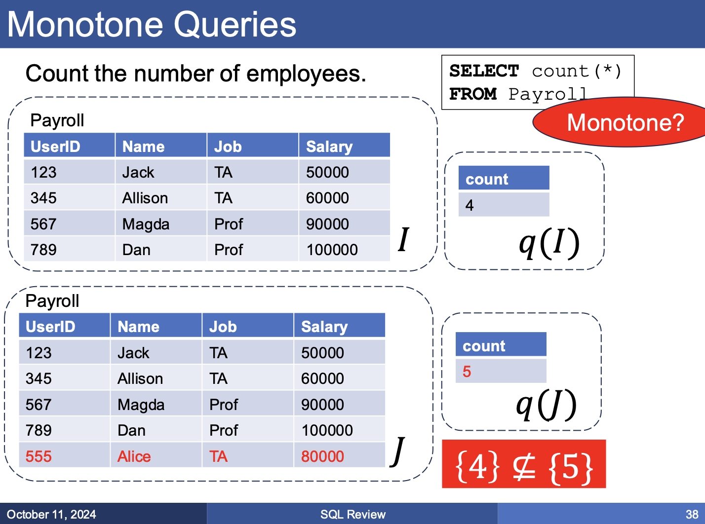

# 2025-04-15/Lecture 5: SQL Wrap-Up

You can find all tables (unless otherwise specified) used in this lecture in the Lecture 5 database file shared by Professor before class on [the class website](https://remy.wang/cs143/), also [downloaded to this repository for your convenience](data/lec5.db):

```sh
sqlite3 data/lec5.db
```

If you want to play around with tables (such as creating the ones introduced on-the-fly in this lecture), you can create and use a copy instead so you don't modify the handout file:

```sh
cp data/lec5.db temp.db
sqlite3 temp.db
rm temp.db
```

## Sub-Queries (Continued)

Up until now we've mostly just been `SELECT`ing directly from the result of our subquery. We can use other predicates on them though:

- `EXISTS (SELECT ...)` checks if it (the inner `SELECT` expression) is not empty. That is, at least one row is returned.
- `NOT EXISTS (SELECT ...)` checks if it is empty. No rows are returned.
- `X IN (SELECT Y FROM ...)` checks that the returned rows include `X`.
- `X NOT IN (SELECT ...)` checks that the returned rows do *not* include `X`.
- `X > ALL(SELECT ...)` checks if X is > than *all* values in output.
- `X > ANY(SELECT ...)` checks if X is > than at least *one* value in output.

> [!NOTE]
>
> `ALL()` and `ANY()` aren't supported in SQLite, but you'll find them in other flavors of SQL.

### SQL Challenge: Find People With/Without Pets (`EXISTS` Edition)

Using the predicates we just learned, how can we return the people that have pets? How about people without pets?

First, let's find the people with pets using `EXISTS`. That is, the query should be something like:

```sql
SELECT ... FROM ...
WHERE EXISTS
(...);
```

Our intuition is:

1. Scan over the `people` table (we also only care about unique `name`s of them). This gives us our table (`FROM`) and our projection (`SELECT`).
2. Select the pets of that `people` since we're only interested in people that *have* pets. How do we do this? We can use our sub-query to, *given* a person's `name`, return the pets that have a matching `person`.
   1. What does this inner query represent? It returns "pets that are owned by a particular person".
3. We're only interested in people that *have* pets, so we can tack `EXISTS` onto our inner query, filtering the outer `people` to only those for which any pets were returned.

```sql
SELECT DISTINCT name FROM people -- (1)
WHERE EXISTS -- (3)
(SELECT * FROM pets WHERE pets.person=people.name); -- (2)
```
```console
┌──────┐
│ name │
├──────┤
│ remy │
└──────┘
```

This is another example where we thought "outer-to-inner". We started with considering *all* of what can possibly make up the result table (`people`), and then "passing in" the `people`'s column to the sub-query to constrain our search.

To find the people *without* pets, we can just swap `EXISTS` for `NOT EXISTS` since that effectively gives us the *complement* of what we just found earlier:

```sql
SELECT DISTINCT name FROM people
WHERE NOT EXISTS
(SELECT * FROM pets WHERE pets.person = people.name);
```
```console
┌─────────┐
│  name   │
├─────────┤
│ zifan   │
│ vincent │
│ dan     │
│ magda   │
└─────────┘
```

### SQL Challenge: Find People With/Without Pets (`IN` Edition)

How about using `IN` to find the people with pets? That is, the query should be something like:

```sql
SELECT ... FROM ...
WHERE ... IN
(...);
```

Our intuition is:

1. Once again, we know we want something from `people`&mdash;specifically, their unique `name`s. That gives us our table and projection.
2. We only want to include people who have pets. We can design our `WHERE` such that our `name` only appears in our sub-query if that person has any pets.
3. Since pets store their owners' names as `person`, this is just a matter of projecting the pets table to `person` and then checking if our outer `name` matches one of them:

```sql
SELECT DISTINCT name FROM people -- (1)
WHERE name IN -- (2)
(SELECT person FROM pets); -- (3)
```
```console
┌──────┐
│ name │
├──────┤
│ remy │
└──────┘
```

Analogously, `NOT IN` would find all the people that *don't* have any pets:

```sql
SELECT DISTINCT name FROM people
WHERE name NOT IN
(SELECT person FROM pets);
```
```console
┌─────────┐
│  name   │
├─────────┤
│ zifan   │
│ vincent │
│ dan     │
│ magda   │
└─────────┘
```

These `IN` examples are known as **uncorrelated sub-queries**, sub-queries that don't use any columns from the outer query. Compare that to other sub-queries we've looked at like the [`EXISTS` examples](#sql-challenge-find-people-withwithout-pets-exists-edition), which are examples of **correlated sub-queries**, where the sub-query references a column(s) from the outer query.

**ASIDE:** Sub-queries cannot have side-effects.

### Un-Nesting Sub-Queries

Recall from last lecture that we can often rewrite queries with nested sub-queries to use joins instead. Sometimes though, the nested and un-nested version may actually still differ.

Consider the ["find people with pets"](#sql-challenge-find-people-withwithout-pets-in-edition) problem just earlier:

<table>
<tr>
  <th>Using Join</th>
  <th>Using Sub-Query (Earlier)</th>
</tr>
<tr>
<td>

```sql
SELECT DISTINCT people.name
FROM people, pets
WHERE people.name = pets.person;
```
```console
┌──────┐
│ name │
├──────┤
│ remy │
└──────┘
```

</td>
<td>

```sql
SELECT DISTINCT name FROM people
WHERE name IN
(SELECT person FROM pets);
```
```console
┌──────┐
│ name │
├──────┤
│ remy │
└──────┘
```

</td>
</tr>
</table>

Here they happen to be functionally equivalent, but consider if we took off `DISTINCT` instead (for example, if we were now also interested in reflecting the number of pets each person has in the result bag). Compare these:

<table>
<tr>
  <th>Using Join</th>
  <th>Using Sub-Query</th>
</tr>
<tr>
<tr>
<td>

```sql
SELECT people.name
FROM people, pets
WHERE people.name = pets.person;
```
```console
┌──────┐
│ name │
├──────┤
│ remy │
│ remy │
│ remy │
│ remy │
│ remy │
│ remy │
└──────┘
```

</td>
<td>

```sql
SELECT name FROM people
WHERE name IN
(SELECT person FROM pets);
```
```console
┌──────┐
│ name │
├──────┤
│ remy │
│ remy │
└──────┘
```

</td>
</tr>
</table>

What's happening here? The reason is rooted in the fact that `remy` appears twice in the `people` table and thrice in the `pets` table:

```console
sqlite> SELECT * FROM people WHERE name="remy";
┌──────┬──────┬───────┬──────┐
│ name │ addr │ phone │ job  │
├──────┼──────┼───────┼──────┤
│ remy │ ...  │ 123   │ UCLA │
│ remy │ ...  │ 123   │ UW   │
└──────┴──────┴───────┴──────┘
sqlite> SELECT * FROM pets WHERE person="remy";
┌──────┬───────────────┬─────┬─────────┬──────┬────────┐
│ name │     breed     │ age │ origin  │ kind │ person │
├──────┼───────────────┼─────┼─────────┼──────┼────────┤
│ casa │ tabby         │ 8   │ seattle │ cat  │ remy   │
│ kira │ tuxedo        │ 6   │ hawaii  │ cat  │ remy   │
│ toby │ border collie │ 17  │ seattle │ dog  │ remy   │
└──────┴───────────────┴─────┴─────────┴──────┴────────┘
```

With the sub-query approach, the intermediate `(SELECT person FROM pets)` evaluates to a column with three `remy`s in it. However, because the outer query is actually selecting from the `people` table, we can only get up to the two `remy`s found inside it (the `IN` "check" is run for *each* tuple, and both `remy`s satisfy the check, so both are included).

With the join approach, we're creating a joined table on the join key `people.name=pets.person`, so every `name=remy` is matched with every `person=remy`. There are 2 `name=remy`s and 3 `person=remy`s, so we get $2 * 3 = 6$ tuples with `name=remy` in the joined table! In fact, let's un-hide some columns so we can see that each "duplicate" `remy` truly corresponds to its own tuple of person-pet combination:

```console
sqlite> SELECT people.name, job, pets.name, pets.person
   ...> FROM people, pets
   ...> ON people.name=pets.person;
┌──────┬──────┬──────┬────────┐
│ name │ job  │ name │ person │
├──────┼──────┼──────┼────────┤
│ remy │ UCLA │ casa │ remy   │
│ remy │ UCLA │ kira │ remy   │
│ remy │ UCLA │ toby │ remy   │
│ remy │ UW   │ casa │ remy   │
│ remy │ UW   │ kira │ remy   │
│ remy │ UW   │ toby │ remy   │
└──────┴──────┴──────┴────────┘
```

This demonstrates how joins and sub-queries don't always have an exact equivalent. We were fortunate that `SELECT DISTINCT` happened to give us the same answer anyway for our particular problem.

### How About `ALL()`/`ANY()`?

> [!NOTE]
>
> SQLite doesn't actually have `ALL()` and `ANY()`, but in other databases, it should work something like this:

```sql
SELECT * FROM pets
WHERE pets.age >= ALL(SELECT age FROM pets);
```

This gives us another way to solve the "oldest pets" problem from last lecture. This query reads, "return the pets whose age is greater than the age of all other pets." In other words, the oldest pets/pets with the largest age. Without `ALL()` (such as in SQLite), we would do something like:

```sql
SELECT p1.name, p1.age
FROM pets AS p1
WHERE NOT EXISTS
(SELECT age FROM pets AS p2 WHERE p2.age > p1.age);
```
```console
┌──────┬─────┐
│ name │ age │
├──────┼─────┤
│ toby │ 17  │
└──────┴─────┘
```

## Monotonicity

We tackle a more general problem: when can and can't sub-queries be un-nested? To answer that, we first introduce the concept of **monotonicity**.

Recall from math: a function $f: R \to R$ is **monotone** if $x \le y$ implies $f(x) \le f(y)$.

| Examples of monotone functions | Examples of non-monotone functions |
| ------------------------------ | ---------------------------------- |
| $x^3 + x^2$                    | $x^3 - x^2$                        |
| $e^x$                          | $e^{-x}$                           |
| $\log(x)$                      | $\frac{1}{x}$                      |

Intuitively: a monotone function "never goes down" when you read its graph from left to right. An example is my unhappiness as a function of time.

There is an analogous concept of **monotone queries**.

> [!IMPORTANT]
>
> **Definition:** A query $Q$ is **monotone** if $I \subseteq J$ implies $q(I) \subseteq q(J)$.
>
> Or intuitively: a monotone query is one where adding more rows to the table never removes rows from the query result.

> [!NOTE]
>
> This is well-defined for *bags* (which are what SQL tables usually are), but for simplicity, we will assume *sets* for now.

### Examples of Monotone Queries

```sql
SELECT name FROM pets;
```

Adding more rows to `pets` will *always* increase the number of rows of the query result, so the query is monotone. In fact, `SELECT x FROM Y` for any column `x` of table `Y` is monotone.

`SELECT DISTINCT` is *also* monotone. Adding more rows might not *increase* the number of distinct rows, but it's still monotone by definition as long nothing from the result table is *removed*.

More generally, the **projection operator** ($\pi$) is monotone.

What about joins?

```sql
SELECT pets.name
FROM pets, people
WHERE pets.person = people.name;
```

Joins are also monotone. Intuitively: consider the "nested loop" semantics of joins we described in Lecture 2:

> ```python
> for pet in pets:          # FROM pets
>   for person in people:   # JOIN people
>     if pet.person == person.name:  # ON <condition>
>       print(pet.name)          # SELECT name
> ```

Adding more pets or people just "add more iterations to the loop" of the join, which can't take *away* rows from the result table, so such a query must be monotone.

> [!IMPORTANT]
>
> **Theorem:** Every SELECT-FROM-WHERE query without subqueries and without aggregates is monotone.

We can use the nested loop semantics described above as proof. Alternatively, we can also prove it by revisiting the concept of Cartesian products. Recall that the most general form of a join can be viewed as the full Cartesian product ($\times$) of the operand tables followed by a selection ($\sigma$) filter and projection ($\pi$) filter.

- The Cartesian product is monotone. Think about it: extending one or more of the sets only increases the number of combinations the elements in the operand sets can have with each other, so the new Cartesian product is a superset of the old one.
- A selection on the Cartesian product is also monotone. Adding more elements to the Cartesian product either adds them to the selection too (they match the predicate) or doesn't (they don't match predicate); it can't *remove* elements already previously matched.
- A projection is also monotone since it doesn't remove *rows* from the result in the first place. It only acts on columns.
- Finally, **the composition of monotone functions is also monotone**, so the entire process is monotone. $\blacksquare$

### Examples of Non-Monotone Queries

Note the "without subqueries" part in the theorem. Here's an example from lecture of how sub-queries can make a query non-monotone.

Recall our solution to the "oldest pets" problem from last lecture:

```sql
SELECT pets.name
FROM pets
WHERE pets.age = (SELECT MAX(age) FROM pets);
```
```console
┌───────┐
│ name  │
├───────┤
│ toby  │
└───────┘
```

We can verify this is correct:

```console
sqlite> SELECT DISTINCT name, age FROM pets;
┌───────────┬─────┐
│   name    │ age │
├───────────┼─────┤
│ casa      │ 8   │
│ kira      │ 6   │
│ toby      │ 17  │
│ maya      │ 10  │
│ moonlight │ 8   │
└───────────┴─────┘
```

Now imagine if we add an older pet:

```console
sqlite> .schema pets
CREATE TABLE IF NOT EXISTS "pets" (
        "name"  TEXT,
        "breed" TEXT,
        "age"   INTEGER,
        "origin"        TEXT,
        "kind"  TEXT,
        "person"        TEXT
);
sqlite> INSERT INTO pets VALUES
   ...> ("new p", "", 20, "", "", "");
sqlite> SELECT pets.name
   ...> FROM pets
   ...> WHERE pets.age = (SELECT MAX(age) FROM pets);
┌───────┐
│ name  │
├───────┤
│ new p │
└───────┘
```

This makes sense because `new p` is now the oldest pet. However, the new query result *removed* a row from before (`toby`)! That means this query is *not* monotone.

Hopefully this also demonstrates why *aggregates* may also make a query non-monotone. Consider the `COUNT(*) FROM Payroll` example from the slides:



### Monotonicity and Sub-Queries

Finally, we return to the punchline. Why do we care about whether a query is monotone?

> [!IMPORTANT]
>
> If a query is monotonic, it implies that a nested query can actually be unnested. [&mdash;Wikipedia](https://en.wikipedia.org/wiki/Monotonic_query)

### SQL Challenge: People Without Pets (Outer Join Edition)

How can we use an **outer join** to find people who do not have pets?

```sql
SELECT people.name
FROM people LEFT OUTER JOIN pets
ON pets.person = people.name
WHERE pets.person IS NULL;
```
```console
┌─────────┐
│  name   │
├─────────┤
│ zifan   │
│ vincent │
│ dan     │
│ magda   │
└─────────┘
```

Why does this work?

1. Remember an outer join pads columns with `NULL` in the rows where the other table (RHS table in the case of a `LEFT OUTER JOIN`) did not have a match.
2. If a person doesn't have any pets, then their `people.name` would never have a match on any `pets.person`, so their rows in the joined table would be padded with `NULL`s in the `pets`-side columns.
3. Thus, we just need to check if any `pets`-side column `IS NULL`.

## Quantifiers

### Brief Review of Logic

> [!TIP]
>
> Here $\neg$ represents logical **negation** ("NOT"), $\lor$ represents logical **disjunction** ("OR"), $\land$ represents logical **conjunction** ("AND"). If you've taken CS M51A/ECE M16, CS 161, or any class that goes over Boolean logic, they should look familiar.

Quantifiers:

- $\exists x, ...$: at least one ("there exists") $x$ satisfies the predicate. This is aka an **existential quantifier**, and can take the form of "any", "some", etc. in plain English.
- $\forall x, ...$: all elements ("for all") $x$ satisfy the predicate. This is aka a **universal quantifier**, and can take the form of "all", "only", etc. in plain English.

An **implication** $A \Rightarrow B$ is equivalent to $\neg A \lor B$.

**DeMorgan's Laws** state that:

- $\neg (A \land B) = \neg A \lor \neg B$
- $\neg (A \lor B) = \neg A \land \neg B$
- $\neg (\exists x, P(x)) = \forall x, \neg P(x)$
- $\neg (\forall x, P(x)) = \exists x, \neg P(x)$

Informally, it's like we're "distributing" the negation $\neg$ inwards, negating all symbols and swapping $\lor$ with $\land$ and $\exists$ with $\forall$ and vice versa.

These consequences then follow from the above identities:

$$\neg (A \Rightarrow B) = (A \land \neg B)$$

$$\neg (\forall x, (A(x) \Rightarrow B(x))) = \exists x, (A(x) \land \neg B(x))$$

### FORALL in SQL

How do we express quantifiers in SQL?

To write **exists**, we just use the built-in [`EXISTS` predicate](#sub-queries-continued) introduced earlier.

To write **forall**, we can leverage **DeMorgan's Law** and use double negation. This works because of what we [showed above](#brief-review-of-logic):

```
predicate holds FORALL elements
              <=>
NOT (EXISTS element where NOT(predicate) holds)
```

Example query (from the slides): "Find people that drive only cars made after 2017". Note that "only" represents a **universal quantifier**, so this is indeed a "FORALL" scenario.

We first negate once: "Find the people that *don't* only drive cars made after 2017". In other words, "find the people that drive *some* car made on or before 2017". Notice that we exchanged the universal quantifier ("only") to an existential one ("some"). This now corresponds to $\exists$, which we know how to write in SQL (using `EXISTS`):

```sql
SELECT P.*
FROM Payroll P
WHERE EXISTS
(SELECT R.Year
  FROM Regist R
  WHERE P.UserID = R.UserID
    AND R.Year <= 2017);
```

Then we negate again to get a query equivalent to what we originally wanted:

```sql
SELECT P.*
FROM Payroll P
WHERE NOT EXISTS -- `NOT` added.
(SELECT R.Year
  FROM Regist R
  WHERE P.UserID = R.UserID
    AND R.Year <= 2017);
```

We implemented FORALL using only EXISTS and logical negation!
