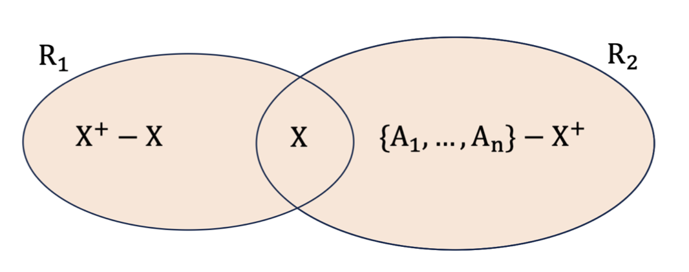
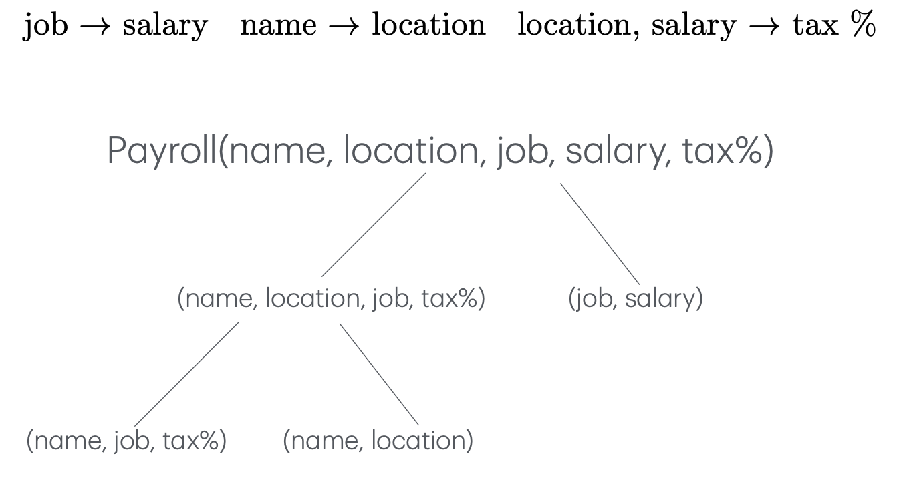
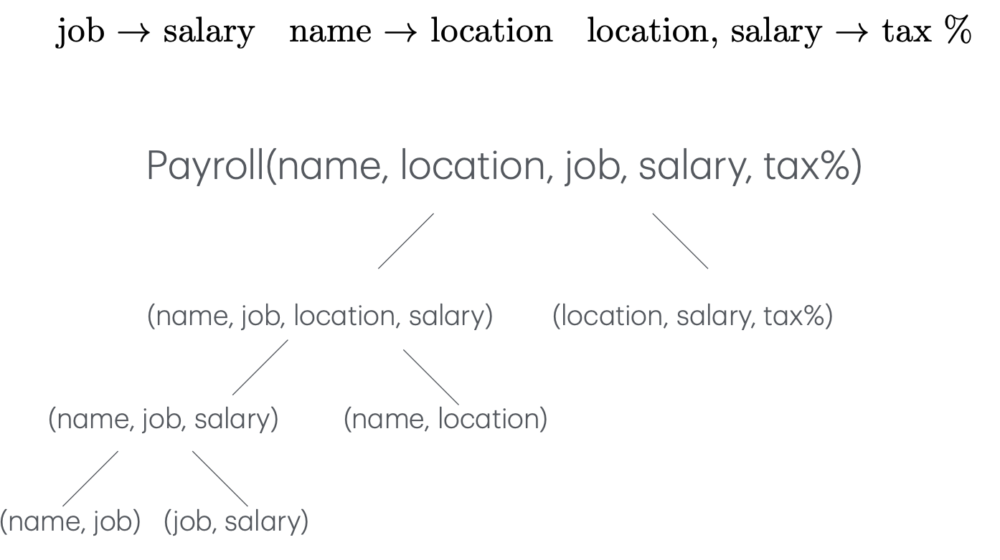

# 2025-04-22/Lecture 7: Dependencies & Decomposition

## Motivation

Previously, we covered independencies, table decomposition, etc. We also said that it's important to have a good database design from day one. Today we tackle: *how* do you figure out what the schema for your tables should be in the first place?

We'll first go over some example tables that each have some glaring problem and use that to motivate some intuitive rules of thumb.

### One Kind Per Table

Consider this table:

| name    | location | breed  | kind | job  |
| ------- | -------- | ------ | ---- | ---- |
| casa    | LA       | tabby  | cat  | NULL |
| kira    | seattle  | tuxedo | cat  | NULL |
| remy    | LA       | NULL   | NULL | prof |
| vincent | LA       | NULL   | NULL | TA   |

Why are there so many `NULL`s? More interestingly, they have a pattern to them. The grouped `NULL`s come from the fact that we're storing two different types of data in the same table: people and pets. Pets (Casa, Kira) have breeds and kinds but not jobs (if only!). People (Remy, Vincent) have jobs (sigh) but not breeds or kinds. Thus, we have `NULL`s everywhere the column is "not applicable". Such a waste of space!

Naturally, the solution then is to decompose this table into separate tables for people and pets and pruning the unapplicable columns:

| name | location | breed  | kind |
| ---- | -------- | ------ | ---- |
| casa | LA       | tabby  | cat  |
| kira | seattle  | tuxedo | cat  |

| name    | location | job  |
| ------- | -------- | ---- |
| remy    | LA       | prof |
| vincent | LA       | TA   |

Many grouped `NULL`s due to data being "not applicable" is often a *symptom* that you're violating a rule of thumb:

> [!TIP]
>
> 1 table stores 1 kind of data.

### A Table for Each Kind

Next example:

| name    | location | salary | graduate | funding |
| ------- | -------- | ------ | -------- | ------- |
| remy    | LA       | $30    | NULL     | $10     |
| vincent | LA       | $20    | 2025     | NULL    |

Once again, there are `NULL`s due to data being "not applicable": Remy doesn't have a graduating year because he's already a Professor, and I don't have funding because I'm ~~ngmi~~ not doing research.

[We know how to fix this](#a-table-for-each-kind): separate the table based on TA vs. professor.

| name | location | salary | funding |
| ---- | -------- | ------ | ------- |
| remy | LA       | $30    | $10     |

| name    | location | salary | graduate |
| ------- | -------- | ------ | -------- |
| vincent | LA       | $20    | 2025     |

But now there's another smell: there seems to be a lot of repeated columns.

The solution would be to extract out the common columns into its own table, and then separate out the differences into different tables:

**Payroll**

| name    | location | salary |
| ------- | -------- | ------ |
| remy    | LA       | $30    |
| vincent | LA       | $20    |

<table>
<tr>
   <th>Professors</th>
   <th>Students</th>
</tr>
<tr>
<td>

| name | funding |
| ---- | ------- |
| remy | $10     |

</td>
<td>

| name    | graduate |
| ------- | -------- |
| vincent | 2025     |

</td>
</tr>
</table>

When you see a lot of repeated columns across multiple tables, that's often a symptom that you're violating a rule of thumb:

> [!TIP]
>
> Each kind of data has its own table.

Even though **payroll** information is applicable to both professors and TAs (so we don't have a bunch of `NULL`s like in [the first example](#one-kind-per-table)), because it represents its own distinct type of information, it deserves its own table. Extracting it out makes more conceptual sense and also reduces the redundancy in schemas.

### Information Stored Once

Another example:

| name | location | salary | course |
| ---- | -------- | ------ | ------ |
| remy | LA       | $30    | 143    |
| remy | LA       | $30    | 240    |
| remy | LA       | $30    | 249    |

This might look familiar from Lecture 2. There's a lot of **redundancy**! In the previous example, the *columns* (*types* of data we're storing) were redundant across multiple tables, but this time we have a singular set of columns and just a lot of redundant *data* under them.

Firstly, you're wasting storage. A bit more subtly, you're actually also complicating future updates & deletes. For example, if Remy moves, then the `location` for *every* copy of `remy` needs to be updated! And if Remy is dropped from the payroll, we would have to delete *every* copy of `remy`. These are called **anomalies**, and they're caused by what are called [functional dependencies](#functional-dependency-fd) in your tables.

If you see a lot of repeated data, it's likely a symptom that you're violating a rule of thumb:

> [!TIP]
>
> Each piece of information stored once.

## Functional Dependency (FD)

Now we return to formalism, where we more rigorously model the redundancy problem and use that to define a way to [systematically decompose tables](#decomposition-to-bcnf) into more robust schemas.

### Intuition

Consider this table, similar to [the one in the last example](#information-stored-once):

| name | location | salary | course |
| ---- | -------- | ------ | ------ |
| remy | LA       | $30    | 143    |
| remy | LA       | $30    | 240    |
| remy | LA       | $30    | 249    |
| dan  | seattle  | $50    | 344    |
| dan  | seattle  | $50    | 444    |

By inspection, it's clear that the *person* (Remy, Dan, etc.) always has the same information associated with them for some of the columns. For example, Remy is always in LA and has a salary of $30 (this darn economy) no matter what course he teaches. Similarly, Dan is always in Seattle and has a salary of $50 no matter what course he teaches. That is, `name` always determines `location` and `salary`. We say that `name` **functionally determines** `location` and `salary`.

Why "functionally"? Think of a function $f(\cdot)$ from math: you give it some value $x$, it'll always give you the same value $f(x)$.

### Definition

More formally:

> [!IMPORTANT]
>
> Suppose $X$ and $Y$ are subsets of the columns of a relation (table). A **functional dependency**:
>
> $X \to Y$
>
> Implies that:
>
> $\forall t,t' \in R: \pi_X(t) = \pi_X(t') \Longrightarrow \pi_Y(t) = \pi_Y(t')$
>
> We say that " $X$ **functionally determines** $Y$ ", or " $Y$ is **functionally determined by** $X$ ".

In other words: if $X$ functionally determines $Y$, every copy of an instantiation of $X$ should have the same instantiation of $Y$ in its tuple.

In the [previous example](#intuition), the functional dependencies are expressed as:

$$\text{name} \to \text{location}$$
$$\text{name} \to \text{salary}$$

Or together:

$$\text{name} \to \lbrace \text{location, salary} \rbrace$$

The LHS (the side doing the "functionally determining") can be a set of multiple columns too. Consider this example:

| first n. | last n. | location | salary | course |
| -------- | ------- | -------- | ------ | ------ |
| remy     | w       | LA       | $30    | 143    |
| remy     | w       | LA       | $30    | 240    |
| remy     | w       | LA       | $30    | 249    |
| dan      | s       | seattle  | $50    | 344    |
| dan      | s       | seattle  | $50    | 444    |
| dan      | o       | zurich   | $50    | 101    |
| dan      | o       | zurich   | $50    | 113    |

Here:

$$\lbrace \text{first n., last n.} \rbrace \to \lbrace \text{location, salary} \rbrace$$

Hopefully that makes sense&mdash;the columns in combination still represent "people" after all. The names were just separated into two columns.

### SQL Challenge: Checking Functional Dependency

How do I check if $X \to Y$ using SQL?

Design a query that will return nothing if $X \to Y$ (at least based on the data within it). Otherwise, return the instantiations of $X$ that violate the FD.

<details>
<summary>Expand for answer.</summary>

```sql
SELECT * FROM R
GROUP BY X
HAVING COUNT(DISTINCT Y) > 1
```

The way it works is:
1. We first group by $X$, so we have up to one output row for every instantiation of $X$.
2. If $X \to Y$, then $X$ should be associated with exactly *one* $Y$ instantiation since $X$ functionally determines $Y$. Thus, we include the instantiations where this is *violated*: $X$ has multiple instantiations of $Y$.

Try it out with some data:

```sh
sqlite3 data/lec5.db
```

```console
sqlite> SELECT * FROM people;
┌─────────┬──────┬───────┬──────┐
│  name   │ addr │ phone │ job  │
├─────────┼──────┼───────┼──────┤
│ remy    │ ...  │ 123   │ UCLA │
│ zifan   │ ...  │ 234   │ UCLA │
│ vincent │ ...  │ 345   │ UCLA │
│ remy    │ ...  │ 123   │ UW   │
│ dan     │ ...  │ 456   │ UW   │
│ magda   │ ...  │ 567   │ UW   │
└─────────┴──────┴───────┴──────┘
sqlite> SELECT * FROM people GROUP BY name HAVING COUNT(DISTINCT phone) > 1;
sqlite> SELECT * FROM people GROUP BY name HAVING COUNT(DISTINCT job) > 1;
┌──────┬──────┬───────┬──────┐
│ name │ addr │ phone │ job  │
├──────┼──────┼───────┼──────┤
│ remy │ ...  │ 123   │ UCLA │
└──────┴──────┴───────┴──────┘
sqlite> -- name functionally determines phone but not job.
```

</details>

## Functional Dependency Inference

Now that we know what [functional dependencies](#definition) are, how do we derive them? In general, the **FD inference** problem is:

Given existing known FDs:

$$X_1 \to Y_1$$
$$X_2 \to Y_2$$
$$X_3 \to Y_3$$

We want to know: does this FD hold?

$$X \to Y$$

### Trivial Functional Dependencies

Let's get the easiest ones out of the way first, the so-called **trivial functional dependencies**.

Firstly, a set of columns always functionally determines itself:

$$A \to A$$
$$B \to B$$

Hopefully this is obvious. The columns are exactly equal! "If I know $A$, I know $A$".

In fact, a set of columns always functionally determines a *subset* of those columns:

$$AB \to A$$
$$AB \to B$$

If I know both $A$ and $B$, of course I know $A$ individually as well! Thus:

> [!IMPORTANT]
>
> This always holds:
>
> $Y \subseteq X \Longrightarrow X \to Y$
>
> A FD $X \to Y$ is called **trivial** if $Y \subseteq X$.

### Manual Inference

Let's run through how you might approach inferring *non-trivial* FDs from existing FDs. Consider this table:

| name    | job  | location | salary | tax % |
| ------- | ---- | -------- | ------ | ----- |
| remy    | prof | LA       | $30    | 20    |
| dan     | prof | seattle  | $50    | 15    |
| vincent | TA   | LA       | $20    | 10    |

And these known functional dependencies:

$$\text{job} \to \text{salary}$$
$$\text{name} \to \text{location}$$
$$\text{location, salary} \to \text{tax \%}$$

We conjecture that:

$$\text{name, job} \to \text{tax \%}$$

How do we prove it? We can do something akin to high school algebra, where we start with a bunch of placeholder variables and then fill out the unknowns based on known rules (FDs in our case).

We fill out a row with arbitrary variables, representing *some* value for their respective column. We want to show that name and job in conjunction functionally determine tax %, so we'll use identical copies of the arbitrary (name, job) 2-tuple:

| name | job | location | salary | tax % |
| ---- | --- | -------- | ------ | ----- |
| N    | J   | L        | S      | T     |
| N    | J   | ?        | ?      | ?     |

If the FD is true, both rows should map to the *same* tax % value $T$. That is, we want to show that $(N, J) \mapsto T$.

By the FD $\text{job} \to \text{salary}$, we know that $J \mapsto S$:

| name | job | location | salary | tax % |
| ---- | --- | -------- | ------ | ----- |
| N    | J   | L        | S      | T     |
| N    | J   | ?        | **S**  | ?     |

By the FD $\text{name} \to \text{location}$, we know that $N \mapsto L$:

| name | job | location | salary | tax % |
| ---- | --- | -------- | ------ | ----- |
| N    | J   | L        | S      | T     |
| N    | J   | **L**    | S      | ?     |

Finally, by the FD $\text{location, salary} \to \text{tax \%}$, we know that $(L, S) \mapsto T$:

| name | job | location | salary | tax % |
| ---- | --- | -------- | ------ | ----- |
| N    | J   | L        | S      | T     |
| N    | J   | L        | S      | **T** |

From the updated table, we see that $(N, J) \mapsto T$. Since the chosen $(N, J)$ is arbitrary, the FD $\text{name, job} \to \text{tax \%}$ holds in general too. $\blacksquare$

### Armstrong's Axioms

The above method is neat and all, but there's a more systematic way to do this where we manipulate columns directly like an algebra instead of filling out a bunch of variables in a table. We can derive FDs from other FDs using **Armstrong's axioms**:

(1) **Reflexivity**:

$$Y \subseteq X \Longrightarrow X \to Y$$

This is simply the definition of a [**trivial FD**](#trivial-functional-dependencies).

(2) **Augmentation**:

$$X \to Y \Longrightarrow XZ \rightarrow YZ$$

In other words, it doesn't matter if you add arbitrary columns to both of $X$ and $Y$ (i.e. *augment* them).

(3) **Transitivity**:

$$X \to Y \land Y \to Z \Longrightarrow X \to Z$$

In intuitive terms, you can "chain" functional dependencies together.

> [!TIP]
>
> These 3 axioms are enough to derive all other functional dependencies within a relation!

### Armstrong's Axioms (Example)

Let's revisit [the example from earlier](#manual-inference) but using Armstrong's axioms this time. Given these functional dependencies:

1. $\text{job} \to \text{salary}$
2. $\text{name} \to \text{location}$
3. $\text{location, salary} \to \text{tax \%}$

Does this hold?

$$\text{name, job} \to \text{tax \%}$$

First we use **augmentation** on (1), adding $\text{name}$ to both sides:

4. $\text{job, name} \to \text{salary, name}$

We use **augmentation** again on (2), adding $\text{salary}$ to both sides:

5. $\text{name, salary} \to \text{location, salary}$

We use **transitivity** on (3) and (5) to derive:

6. $\text{name, salary} \to \text{tax \%}$

We use **transitivity** again on (4) and (6) to derive:

7. $\text{job, name} \to \text{tax \%}$

Because we have derived the FD through Armstrong's axioms, the FD holds. $\blacksquare$

> [!NOTE]
>
> Notice that since we're dealing with *sets* of columns, the order of them within each set doesn't matter. In the above example, $\text{salary, name}$ in (4) is the same as $\text{name, salary}$ in (6).
>
> Look out for that when identifying transitive relationships.

### FD Closure

[Armstrong's axioms](#armstrongs-axioms) are neat and all, but there's actually yet *another*, even easier/more systematic way to do FD inference.

We introduce the concept of an **attribute closure**:

> [!IMPORTANT]
>
> Given a set of attributes (columns) $X$, the **closure** $X^+$ is defined as the set of all attributes that can be functionally determined by $X$.

It follows that, to answer the FD inference question "does $X \to Y$ hold?", we just check if $Y \subseteq X^+$! That is, are all columns of $Y$ functionally determined by $X$? If so, $X$ functionally determines $Y$.

Closures are useful beyond FD inference too, when we get to our discussion about [keys](#keys).

> [!IMPORTANT]
>
> To *compute* the **closure** $X^+$, we use this algorithm:
>
> Given the FDs:
>
> - $X_1 \to Y_1$
> - $X_2 \to Y_2$
> - $X_3 \to Y_3$
> - ...
>
> Do:
>
> 1. Let $R$ be the result set (what we're building to ultimately be $X^+$).
> 2. Initialize $R$ to $X$. That is, start with the columns of $X$ (because by [reflexivity](#armstrongs-axioms), we know that $X \to X$).
> 3. Repeat until $R$ no longer changes:
>    1. Add $Y_i$ to $R$ if $X_i \subseteq X$

The variables make it sound a bit abstract, so in more intuitive terms, the algorithm is:

1. Start with the attributes whose closure we're finding.
2. Go through the given FDs one by one. If the LHS is contained in our set so far, add the RHS to it.

This following example will make it clearer too. It's actually a very simple process that will become muscle memory in no time.

### FD Closure (Example)

Given these FDs:

1. $\text{job} \to \text{salary}$
2. $\text{name} \to \text{location}$
3. $\text{location, salary} \to \text{tax \%}$

Compute the closure:

$$\lbrace \text{name}, \text{job} \rbrace^+$$

We start with the attributes whose closure we're finding:

$$\lbrace \text{name}, \text{job} \rbrace$$

We then go through each FD and use this idiom: "if the LHS is contained within our set so far, add the RHS to it".

For FD (1) $\text{job} \to \text{salary}$: $\text{job}$ is in our set, so we add $\text{salary}$ to it:

$$\lbrace \text{name}, \text{job}, \text{salary} \rbrace$$

For FD (2) $\text{name} \to \text{location}$: $\text{name}$ is in our set, so we add $\text{location}$ to it:

$$\lbrace \text{name}, \text{job}, \text{salary}, \text{location} \rbrace$$

For FD (3) $\text{location, salary} \to \text{tax \%}$: both $\text{location}$ and $\text{salary}$ are in our set, so we add $\text{tax \%}$ to it:

$$\lbrace \text{name}, \text{job}, \text{salary}, \text{location}, \text{tax \%} \rbrace$$

We see that $\lbrace \text{name}, \text{job} \rbrace^+$ equals the entire set of attributes. What this tells us is that $\lbrace \text{name}, \text{job} \rbrace \to$ *any* subset of columns is a FD (this makes them a [superkey](#keys) as we'll explain later)! Using the closure method, we not only answer our original question of "does $\text{job, name} \to \text{tax \%}$ hold?" but many other FD questions at the same time!

## Keys

### Superkeys

When introducing [closures](#fd-closure), we made an observation in [the example](#fd-closure-example):

> $\lbrace \text{name}, \text{job} \rbrace^+$ equals the entire set of attributes. What this tells us is that $\lbrace \text{name}, \text{job} \rbrace \to$ *any* subset of columns is a FD.

In other words, these two attributes in conjunction functionally determine *all* other columns in the table. They functionally determine i.e. uniquely identify the entire *row*. Such attribute sets are called **superkeys**. More formally:

> [!IMPORTANT]
>
> Suppose relation $R$ has the columns $A_1, ..., A_m$.
>
> $X \subseteq \lbrace A_1, ... , A_m \rbrace$ is a **superkey** of $R$ if $\forall i: X \to A_i$.
>
> That is, $X^+ = \lbrace A_1, ..., A_m \rbrace$.

### Superkeys (Examples)

Example table:

| name (PK) | location | salary |
| --------- | -------- | ------ |
| remy      | LA       | $30    |
| vincent   | LA       | $20    |

Here, `name` is explicitly defined to be the table's **primary key (PK)** (recall PKs from Lecture 3). A primary key is always a superkey because it's unique by design, so every primary key value uniquely identifies a tuple in the table.

> [!TIP]
>
> In fact, in general, any attribute with only unique values is automatically a superkey. This follows from the definition of [functional dependencies](#functional-dependency-fd).

Another example, where we don't make it obvious with a PK:

| first n. | last n. | location | salary |
| -------- | ------- | -------- | ------ |
| remy     | w       | LA       | $30    |
| dan      | s       | seattle  | $50    |
| dan      | o       | zurich   | $50    |

Assuming this data is representative of the relation in general, $\lbrace \text{first n., last n.} \rbrace$ is a superkey&mdash;it uniquely identifies all other attributes.

Suppose we now include a `course` column:

| first n. | last n. | location | salary | course |
| -------- | ------- | -------- | ------ | ------ |
| remy     | w       | LA       | $30    | 143    |
| remy     | w       | LA       | $30    | 240    |
| remy     | w       | LA       | $30    | 249    |
| dan      | s       | seattle  | $50    | 344    |
| dan      | s       | seattle  | $50    | 444    |
| dan      | o       | zurich   | $50    | 101    |
| dan      | o       | zurich   | $50    | 113    |

First name and last name together are *no longer* a superkey since for the same combination e.g. `(remy, w)`, we have different courses e.g. `143`, `240`, `249`. That is, $\lbrace \text{first n., last n.} \rbrace \not\to \text{course}$, and thus it no longer functionally determines *all* attributes and thus is no longer a superkey.

### Finding Superkeys

Every table has at least one superkey, a **trivial** one if you will.

> [!IMPORTANT]
>
> For any table, one of the superkeys is always just the complete set of the columns.

This is a superkey by definition because the set of entire columns uniquely identifies every tuple in the table. "If I know every value, I know every value"&mdash;this same tautological intuition from why [reflexivity](#armstrongs-axioms) explains the [trivial FD](#trivial-functional-dependencies).

Consider this table from before:

| name    | job  | location | salary | tax % |
| ------- | ---- | -------- | ------ | ----- |
| remy    | prof | LA       | $30    | 20    |
| dan     | prof | seattle  | $50    | 15    |
| vincent | TA   | LA       | $20    | 10    |

And its FDs:

$$\text{job} \to \text{salary}$$
$$\text{name} \to \text{location}$$
$$\text{location, salary} \to \text{tax \%}$$
$$\text{name, job} \to \text{tax \%}$$

The trivial superkey is:

$$\lbrace \text{name, job, location, salary, tax \%} \rbrace$$

We can find more superkeys by removing rows until the attribute set is no longer a superkey. We can do this by dropping columns that are already functionally determined by other columns in the superkey.

1. Salary is already functionally determined by job, so we can drop salary without reducing the set's closure. So this set is still a superkey:

$$\lbrace \text{name, job, location, tax \%} \rbrace$$

2. Similarly, location is already functionally determined by name, so we can drop location too. So this set is still a superkey too:

$$\lbrace \text{name, job, tax \%} \rbrace$$

3. Similarly, tax % is already functionally determined by name and job together, so we can drop tax % too. So this set is yet another superkey:

$$\lbrace \text{name, job} \rbrace$$

We cannot drop any more attributes without it no longer being a superkey, so this is a *minimal* superkey.

In fact, this example demonstrates the general approach to finding a minimal superkey:

> [!IMPORTANT]
>
> **Finding a minimal superkey:**
>
> 1. Start with the trivial superkey.
> 2. Use the FDs to drop redundant columns from the set.
> 3. Repeat until you can't drop any more columns.

> [!TIP]
>
> A corollary of this process is that if we *add* columns to a superkey, we still get a superkey (like the reverse of the process of finding a minimal superkey).
>
> This follows from the definition of [closures](#fd-closure). If some set $X$ already functionally determines every column, then extending that set into $X \cup X'$ for any $X'$ will still functionally determine every column.

### Candidate Keys

> [!IMPORTANT]
>
> A *minimal* superkey is also known as a **candidate key**, or just a **key** for short. That is, a candidate key is a superkey for which removing any more columns would make it no longer a superkey.

Revisiting the previous examples:

| name (PK) | location | salary |
| --------- | -------- | ------ |
| remy      | LA       | $30    |
| vincent   | LA       | $?     |

`name` is a PK and one of the superkeys as [described earlier](#superkeys-examples). Because this PK is a singular column, it also must be a candidate key (we can't remove any more columns).

> [!TIP]
>
> In general, primary keys are always one of the candidate keys of a table. More on primary keys in the future (I think).

Next example:

| first n. | last n. | location | salary |
| -------- | ------- | -------- | ------ |
| remy     | w       | LA       | $30    |
| dan      | s       | seattle  | $50    |
| dan      | o       | zurich   | $50    |

`(first n., last. n, location, salary)` is not a key because you can remove columns and it would still be a superkey. `(first n., last. n)` is a candidate key.

Next example:

| first n. | last n. | location | salary | course |
| -------- | ------- | -------- | ------ | ------ |
| remy     | w       | LA       | $30    | 143    |
| remy     | w       | LA       | $30    | 240    |
| remy     | w       | LA       | $30    | 249    |
| dan      | s       | seattle  | $50    | 344    |
| dan      | s       | seattle  | $50    | 444    |
| dan      | o       | zurich   | $50    | 101    |
| dan      | o       | zurich   | $50    | 113    |

`(first n., last n.)` was found to *not* be a superkey [earlier](#finding-superkeys) because of the different `course`s for the same `(first n., last n.)` 2-tuples. We can add `course` into the set, and now `(first n, last n., course)` is a superkey and candidate key.

Next example:

| name    | job  | location | salary | tax % |
| ------- | ---- | -------- | ------ | ----- |
| remy    | prof | LA       | $30    | 20    |
| dan     | prof | seattle  | $50    | 15    |
| vincent | TA   | LA       | $20    | 10    |

`(name, job)` is a candidate key.

### Finding Candidate Keys

As described [above](#finding-superkeys), finding minimal superkeys aka candidate keys is a matter of starting with the trivial superkey and removing redundant columns from it. We did so by consulting the provided FDs, but once again, we can use [**closures**](#fd-closure) for a more systematic approach.

The algorithm is simply:

> [!IMPORTANT]
>
> Suppose relation $R$ has the attributes $A_1, ..., A_m$.
>
> To find a candidate key:
> 1. Guess $X \in \mathcal{P}(\lbrace A_1, ..., A_m \rbrace) \setminus \lbrace \emptyset \rbrace$ from small to large. Here $\mathcal{P}(\cdot)$ denotes the [**powerset**](https://en.wikipedia.org/wiki/Power_set), the set of all subsets of the input set.
> 2. At each $X$, compute and check if $X^+ = \lbrace A_1, ..., A_m \rbrace$. If it does, then $X$ is a candidate key and you're done.

In more intuitive terms:

1. Compute the closure over all individual columns.
2. Compute the closure over all sets of two columns.
3. And so on until we get a closure that is equal to the set of all columns. Such a set is a candidate key.

> [!NOTE]
>
> Informal proof: how do we know this finds us a **candidate key** specifically and not just any **superkey**? Because we guess small to large, the first superkey found is guaranteed to be a minimal one by this algorithm.

### Finding Candidate Keys (Example)

Suppose we're given these FDs from before:

$$\text{job} \to \text{salary}$$
$$\text{name} \to \text{location}$$
$$\text{location, salary} \to \text{tax \%}$$

First, let's start by computing the closure for sets of one attribute each:

$$\lbrace \text{job} \rbrace^+ = \lbrace \text{job, salary} \rbrace$$

$$\lbrace \text{salary} \rbrace^+ = \lbrace \text{salary} \rbrace$$

$$\lbrace \text{name} \rbrace^+ = \lbrace \text{name, location} \rbrace$$

$$\lbrace \text{location} \rbrace^+ = \lbrace \text{location} \rbrace$$

$$\lbrace \text{tax} \rbrace^+ = \lbrace \text{tax} \rbrace$$

None of these can be keys since their closures do not cover all attributes. We move on to computing the closure for sets of two attributes each:

$$\lbrace \text{name, job} \rbrace^+ = \lbrace \text{name, job, salary, location, tax} \rbrace$$

Since the closure of $\lbrace \text{name, job} \rbrace$ includes all attributes, $\lbrace \text{name, job} \rbrace$ is a candidate key.

Another conclusion we draw from this process is that, for this example, any key *must* contain name and job. This is because name and job are not functionally determined by anything else (by inspection, they don't appear on the RHS of any FD expression). Thus, you can't start with anything else and end up with a closure with every attribute.

### Another Exercise

Consider this relation:

$$R(A, B, C)$$

And its FDs:

$$A \to BC$$
$$B \to AC$$
$$AB \to C$$

Find their **keys** (note that there can be multiple).

$A$ and $B$ themselves are valid keys since they functionally determine all other attributes.

Recall that while you can have multiple keys (multiple sets of columns with the same size), in SQL, you're only allowed to choose *one* **primary key**.

### Keys Summary

So many keys!

- A [**superkey**](#superkeys) is a set of attributes that [**functionally determines**](#functional-dependency-fd) all other attributes in a relation.
  - Every relation has at least one superkey, the trivial superkey (the set of all columns).
  - A relation can have multiple superkeys.
- A [**candidate key** (**key**)](#candidate-keys) is a *minimal* superkey.
  - All candidate keys are superkeys, but not all superkeys are candidate keys.
  - Because every relation has at least one superkey, every relation must also have at least one candidate key.
  - A relation can have multiple candidate keys (different superkeys with the same minimal length).
- A **primary key** is one of the candidate keys designated by the database designer as the one used for unique identification, for foreign key references, etc.
  - Any candidate key can be a primary key (hence their name, *candidate* key), but only one of them is the primary key at a time.
  - A relation can have at most one primary key.

This relationship holds:

$$\text{primary key} \in \text{candidate keys} \subseteq \text{superkeys}$$

## Database Normalization

Now that we have a handle on [functional dependencies](#functional-dependency-fd), [keys](#keys), and how to find them, we're finally ready to **decompose** relations.

The process of decomposing relations to [reduce data redundancy and improve data integrity](#motivation) is called **normalization**. Specifically, we're reorganizing the relations into forms with specific properties, so-called [**normal forms**](https://en.wikipedia.org/wiki/Database_normalization#Normal_forms). There are many normal forms such as, in increasing "degree" of normalization:

1. [First normal form (1NF)](https://en.wikipedia.org/wiki/First_normal_form)
2. [Second normal form (2NF)](https://en.wikipedia.org/wiki/Second_normal_form)
3. [Third normal form (3NF)](https://en.wikipedia.org/wiki/Third_normal_form)
4. [Boyce-Codd Normal Form (BCNF aka 3.5NF)](https://en.wikipedia.org/wiki/Boyce–Codd_normal_form)
5. [Fourth normal form (4NF)](https://en.wikipedia.org/wiki/Fourth_normal_form)
6. There are more forms up to 6NF and miscellaneous named forms in between each level, but they are rarely used in practice beyond academic interest. [Source](https://en.wikipedia.org/wiki/Database_normalization#Example_of_a_step-by-step_normalization).

Higher degrees of normalization introduce more constraints that each solve certain **anomalies** caused by data redundancy. This lecture introduces [BCNF](#boyce-codd-normal-form-bcnf) (you don't have to know the other forms).

### Boyce-Codd Normal Form (BCNF)

Formally:

> [!IMPORTANT]
>
> Suppose $R$ is a relation with attributes $A_1, ..., A_m$ and $X, Y \subseteq \lbrace A_1, ..., A_m \rbrace$.
>
> $R$ is in **Boyce-Codd Normal Form (BCNF)** if:
>
> $\forall X \to Y \models R: Y \subseteq X \lor X$ is a superkey.
>
> Or equivalently: $\forall X: X^+ = X \lor X^+ = \lbrace A_1, ..., A_m \rbrace$.

Or more intuitively:

> For every FD $X \to Y$, $X \to Y$ is either a [trivial FD](#trivial-functional-dependencies) ***OR*** $X$ is a [superkey](#superkeys).

Some corollaries of this definition are (may be useful for saving time in a test question lol):
- If a relation has 2 attributes, it's automatically in BCNF.
- If all attributes of a relation form a candidate key, it's automatically in BCNF.

### Decomposition to BCNF

A neat property of BCNF is that to decompose a relation *into* BCNF, you just have to follow this recursive algorithm:

> [!IMPORTANT]
>
> **Decomposition to BCNF:**
>
> Repeat:
> 1. Find a FD $X \to Y$ [violating BCNF](#boyce-codd-normal-form-bcnf) (that is, it's neither a trivial FD nor a superkey).
> 2. "Factor out" $X^+$ from $R$.

That is, for any $X$ of a violating FD $X \to Y$, your decomposed relations $R_1$ and $R_2$ have columns as visualized:



That is, one table has all the attributes of $X^+$. The other table has all remaining attributes, but also sharing $X$.

### Decomposition to BCNF (Example)

Let's consider a concrete example. Suppose we have the relation from before:

```
Payroll(name, location, job, salary, tax)
```

And the FDs:

$$\text{job} \to \text{salary}$$
$$\text{name} \to \text{location}$$
$$\text{location, salary} \to \text{tax}$$

The FD $\text{job} \to \text{salary}$ violates BCNF because it's not trivial nor is it a superkey. Thus, we compute and factor out $\lbrace \text{job} \rbrace^+$:

$$\lbrace \text{job} \rbrace^+ = \lbrace \text{job, salary} \rbrace$$

Let $R_1$ have the attributes:

$$X^+ = \lbrace \text{job} \rbrace^+ = \lbrace \text{job, salary} \rbrace$$

Let $R_2$ have the attributes:

$$\lbrace A_1, ..., A_m \rbrace \setminus (X^+ \setminus X)$$
$$= \lbrace \text{name, location, job, salary, tax} \rbrace \setminus (\lbrace \text{job, salary} \rbrace \setminus \lbrace \text{job} \rbrace)$$
$$= \lbrace \text{name, location, job, tax} \rbrace$$

That is:

```
R1(job, salary)
R2(name, location, job, tax)
```

For $R_1$, the only applicable FD left is $\text{job} \to \text{salary}$, which is now a **superkey** since there are only the `job` and `salary` attributes left. Recall that any relation with only 2 attributes is automatically in BCNF. $R_1$ is in BCNF.

For $R_2$, the FD $\text{name} \to \text{location}$ is still present and violates BCNF, so we recursively continue the process to get the relations:

```
R3(name, location)
R4(name, job, tax)
```

For $R_3$, the FD $\text{name} \to \text{location}$ is now a superkey. $R_3$ is in BCNF.

For $R_4$, the (derived) FD $\text{name, job} \to \text{tax \%}$ is also a superkey. $R_4$ is in BCNF.

Because all sub-relations are in BCNF, we are done. Our final decomposed layout is:

```
R1(job, salary)
R3(name, location)
R4(name, job, tax)
```

Our decomposition steps as visualized as a tree structure in the slides:



Note however that there are multiple ways to decompose a relation into BCNF depending on which violating FD you choose at each step (different decomposition order). This is also a valid decomposition:



Which one is better? It turns out that some orderings are **dependency preserving** while others aren't. We would prefer BCNF decompositions that are dependency preserving. What does it mean to be dependency preserving and how can we ensure it? We ran out of time this lecture, so stay tuned!
