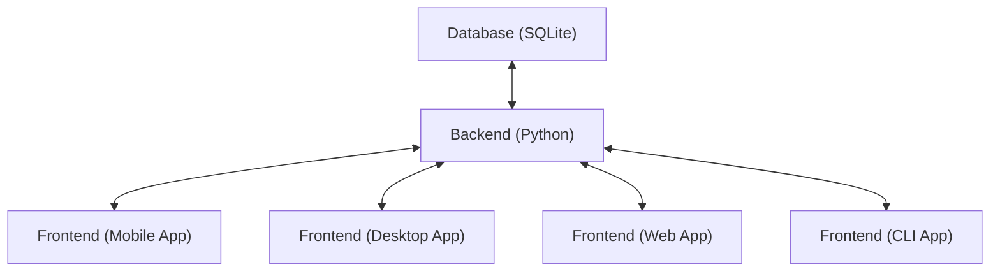

# 2025-04-24/Lecture 8: Normal Forms and Intro to Transactions

## Review

### Boyce-Codd Normal Form (BCNF)

Recall from previous lecture:

> [!IMPORTANT]
>
> A relation $R$ is in **Boyce-Codd Normal Form (BCNF)** if either of these conditions hold:
>
> $$
> \forall (X \to Y): \begin{cases}
>   Y \subseteq X \text{ (trivial FD)} \\
>   X^+ = R \text{ ($X$ is a superkey)}
> \end{cases}
> $$

Practice question: consider this relation and its FDs from previous lecture. Is it in BCNF?

```
R(name, job, location, salary, tax)

job -> salary
name -> location
location, salary -> tax
name, job -> tax
```

<details>
<summary>Expand for answer.</summary>

Check all the FDs to see if they are either trivial or a superkey.

1. `job -> salary`:
   1. Trivial? No.
   2. Superkey? `{job}+ = {job, salary} != R`. No.

We already found an FD that violates BCNF, so $R$ is *not* in BCNF!

</details>

### BCNF Decomposition

What if a table $R$ *isn't* in BCNF? To decompose a table *into* BCNF, we:

1. Make a new table with attributes $X^+$.
2. Drop the other attributes from the old table, but keeping $X$. That is, $R \setminus (X^+ \setminus X)$.

The intuition behind why we do this is that since $X \to Y$ is a violating FD (due to $X$ not being a superkey), we want to *make* $X$ into a superkey! If we move $X$ and all the attributes it functionally determines ($Y$) into one table, then $X$ automatically becomes a superkey by definition. The decomposed tables may still not be in BCNF, so we recursively continue the algorithm until everything is in BCNF.

Consider this concrete example (Professor created a very cool animation in the Keynote version of the slides this too, you should check it out):

| first n. | last n. | location | salary | course |
| -------- | ------- | -------- | ------ | ------ |
| remy     | w       | LA       | $30    | 143    |
| remy     | w       | LA       | $30    | 240    |
| remy     | w       | LA       | $30    | 249    |
| dan      | s       | seattle  | $50    | 344    |
| dan      | s       | seattle  | $50    | 444    |
| dan      | o       | zurich   | $50    | 101    |
| dan      | o       | zurich   | $50    | 113    |

$$\lbrace \text{first n, last n.} \to \text{location, salary} \rbrace$$

<details>
<summary>Expand for answer.</summary>

First convince yourself that this isn't in BCNF. The provided FD is sufficient: it's neither trivial nor is it a superkey (it doesn't functionally determine $\text{course}$). We then split the tables into:

- One with the attributes of the violating FD, so $\lbrace \text{first n, last n., location, salary} \rbrace$.
- One with all remaining attributes but also sharing LHS of the violating FD, so $\lbrace \text{first n., last n., course} \rbrace$.

<table>
<tr>
<th></th>
<th></th>
</tr>
<tr>
<td>

| first n. | last n. | location | salary |
| -------- | ------- | -------- | ------ |
| remy     | w       | LA       | $30    |
| remy     | w       | LA       | $30    |
| remy     | w       | LA       | $30    |
| dan      | s       | seattle  | $50    |
| dan      | s       | seattle  | $50    |
| dan      | o       | zurich   | $50    |
| dan      | o       | zurich   | $50    |

</td>
<td>

| first n. | last n. | course |
| -------- | ------- | ------ |
| remy     | w       | 143    |
| remy     | w       | 240    |
| remy     | w       | 249    |
| dan      | s       | 344    |
| dan      | s       | 444    |
| dan      | o       | 101    |
| dan      | o       | 113    |

</td>
</tr>
</table>

</details>

## Database Normalization (Continued)

### BCNF Decomposition (Multiple Answers)

Now consider this more abstract example from [before](#boyce-codd-normal-form-bcnf):

```
R(name, job, location, salary, tax)

job -> salary
name -> location
location, salary -> tax
name, job -> tax
```

What are some possible decompositions? I already went over this in the previous lecture notes, but to reiterate:

One way is by first splitting $R$ by the violating FD `job -> salary`.

<details>
<summary>Expand for answer by decomposing using this order.</summary>

```
R1(name, job, location, tax)
R2(job, salary)
```

Then split $R_1$ by the violating FD `name -> location`:

```
R3(name, job, tax)
R4(name, location)
R2(job, salary)
```

What about the last FD `location, salary -> tax %`? This doesn't appear in any of the decomposed tables anymore, so we're done. [Or are we?](https://www.youtube.com/watch?v=OB0wsQrMC3c)

Remember before there's actually another FD we derived before: `name, job -> tax %`. However, `name, job` is now a superkey, so this FD is not a violating FD anymore. Yes, we actually are done, and the decomposed tables are in BCNF.

</details>

This is *one* way to decompose. Let's try another decomposition order: Split $R$ by the violating FD `location, salary -> tax%` first this time.

<details>
<summary>Expand for answer by decomposing using this order.</summary>

```
R1(name, job, location, salary)
R2(location, salary, tax)
```

Split $R_1$ by the violating FD `name -> location`:

```
R3(name, job, salary)
R4(name, location)
R2(location, salary, tax)
```

Split $R_3$ by the violating FD `job -> salary`:

```
R5(name, job)
R6(job, salary)
R4(name, location)
R2(location, salary, tax)
```

This final layout is *also* in BCNF. Moreover, with this decomposition order, we actually have 4 tables now instead of 3 from before.

</details>

How do we know which one is better? It depends on what you want to more conveniently pull out of your tables (without having to join). There are also [other considerations](#aside-losslessness-and-dependency-preservation).

### ASIDE: Losslessness and Dependency Preservation

In the previous lecture notes, I name-dropped a bunch of normal forms in addition to BCNF (which you do not need to know for this class). With "higher" normal forms, we further reduce data redundancy, but past around 3NF, there starts to be tradeoffs.

Firstly, there's a property called **losslessness**. In the [above example](#bcnf-decomposition-multiple-answers), we say to just choose whatever layout minimizes needs for joins based on your use case. After all, worst case scenario, joining everything back together just gets you back to where you were with all the data, right? It turns out, much higher order forms actually *aren't* lossless anymore. Don't worry though&mdash;BCNF is still lossless, so everything we've covered doesn't go out the window.

There's another property called **dependency-preserving** (DP). In the [above example](#bcnf-decomposition-multiple-answers), we see that our decomposed layouts actually shrink "beyond" the functional dependencies. That is, for some $X \to Y$, $X \cup Y$ no longer fits in the column sets of any table. It turns out that BCNF is *not* always dependency-preserving.

> [!WARNING]
>
> BCNF is indeed not always dependency-preserving, but the reason I cited "for some $X \to Y$, $X \cup Y$ no longer fits in the column sets of any table" is not actually a complete metric. A decomposition can still be dependency-preserving despite this being true. To reliably determine dependency preservation, you need to:
> 1. Check if all your FDs "fit" into sub-relations: $\forall (X \to Y), \exists R_i : X \cup Y \subseteq R_i$. If so, the decomposition IS dependency-preserving and you're done.
> 2. If not, you need to use the [Ullman Algorithm](https://en.wikipedia.org/wiki/Chase_(algorithm)), which is yet another use for the **attribute closures** we learned last lecture. It's a pain! You don't need to know this for this class, though.

Why is dependency preservation desirable? Functional dependencies describe **constraints** on our data. This can be implemented at the SQL level using constraint clauses (we covered some already, like `FOREIGN KEY`, `UNIQUE`, etc. but they can also be more general). Even if a decomposition fails to preserve an FD, we still want that FD to *hold*, even if it's now *across* sub-relations. The only way to *enforce* a constraint is to join those sub-relations back together to check the constraint. This is very inefficient!

**ASIDE:** Normal Forms Summary:

| Normal Form | Lossless | DP  |
| ----------- | -------- | --- |
| 1NF         | ✅        | ✅   |
| 2NF         | ✅        | ✅   |
| 3NF         | ✅        | ✅   |
| BCNF        | ✅        | ❌   |
| 4NF         | ✅        | ❌   |
| 5NF         | ❌        | ❌   |
| 6NF         | ❌        | ❌   |

> [!IMPORTANT]
>
> TL;DR? For this class, you just need to know that:
> - **BCNF** is **lossless** ✅ but NOT **dependency-preserving** ❌.
> - **3NF** is both **lossless** ✅ and **dependency-preserving** ✅. [We introduce 3NF below.](#3rd-normal-form-3nf)

### 3rd Normal Form (3NF)

Hopefully [that long aside](#aside-losslessness-and-dependency-preservation) motivates the the introduction of a slightly looser normal form that still preserves our FDs. The normal form just below [BCNF](#boyce-codd-normal-form-bcnf) is **3rd Normal Form (3NF)**.

> [!IMPORTANT]
>
> A relation $R$ is in **3rd Normal Form (3NF)** if any of these conditions hold:
>
> $$
> \forall (X \to Y) \begin{cases}
>   Y \subseteq X \text{ (trivial FD)} \\
>   X^+ = R \text{ ($X$ is a superkey)} \\
>   \exists \text{key} \in \text{keys}: Y \subseteq \text{ key ($Y$ is part of a candidate key)} \\
> \end{cases}
> $$

These are also known as **Zaniolo's Conditions**, named after UCLA emeritus [Carlo Zaniolo](https://samueli.ucla.edu/people/carlo-zaniolo/)!

Important properties of 3NF:

- You [never *lose*](#aside-losslessness-and-dependency-preservation) any FDs that held true before.
- The decomposition can be done in polynomial time.

<details>
<summary>Example of a table in 3NF but not BCNF (taken from my answer in Ed).</summary>

This question comes from the lectures slides of when I took CS 143 with [Professor Ryan Rosario](https://web.cs.ucla.edu/~rrosario/):

> Consider $R(A, B, C)$ with $F = \{AB \to C, C \to B\}$. Is R in BCNF with respect to $F$? What about 3NF?

Go through each FD $\alpha \to \beta$ and check if it satisfies any of the above rules for 3NF/BCNF:

1. $AB \to C$: Is this trivial? No. Is $AB$ a superkey? $AB^+ = ABC = R$, so yes. This FD satisfies both 3NF and BCNF.
2. $C \to B$: Is this trivial? No. Is $C$ a superkey? $C^+ = CB \ne R$, so no. This FD does not satisfy BCNF. But we have one more option left for 3NF: is $B$ part of a candidate key?
    1. Let's find the candidate keys, using the small-to-large closures method described in Lecture 7.
    2. $A^+ = A, B^+ = B, C^+ = BC$ None of $A, B, C$ alone are candidate keys.
    3. $AB^+ = ABC = R$ as found earlier. $AB$ is a candidate key. It contains $B$, so we can stop here.
    4. $B$ is part of candidate key $AB$, so the FD $C \to B$ satisfies 3NF.

We see that because of the difference of that third option, $R$ satisfies 3NF but not BCNF.

As a follow-up: how would you decompose $R$ into BCNF?

<details>
<summary>Expand for answer.</summary>

The violating FD as found above is $C \to B$, so we factor out $C^+ BC$. The other table keeps $R - (BC - C) = ABC - B = AC$.

$$R_1(B, C), R_2(A, C)$$

This layout is in BCNF. We can know immediately by using the shortcut I described before in Lecture 7: any relation with only 2 attributes is automatically in BCNF (because any FD among those two attributes must be either reflexive i.e. **trivial** or cover both attributes i.e. a **superkey**!).

</details>

There is also a quick and dirty rule-of-thumb for the specific question "3NF but not in BCNF?":

> Typically the only time a relation in 3NF violates BCNF is when it contains multiple overlapping candidate keys.

If we were to continue computing closures above, we would find that both $AB^+ = AC^+ = ABC$. Both $AB$ and $AC$ are superkeys and they overlap ($AB \cap AC = A \ne \emptyset$), so this is an example where you can see at a glance that $R$ is in 3NF but not BCNF.

> [!NOTE]
>
> We only very briefly covered 3NF. I don't think you have to know it for this class in much detail as written here.

</details>

## Transactions

### Motivation

Roughly speaking, there are two kinds of workload (also corresponding to two halves of this course): **analytical workload** vs. **transactional workload**. The former is, like the name implies, more so for data compilation ultimately for data reporting/analysis. The latter is more so for real-time applications that requires constant reading and writing.

- One extreme: **analytical queries** are run by maybe a few data scientists every now and then but they interact with most if not all of the data at a time.
- Other extreme: **transactional queries** are ones that power, say, e-commerce applications. Every customer might order one or two items, not the whole warehouse. Thus, every query will only touch a small part of the database, but we have a ton of those queries from around the world at the same time.

If we approach transactional queries the same way as we did analytical queries, it would be really expensive! We have *many* queries, but all of them are *small*.

Another concern: "it's a wild world out there". Anything can happen in practical settings. It's important to have a robust system that can handle crashes as well as many concurrent users.

As you may have learned in classes such as CS 35L, many applications these days follow this kind of general architecture, where we have some frontend, backend, and database (specific technologies listed are just examples):



A reliable database must be able to efficiently service many clients at the same time while ensuring data integrity across every user's data!

### ACID

Remember all the way back in Lecture 1 when we were motivating *why* we should use databases anyway instead of just, say, Google Sheets? The following in-lecture exercises simulate some "real-world" scenarios that can really mess up your data if you don't have a reliable database management system that adheres to what we'll introduce as **ACID principles**.

> [!NOTE]
>
> Unfortunately, I cannot recreate the *peak* that was the interactive exercises during lecture, but I'll try to narrate what happened in writing and the takeaways. If you're curious, do watch the recording (or show up live next time :D).

### Atomicity/Exercise 1: Free Points for All!

For the first exercise, Professor Remy shared a Google Sheets spreadsheet of definitely fake quiz scores. He felt very benevolent, so a volunteer was asked to try and 10 points to every quiz score. That is, pretend they were SQLite just dutifully going through every spreadsheet row (like table rows) and editing the cells to be 10 more than what they currently were.

Then Remy, pretends his cat is going over the keyboard. Suddenly, much of the volunteer's work was being overwritten in real time. This simulates clashes with the data interfering with the data in real time while the volunteer was still dutifully continuing to add 10 to everything, even the overwritten data (like a bunch of 0 or 2000+ scores, dang).

Finally, the cat "accidentally" revokes editor access to the volunteer. This is like the database crashing or just losing connection.

This motivates the concept:

> [!IMPORTANT]
>
> **Atomicity:**
>
> A **transaction** either completes or leaves no trace.

Ideally, the volunteer should have been able to add 10 to every score "in one fell swoop". If a cat comes along and messes it up (a stand-in for just some other user writing to the data), it's separate from what the volunteer's effects (no longer any +10's *interleaved* with other writes).

**ASIDE:** You may recall this term from courses like CS 111 (Operating Systems). In fact, interleaving writes due to process/thread preemption is the textbook example for motivating atomicity. A statement like `x += 10` is actually the combination of a read, addition, and write; if execution is interrupted during that sequence and `x` is updated by someone else, `x` may be overwritten with the incorrect value when control returns.

<sub><sup></sub></sub>

### Consistency/Exercise 2: Playing Favorites!

For the next exercise, Professor was feeling a bit more evil. The volunteer was asked to take 10 points from someone and give 10 points to someone else, and repeat that process however many times they wanted.

No matter what the volunteer does, notice there's some property always holds true: the *sum* of total points is still the same. That is, this scenario is a [zero-sum game](https://en.wikipedia.org/wiki/Zero-sum_game). A property of the data that must always hold is called an **invariant**.

The volunteer dutifully subtracts 10 and adds 10, subtracts 10 and adds 10, etc. But now Remy's cat returns and "accidentally" revokes editor access again! Consider the scenario where the volunteer just took points away but wasn't able to get to giving those points to someone else. Now the sum of points in the table has decreased by 10! The invariant was *violated*.

The broader concept of enforcing *invariants* is known as:

> [!IMPORTANT]
>
> **Consistency**
>
> A **transaction** should leave the database in a consistent state.

A database that implements consistency should maintain its invariants, even through crashes.

### Isolation/Exercise 3: Armageddon!

Now for the next exercise, Professor "accidentally" enabled editor access to everyone! Everyone started randomly editing all the cells in the spreadsheet. Besides the obvious trolling (writing text, ASCII art, etc. outside of the cells representing the actual table), this simulates a scenario where many users are chaotically writing to the database at the same time.

> [!IMPORTANT]
>
> **Isolation:**
>
> Multiple concurrent transactions should not interfere.

Everyone was allowed to edit the form at the same time. If the goal was something like "give everyone one point", what's a better way to do it? Have one person do all the changes (like forcing single-thread execution). In fact, this is [kind of what transactions do as we'll demo later](#sqlite-demo).

### Durability/Exercise 4: Blackout!

We didn't have time for this exercise, but basically, consider the scenario where there is a blackout and the database is taken offline.

> [!IMPORTANT]
>
> **Durability:**
>
> Completed transactions are forever.

We can make our transactions atomic, consistent, and isolated, but none of that matter is their effects aren't also *persistent*. Otherwise, that defeats the purpose of a database!

### Summary

In combination, the properties of [atomicity](#atomicityexercise-1-free-points-for-all), [consistency](#consistencyexercise-2-playing-favorites), [isolation](#isolationexercise-3-armageddon), and [durability](#durabilityexercise-4-blackout) form the acronym **ACID**. A database is **ACID-compliant** if it upholds these properties.

These exercises were silly but represent conditions that can happen in the real world!

### SQLite Demo

Now that we covered the problems that transactions *address*, let's see an example of them in action.

We can create a new persistent database by supplying a file name at the command line (assuming this file doesn't already exist):

```sh
sqlite3 demo.db
```
```console
sqlite> CREATE TABLE r (x INT);
sqlite> .tables
r
```

Open another terminal and connect to that same database. We observe that both connections can "see" the table we just made, as expected:

```sh
sqlite3 demo.db
```
```console
sqlite> .tables
r
```

Pretend these two connections represent some user **Alice** and some other user **Bob**. **ASIDE:** More generally, they don't have to be the same "human"&mdash;consider a multi-threaded application with multiple streams of access to the same database. We'll just name the agents [as is tradition](https://en.wikipedia.org/wiki/Alice_and_Bob) and to make the example more readable.

Now consider these concurrent actions (each side-by-side line represents commands at approximately the same time, after all lines before it and before all lines after it):

<table>
<tr>
<th>Alice</th>
<th>Bob</th>
</tr>
<tr>
<td>

```console
sqlite> # ...
sqlite> INSERT INTO r VALUES (1);
Runtime error: database is locked (5)
sqlite> SELECT * FROM r;
sqlite> # Nothing, Bob didn't commit TX yet.
sqlite> BEGIN IMMEDIATE TRANSACTION;
Runtime error: database is locked (5)
sqlite> SELECT * FROM r; # Bob committed TX.
1
sqlite> BEGIN IMMEDIATE TRANSACTION;
sqlite> # This is fine now, TX started.
sqlite> INSERT INTO r VALUES (2);
```

</td>
<td>

```console
sqlite> BEGIN IMMEDIATE TRANSACTION;
sqlite> SELECT * FROM r;
sqlite> # Nothing, expected.
sqlite> INSERT INTO r VALUES (1);
sqlite> SELECT * FROM r;
1
sqlite> END TRANSACTION;
sqlite> SELECT * FROM r;
1 ...
sqlite> #
sqlite> BEGIN IMMEDIATE TRANSACTION;
Runtime error: database is locked (5)
```

</td>
</tr>
</table>

Some key observations:

- When a user starts a transaction, they now have a level of "exclusivity" over the database. Bob was first to begin a transaction. While the transaction was active, Alice could not write (`INSERT INTO`) nor could she start her own transaction.
- Users outside of the transaction still have read access though, as evidenced by Alice still being able to run `SELECT`.
- While a transaction is active, writes during that transaction appear to have taken effect for the user owning the transaction. Bob inserted `1` and was able to read it back out in a subsequent query.
- While a transaction is active, writes during that transaction do *not* appear to have taken effect for other users. Alice queried the table after Bob inserted `1`, but Alice could not see the new `1`.
- When a transaction is committed, the writes actually materialize for all users. After Bob commits the transaction, both Alice and Bob could see the newly inserted `1`.
- When a transaction is committed, the exclusive control ends as well. After Bob commits the transaction, Alice is now able to start her own transaction.

This demonstrates the power of transactions. They temporarily restrict control to a user to prevent [concurrent interference](#isolationexercise-3-armageddon), and they ensure that side effects (writes) of a transaction do not actually materialize [until the entire thing is committed](#atomicityexercise-1-free-points-for-all).

Furthermore, imagine if in the above example, Bob's computer crashes before he could commit the transaction. The inserted `1` would never materialize, so both Alice and Bob (after relogging) would see the database in the same state it was before the transaction.

Finally, clean up if you don't like database files littering your filesystem. <kbd>Ctrl</kbd>+<kbd>C</kbd> from both connections and:

```sh
rm demo.db
```
