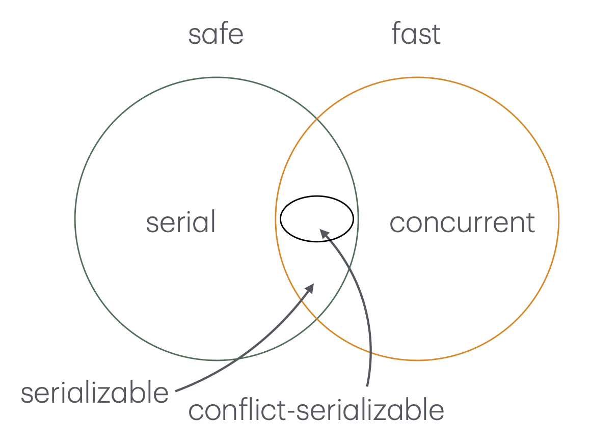
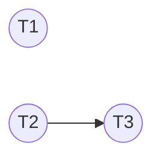
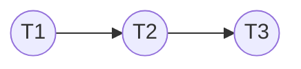
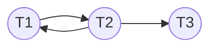

# 2025-04-29/Lecture 9: Transactions & Schedules

## Motivation: The Speed of Hard Drives

Cool animation about the parts of a hard drive: https://youtu.be/f07mLQwt-AI

The key takeaway is that there are many moving parts. It's a very *mechanical* system. There's an actuator arm, platters, write head, spindle coil, etc.

Cool animation about how magnetism is used to implement data storage: https://youtu.be/f3BNHhfTsvk

As you recall from physics, magnets have north/south polarity. 1s and 0s are *encoded* by the orientation of this polarity. Thus, you can write data by magnetizing and polarizing individual strips of metal within the hard drive.

The key point is that the magnetization is *persistent*, even when power goes out. This is why we're able to use it to implement persistent storage.

Cool video about a real, physical hard drive and its moving parts: https://youtube.com/shorts/0i1Ynk2WVGw

We see that the arm is really fast, but because it's still limited by mechanical physics, its speed just cannot compare with what happens at the CPU/memory level. This makes accessing disk inherently slower (*magnitudes* of order slower) than when operating with volatile memory.

In *general*, I/O devices (not just disk) like monitor displays, keyboard input, etc. are much slower than the CPU world. Why does this matter? Because if I/O is so slow, we don't want to stall the CPU waiting for I/O to complete. We want to be able to do meaningful work on the CPU *while* the disk arm is still slowly moving to service some I/O request. Thus, we should **keep both disk and CPU busy**.

## Transactions (Continued)

We want to keep both the disk and the CPU busy at the same time.

Consider this timeline of operations by two transactions/threads $T_1$ and $T_2$:

| $T_1$       | $T_2$       |
| ----------- | ----------- |
| x = READ(A) |             |
| x = f(x)    |             |
| WRITE(A, x) |             |
|             | y = READ(B) |
|             | y = g(y)    |
|             | WRITE(B, y) |

This is an example of a completely **serial** schedule: all of $T_1$ executes before any of $T_2$ executes. Ideally, we want to be able to **parallelize** the operations:

| $T_1$       | $T_2$       |
| ----------- | ----------- |
| x = READ(A) | y = READ(B) |
| x = f(x)    | y = g(y)    |
| WRITE(A, x) | WRITE(B, y) |

However, assume we can't do two CPU things at the same time point or two disk things at the same time. That's fine: even if it's not a perfect overlap, it can still be a significant improvement:

| $T_1$       | $T_2$       |
| ----------- | ----------- |
| x = READ(A) |             |
| x = f(x)    | y = READ(B) |
| WRITE(A, x) | y = g(y)    |
|             | WRITE(B, y) |

Notice how at each "row" (time point), both CPU and disk are busy at the same time. This is the kind of concurrency we want to maximize!

## Schedules

### Definition

Let's finally define what we mean by **schedule**:

> [!IMPORTANT]
>
> **Schedule**: a *strict* ordering of read/write actions such that:
> 1. Transactions do not interfere.
> 2. Improve concurrency.

**Strict** ordering here is in contrast to a *partial* ordering. Consider the second schedule introduced above (perfect overlap). There are multiple ways to order the read/write operations (since the same time point can have multiple), so this is an example of a partial ordering. We will ignore such cases and only focus on strict orderings.

By convention, we'll also further minify our considered timelines to only the interactions happening with the disk. That is:

- Ignore "computation" steps e.g. `x = f(x)`.
- Ignore *variables* used to store `READ()`s or call `WRITE()`s since those are also only relevant to the computation side of things.

<table>
<tr>
<th>Before</th>
<th>Ignoring</th>
<th>Henceforth</th>
</tr>
<tr>
<td>

| $T_1$       | $T_2$       |
| ----------- | ----------- |
| x = READ(A) |             |
| x = f(x)    |             |
| WRITE(A, x) |             |
|             | y = READ(B) |
|             | y = g(y)    |
|             | WRITE(B, y) |

</td>
<td>

| $T_1$           | $T_2$           |
| --------------- | --------------- |
| ~~x =~~ READ(A) |                 |
| ~~x = f(x)~~    |                 |
| WRITE(A, ~~x~~) |                 |
|                 | ~~y =~~ READ(B) |
|                 | ~~y = g(y)~~    |
|                 | WRITE(B, ~~y~~) |

</td>
<td>

| $T_1$    | $T_2$    |
| -------- | -------- |
| READ(A)  |          |
| WRITE(A) |          |
|          | READ(B)  |
|          | WRITE(B) |

</td>
</tr>
</table>

### Serial Schedules

Consider these two schedules:

<table>
<tr>
<th>Schedule 1</th>
<th>Schedule 2</th>
</tr>
<tr>
<td>

| $T_1$    | $T_2$    |
| -------- | -------- |
| READ(A)  |          |
| WRITE(A) |          |
|          | READ(B)  |
|          | WRITE(B) |

</td>
<td>

| $T_1$    | $T_2$    |
| -------- | -------- |
|          | READ(B)  |
|          | WRITE(B) |
| READ(A)  |          |
| WRITE(A) |          |

</td>
</tr>
</table>

They are both examples of **serial schedules**, like the [first schedule from earlier](#transactions-continued) because entire transactions complete before the next one can start.

> [!IMPORTANT]
>
> A **serial schedule**:
> - One transaction at a time.
> - Two serial schedules can differ!

Serial schedules are the *easiest* way to achieve isolation. If we run one transaction at a time, there's no way they can ever interfere with each other!

Note that serial schedules can still differ. Consider these examples, with variables added back in to illustrate the point:

<table>
<tr>
<th>Schedule 1</th>
<th>Schedule 2</th>
</tr>
<tr>
<td>

| $T_1$                        | $T_2$                              |
| ---------------------------- | ---------------------------------- |
| <sup><sub>A=10</sub><sup>    |                                    |
| x = READ(A)                  |                                    |
| <sup><sub>x=2x=20</sub><sup> |                                    |
| WRITE(A, x)                  |                                    |
|                              | <sup><sub>A=20</sub><sup>          |
|                              | y = READ(A)                        |
|                              | <sup><sub>y=y+2=20+2=22</sub><sup> |
|                              | WRITE(A, y)                        |
|                              | <sup><sub>A=22</sub><sup>          |

</td>
<td>

| $T_1$                              | $T_2$                              |
| ---------------------------------- | ---------------------------------- |
|                                    | <sup><sub>A=10</sub><sup>          |
|                                    | y = READ(A)                        |
|                                    | <sup><sub>y=y+2=10+2=12</sub><sup> |
|                                    | WRITE(A, y)                        |
| <sup><sub>A=12</sub><sup>          |                                    |
| x = READ(A)                        |                                    |
| <sup><sub>x=2x=2(12)=24</sub><sup> |                                    |
| WRITE(A, x)                        |                                    |
| <sup><sub>A=24</sub><sup>          |                                    |

</td>
</tr>
</table>

We see that with the same initial state `A=10`, scheduling the transactions in a different order (but still serial) results in a different final state.

However, this is not the database's problem. The database can guarantee **isolation** (recall: transactions should not interfere with each other), but it's the application programmer's responsibility to write code that produces intended effects.

## Non-Serial Schedules

Serial schedules are easy to reason about, so why don't we just use them? [As motivated](#motivation-the-speed-of-hard-drives), we want to be able to overlap computation and disk access as much as possible. One transaction at a time is *so slow*.

Compare these schedules:

<table>
<tr>
<th>Serial Schedule</th>
<th>Interleaved Schedule</th>
</tr>
<tr>
<td>

| $T_1$       | $T_2$       |
| ----------- | ----------- |
| x = READ(A) |             |
| x = 2x      |             |
| WRITE(A, x) |             |
|             | y = READ(B) |
|             | y = y + 2   |
|             | WRITE(B, y) |

</td>
<td>

| $T_1$       | $T_2$       |
| ----------- | ----------- |
| x = READ(A) |             |
| x = 2x      | y = READ(B) |
| WRITE(A, x) | y = y + 2   |
|             | WRITE(B, y) |

</td>
</tr>
</table>

In the left (serial) schedule, we have 6 "steps" but we're idling in some of them. In the right (non-serial) schedule, we exploit concurrency between the CPU and the disk by overlapping computation with read/write operations, producing a schedule that completes in only 4 "steps".

Intuitively:
- When $T_1$ is performing some computation `x = 2x`, why *shouldn't* $T_2$ start on its `READ(B)`? They're handled by separate devices (CPU vs. disk).
- When $T_2$ is performing some computation `y = y + 2`, why *shouldn't* $T_1$ start on its `WRITE(B)`? Once again, they can run concurrently.

Thus, we see the solution to slow serial schedules is to make them non-serial by *interleaving* transactions, thereby improving concurrency.

This brings us to the next problem: *how* do we do this interleaving of transactions?

> [!IMPORTANT]
>
> The key idea: We want to guarantee that the interleaved schedule has the *same result* as the serial schedule.

### Equivalent Schedules

Consider this example:

<table>
<tr>
<th>Serial Schedule</th>
<th>Interleaved Schedule</th>
</tr>
<tr>
<td>

| $T_1$       | $T_2$       |
| ----------- | ----------- |
| x = READ(A) |             |
| x = 2x      |             |
| WRITE(A, x) |             |
|             | y = READ(B) |
|             | y = y + 2   |
|             | WRITE(B, y) |

</td>
<td>

| $T_1$       | $T_2$       |
| ----------- | ----------- |
| x = READ(A) |             |
| x = 2x      | y = READ(B) |
| WRITE(A, x) | y = y + 2   |
|             | WRITE(B, y) |

</td>
</tr>
</table>

Suppose we start with initial state `A=10` and `B=22`. If we work through the variables similar to what we did [above](#serial-schedules), we'll find that the final state is the same: `A=20`, `x=20`, `y=22`, `B=22`. Thus, the two schedules are **equivalent**.

Hopefully this makes sense. By inspection, we agree that there is no way for the threads of the interleaved schedule to interfere with each other in the first place. They work with different data items (`A` vs. `B`) after all.

Now consider an example where this *isn't* the case:

**Schedule A**

| $T_1$    | $T_2$     |
| -------- | --------- |
| x = R(A) |           |
| x = 2x   |           |
| W(A, x)  |           |
|          | y = R(A)  |
|          | y = y + 2 |
|          | W(A, y)   |

Our data transforms like so: `A=10` => `x=10` => `x=20` => `A=20` => `y=20` => `y=22` => `A=22`.

**Schedule B**

| $T_1$    | $T_2$     |
| -------- | --------- |
|          | y = R(A)  |
|          | y = y + 2 |
|          | W(A, y)   |
| x = R(A) |           |
| x = 2x   |           |
| W(A, x)  |           |

Our data transforms like so: `A=10` => `y=10` => `y=12` => `A=12` => `x=12` => `x=24` => `A=24`.

Notice that at the end, `A=24`, which is different from `A=22` in Schedule A. Schedule B is *not* equivalent to Schedule A!

**Schedule C**

| $T_1$    | $T_2$     |
| -------- | --------- |
| x = R(A) |           |
| x = 2x   | y = R(A)  |
| W(A, x)  | y = y + 2 |
|          | W(A, y)   |

Our data transforms like so:

```
A=10 => x=10 => x=20 => A=20
                y=10 => y=12 => A=12
```

At the end, `A=12`. Thus, the third schedule is *not* functionally equivalent to the other two schedules either!

### Serializable Schedules

This brings us to the next concept:

> [!IMPORTANT]
>
> A **serializable schedule** is a schedule that is *equivalent* to some serial schedule.

*Equivalent* as in *functionally* equivalent (same initial state, same final state).

> [!TIP]
>
> Note that by this definition, every **serial** schedule is also **serializable** (because it's equivalent to itself, which is a serial schedule). In other words, serializability is reflexive for serial schedules.

The [first set of schedules above](#equivalent-schedules) is an example of equivalent schedules. The set after that is an example of *non-equivalent* schedules.

This brings us to the *next* problem: How do we check if a schedule is serializable? We can't just enumerate *every* possible initial state and check if the final state is equivalent.

### Conflicts

Instead, we can do something just as good. We first introduce the concept of **conflict-equivalence**, which is then used to determine [**conflict-serializability**](#conflict-serializable), which is a subset of serializability.

Firstly, what is a "conflict" anyway?

> [!IMPORTANT]
>
> Two read/write actions **conflict** if they affect each other.

What does it mean to *affect* one another?

Consider this schedule (`R()` is short for `READ()` and `W()` is short for `WRITE()`):

| $T_1$ | $T_2$ |
| ----- | ----- |
| R(A)  |       |
|       | R(B)  |
| W(A)  |       |
|       | W(B)  |

- The effects of `R(A)` and `R(B)` won't affect each other, so they don't conflict. In fact, two **reads** will never conflict with each other.
- The effects of `R(A)` and `W(B)` won't affect each other because they operate on different data items `A` and `B`.
- For the same reason, `W(A)` and `W(B)` don't conflict.
- The effects of `R(A)` and `W(A)` don't conflict because although they operate on the same data item `A`, they appear in the same transaction (order *within* a transaction is always preserved).

Now consider this schedule:

| $T_1$ | $T_2$ |
| ----- | ----- |
| R(A)  |       |
|       | R(A)  |
| W(A)  |       |
|       | W(A)  |

- `T1.R(A)` and `T2.R(A)` don't conflict because reads don't conflict.
- `T2.R(A)` and `T1.W(A)` *could* conflict. They don't in this specific schedule, but if the transactions are interleaved differently in another schedule, we'll have a problem. For example, if the write to A gets ordered *before* its read, the read will now see a different data state.

Bringing together our above findings:

> [!TIP]
>
> When *isn't* there a conflict?
> - *Reads* never conflict with each other.
> - Operations on *different* data items never conflict with each other.
> - Operations within the *same* transaction never conflict with each other.

> [!IMPORTANT]
>
> When *is* there a conflict?
> - `R1(x)`, `W2(x)`
> - `W1(x)`, `R2(x)`
> - `W1(x)`, `W2(x)`
>
> Where the number denotes some transaction index. That is, these three conditions must all hold for some pair of operations:
> 1. At least one of them must be a write `W()`.
> 2. They must be operating on the same data item `x`.
> 3. They must be from different transactions/threads.

You'll find these conditions useful [later](#precedence-graph) when working out if a schedule is [conflict-serializable](#conflict-serializable).

### Conflict-Equivalence

Finally, we're ready to define **conflict-equivalence**:

> [!IMPORTANT]
>
> Two schedules are **conflict-equivalent** if we can swap non-conflicting operations with each other until one schedule is exactly equal to the other.

Consider this example:

<table>
<tr>
<th>Schedule A</th>
<th>Schedule B</th>
</tr>
<tr>
<td>

| $T_1$ | $T_2$ |
| ----- | ----- |
| R(A)  |       |
| W(A)  |       |
|       | R(B)  |
|       | W(B)  |

</td>
<td>

| $T_1$ | $T_2$ |
| ----- | ----- |
| R(A)  |       |
|       | R(B)  |
| W(A)  |       |
|       | W(B)  |

</td>
</tr>
</table>

Are `T2.R(B)` and `T1.W(A)` in conflict? No, they operate on different tables. Thus, we can swap their time points:

| $T_1$ | $T_2$ |
| ----- | ----- |
| R(A)  |       |
| W(A)  |       |
|       | R(B)  |
|       | W(B)  |

Notice that this is now **equivalent** to the first schedule, so we say that the two schedules are **conflict-equivalent**.

### Conflict-Serializable

What's so good about being **conflict-equivalent**?

> [!IMPORTANT]
>
> A schedule is **conflict-serializable** if it is **conflict-equivalent** to a **serial** schedule.

[Oh yeah, it's all coming together.](https://www.youtube.com/watch?v=QyrDgEz3DR0)

Revisit this same example from [above](#conflict-equivalence):

<table>
<tr>
<th>Schedule A</th>
<th>Schedule B</th>
</tr>
<tr>
<td>

| $T_1$ | $T_2$ |
| ----- | ----- |
| R(A)  |       |
| W(A)  |       |
|       | R(B)  |
|       | W(B)  |

</td>
<td>

| $T_1$ | $T_2$ |
| ----- | ----- |
| R(A)  |       |
|       | R(B)  |
| W(A)  |       |
|       | W(B)  |

</td>
</tr>
</table>

We demonstrated before that Schedule 2 is conflict-equivalent to Schedule 1. Since Schedule 1 is serial, we say that Schedule 2 is **conflict-serializable**.

Now consider this example:

<table>
<tr>
<th>Serial Schedule</th>
<th>Schedule to Swap</th>
</tr>
<tr>
<td>

| $T_1$ | $T_2$ |
| ----- | ----- |
| R(A)  |       |
| W(A)  |       |
|       | R(A)  |
|       | W(A)  |

</td>
<td>

| $T_1$ | $T_2$ |
| ----- | ----- |
| R(A)  |       |
|       | R(A)  |
| W(A)  |       |
|       | W(A)  |

</td>
</tr>
</table>

Are `T2.R(A)` and `T1.W(A)` in conflict? Yes, we have a read and write to the same table A across different threads. Thus, we cannot swap them. But we can still try swapping it into a *different* serial schedule. The only other possible serial schedule is:

<table>
<tr>
<th>Another Serial Schedule</th>
<th>Schedule to Swap</th>
</tr>
<tr>
<td>

| T1   | T2   |
| ---- | ---- |
|      | R(A) |
|      | W(A) |
| R(A) |      |
| W(A) |      |

</td>
<td>

| T1   | T2   |
| ---- | ---- |
| R(A) |      |
|      | R(A) |
| W(A) |      |
|      | W(A) |

</td>
</tr>
</table>

But `T1.W(A)` and `T2.W(A)` are also in conflict with each other, so we cannot swap it into this serial schedule either.

Because this schedule is not conflict-equivalent to *any* serial schedule, the schedule is *not* conflict-serializable.

### Summary

We have this relationship between serial and non-serial (concurrent) scheduling:



Recall:

> > [!IMPORTANT]
> >
> > A schedule is **conflict-serializable** if it is conflict-equivalent to a serial schedule.

Conflict-serializable schedules are a subset of **serializable** schedules:

> [!IMPORTANT]
>
> A schedule is **serializable** if it is equivalent to a serial one.

### Quiz Scores (Continued)

Remember the quiz score Google Sheets exercise from last lecture? This time, everyone is given editor access to the spreadsheet. Everyone is told to increase their score (and "their crush's" 😉) score.

Remy then revokes access to everyone but a chosen volunteer. The volunteer was given secret instructions: just give everyone zero. They then dutifully go through every row and set everything to 0.

You can think of this scenario as a schedule like this:

| $T_1$    | $T_2$    | ... | $T_j$   |
| -------- | -------- | --- | ------- |
| x = R(A) |          | ... |         |
|          | y = R(A) | ... |         |
|          | W(A, y)  | ... |         |
| W(A, x)  |          | ... |         |
|          |          | ... | W(A, 0) |

The volunteer is $T_j$. No matter what schedule you have for $T_1, T_2, ... T_{j-1}$, as long as we schedule $T_j$ "last", the end effect is that the whole table is zeroed out.

This schedule is technically serializable! You can create a serial schedule $T_1 \to T_2 \to T_3$ etc. (or any other order) and it'll still be equivalent because the $T_j$ transaction will write everything to be 0 anyway.

This just illustrates an example of a serializable schedule you might not have thought of.

### Precedence Graph

So we want to check if a schedule is **conflict-serializable**. We can systematically check this using a **precedence graph**.

Our graph formulation is as follows:

- Nodes: transactions
- Edges: conflicts (between transactions)

Let $R_i(x)$ denote a read on table $x$ from transaction $i$ and $W_j(x)$ denote a write to table $x$ from transaction $j$. Suppose we have this collection of read/write actions from several transactions:

$$R_2(A), R_1(B), W_2(A), R_3(A), W_1(B), W_3(A), R_2(B), W_2(B)$$

> [!NOTE]
>
> We can always write out the actions among different threads in some strict linear order (remember we're only dealing with [strict orderings](#schedules)).

There are 3 transactions here, so we have 3 nodes:


We'll add a directed edge between two nodes if their corresponding transactions have a conflict.

1. Start with $R_2(A), R_2(B)$. This is not a conflict. Nothing to do yet.
2. Then consider $R_2(A), W_2(A)$. This isn't a conflict either because it's in the same transaction (remember transactions run in order within themselves).
3. Then consider $R_2(A), R_3(A)$. This isn't a conflict because two reads cannot conflict with each other.
4. Then consider $R_2(A), W_1(B)$. No conflict.
5. Then consider $R_2(A), W_2(A)$. Finally, a conflict (same data item, different threads). We add a directed edge with source at the first action and destination at the second action:



Notice that working through this naively would require a quadratic amount of comparisons (for each action, check if there's a conflict with any of the other subsequent actions).

If we dutifully work through the rest of the pairs:

- $R_1(B), W_2(B)$ is a conflict. We add an edge from $T_1$ to $T_2$.
- $W_2(A), W_3(A)$ is a conflict. We *could* add another edge from $T_2$ to $T_3$, but for the purposes demonstrated later, we can de-duplicate edges. Nothing to do here.

This is the final precedence graph:



How do we express this process as an (efficient) algorithm? We keep in mind [the conditions for a conflict](#conflicts) and filter out non-conflicting pairs first, which can be easily done by inspection:

> [!IMPORTANT]
>
> Building the **precedence graph**: consider all (ordered) pairs and:
> 1. Filter out pairs from the same transaction.
> 2. Filter for pairs that operate on the same data item.
> 3. Filter for pairs that have at least one write.
> 4. Then add edges for remaining pairs.

**ASIDE:** You might observe that this can even be modeled as a constraint satisfaction (SAT) problem!

Why do we care about the precedence graph?

> [!IMPORTANT]
>
> **THEOREM:** A schedule is **conflict-serializable** iff the precedence graph has no cycle.

Consider the $R_1(B), W_2(B)$ conflict (edge from $T_1$ to $T_2$). Intuitively, it means that no matter how we serially schedule the actions, $R_1(B)$ *must* happen before $W_2(B)$.

Similarly, for the $W_2(A), W_3(A)$ conflict (edge from $T_2$ to $T_3$). No matter how we serially schedule the actions, $W_2(A)$ *must* happen before $W_3(A)$.

What this graph is telling us is that in the serial schedule, it must be that $T_1 \to T_2 \to T_3$.

### SQL Challenge: Precedence Graph

How do we model a schedule and get its precedence graph using SQL?

Once again, draw from [the conditions above](#conflicts). First set up our "schedule" model:

```sh
sqlite3
```
```sql
CREATE TABLE schedule (
  op TEXT,
  txn INT,
  loc TEXT
);
```

Getting a precedence order can be done with this query:

```sql
SELECT *
FROM schedule AS s1, schedule AS s2
WHERE s1.loc = s2.loc -- Only conflict when accessing same data item.
  AND s1.txn <> s2.txn -- Within same transaction is NOT conflict.
  AND (s1.op="w" OR s2.op="w"); -- Must have at least one write.
```

### Precedence Graph: Cyclic Example

Consider these actions:

$$R_2(A), R_1(B), W_2(A), R_2(B), R_3(A), W_1(B), W_3(A), W_2(B)$$

First identify all the conflicting pairs:

- $R_1(B), W_2(B)$
- $R_2(A), W_3(A)$ AND $W_2(A), R_3(A)$
- $R_2(B), W_1(B)$

Now we add the edges:



Notice that this precedence graph now has a cycle in it. This means that this schedule is NOT conflict-serializable. It is *impossible* to swap actions within the schedule to be conflict-equivalent with a serial schedule.

Intuitively, this graph is telling us:
- $R1(B)$ must occur before $W_2(B)$, but:
- $R_2(B)$ must occur before $W_1(B)$.

This means that in a serial schedule, $T_1$ must occur before $T_2$, but $T_2$ must also occur before $T_1$. Impossible!

### Summary v2

1. Motivation: we want to see if a schedule is [**serializable**](#serializable-schedules).
2. To make a serializable schedule, we find a [**conflict-serializable**](#conflict-serializable) one.
3. To find a conflict-serializable schedule, we use the [**precedence graph**](#precedence-graph).

## Locking

To ensure serializability, we use **locks**.

Each transaction locks the entire database (for now). The user that starts the transaction holds the lock, so only they're allowed to perform actions.

Example timeline:

| $T_1$  | $T_2$  |
| ------ | ------ |
| Lock   |        |
| R(A)   |        |
| W(A)   |        |
| Unlock |        |
|        | Lock   |
|        | R(B)   |
|        | W(B)   |
|        | Unlock |

This is what SQLite does. Kinda.

To be a bit more efficient, SQLite actually separates a read and write lock. The write lock is *exclusive*, but the read lock is *shared*. You can also think of it like a two-level lock. Only the user with the write lock can write to the database, but anyone with the read lock can read from the database. If you want to write to the database, you need to request to upgrade your lock to the write lock (and you would have to wait for the current write lock holder to finish doing what they were doing).

We saw this with the Alice and Bob example from last lecture notes! Alice could still read even while Bob's transaction was active.

An example timeline of this more granular locking mechanism:

| $T_1$      | $T_2$     |
| ---------- | --------- |
| Read Lock  |           |
| R(A)       | Read Lock |
|            | R(B)      |
|            | Unlock    |
| Write Lock |           |
| W(A)       |           |
| Unlock     |           |

Another example as illustrated with SQLite commands in two different sessions:

<table>
<tr>
<td>

```console
sqlite> BEGIN TRANSACTION;
sqlite> # Lazily acquire read lock:
sqlite> SELECT * FROM r;
1
2
3
4
4
sqlite> # Request to upgrade to write lock:
sqlite> INSERT INTO r VALUES(5);
sqlite> SELECT * FROM r;
1
2
3
4
4
5
sqlite> END; # Other guy still has lock.
Runtime error: database is locked (5)
sqlite> END; # Now we can materialize writes.
```

</td>
<td>

```console
sqlite> # While other guy has write lock:
sqlite> INSERT INTO r VALUES (5);
Runtime error: database is locked (5)
sqlite> # Write from other TX not materialized yet:
sqlite> SELECT * FROM r; (isolation)
1
2
3
4
4
sqlite> END; # So other guy can end.
sqlite> # Now we see the effects of TX:
sqlite> SELECT * FROM r;
1
2
3
4
4
5
```

</td>
</tr>
</table>

This is an introduction to more advanced locking schemes than just "lock the whole database". We'll continue to work with more finer grained locking models in future lectures.

> [!NOTE]
>
> From [the documentation](https://www.sqlite.org/isolation.html):
>
> > Transactions in SQLite are SERIALIZABLE.
