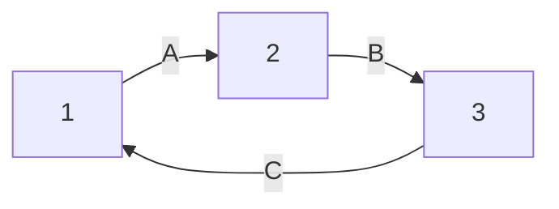
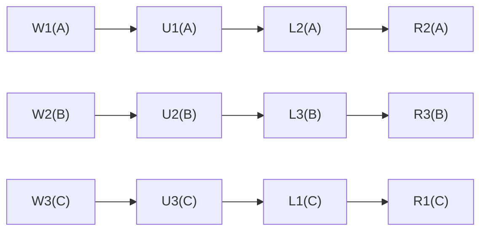
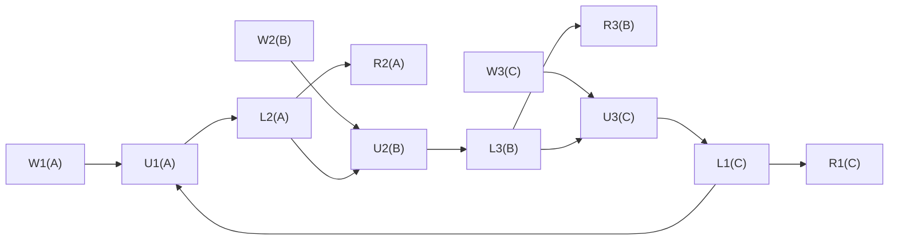
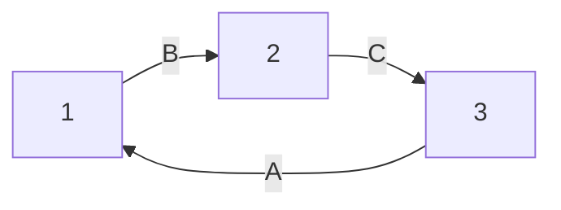

# 2025-05-01/Lecture 10: Transaction Locks

## Scheduling (Continued)

### Review

Last lecture, we stepped through many new terms & concepts to motivate and ultimately introduce a way to check if schedules may be problematic:

1. A **transaction** is a sequence of reads and writes.
2. We want our database to guarantee **isolation**, which states that two transactions must not interfere.
3. A **schedule** is a way to arrange a sequence of operations within transactions, possibly interleaving the different transaction threads.
4. A **serial schedule** is a schedule where we execute each transaction from start to finish before moving on to the next transaction.
5. A **serializable schedule** is a schedule that's **equivalent** to some serial schedule.
   - **Equivalent** means to be functionally equivalent (same initial state results in same final state).
6. A **conflict-serializable schedule** is a schedule that is **conflict-equivalent** to a serial schedule.
   - A pair of operations is in **conflict** if they're from different transactions acting on the same data item and at least one of them is a write (so correctness of the stored value may be jeopardized depending on scheduled order).
   - **Conflict-equivalent** means we can swap non-conflicting operations with each other until one schedule is exactly equal to the other.
   - Conflict-serializable is a subset of serializable.
7. We can use a **precedence graph** to systematically check *if* a given schedule is conflict-serializable and thus serializable. If the graph is acyclic, the schedule is conflict-serializable.

> [!NOTE]
>
> Up until now, we were just *given* the schedules and asked to reason about if they were serializable/conflict-serializable. How do we *get* schedules in the first place?
>
> The database may use **deterministic schedule**, where it collects a batch of transactions and *computes* a serializable schedule.

## Locking (Continued)

Last lecture we introduced **locking**, where transactions "lock" and "unlock" database items (specific entries within a database) to acquire and release some form of exclusive control over them.

Specifically, we looked at how locking is used to enforce a serial schedule. To do so, we lock the entire database each time. This is simple and guarantees correctness.

| $T_1$ | $T_2$ |
| ----- | ----- |
| L(DB) |       |
| ...   |       |
| U(DB) |       |
|       | L(DB) |
|       | ...   |
|       | U(DB) |

We'll use `L()` to represent locking and `U()` to represent unlocking.

Another idea is to "only lock what you need". The `L()` and `U()` act only on the data items they need. However, consider this example from the slides:

| $T_1$                       | $T_2$                     |
| --------------------------- | ------------------------- |
| L(A), x = R(A)              |                           |
| <sup><sub>x=x+10</sub><sup> |                           |
| W(A, x), U(A)               |                           |
|                             | L(A), y = R(A)            |
|                             | <sup><sub>y=2y</sub><sup> |
|                             | W(A, y), U(A)             |
|                             | L(B), y = r(B)            |
|                             | <sup><sub>y=2y</sub><sup> |
|                             | W(B, y), U(B)             |
| L(B), x = R(B)              |                           |
| <sup><sub>x=x+10</sub><sup> |                           |
| W(B, x), U(B)               |                           |

> [!NOTE]
>
> The convention where we write pairs of operations in the same cell is just to compact the schedule and save space. For example, `L(A), x = R(A)`, just means `L(A)` and then `x = R(A)` directy after. That is, it's the same as if we had written `L(A)` in one cell and then `x = R(A)` in another cell directly below it.

Focus on *within* each column first. Notice that they're both doing the same thing (just with different private variables name `x` and `y`):

1. Lock A, load A into var
2. ... do something with var ...
3. Write var to A, unlock A
4. Lock B, load B into var
5. ... do something with var ...
6. Write var to B, unlock B

That is, if `A` and `B` are the same in the initial state (say, `A=B=10`), an **invariant** that should hold is that `A=B` in the final state too, no matter what that intermediate computation was (because it was the same operation on both `A` and `B`'s data). But if we trace through it:

| $T_1$                           | $T_2$                           |
| ------------------------------- | ------------------------------- |
| <sup><sub>A=B=10</sub><sup>     |                                 |
| L(A), x = R(A)                  |                                 |
| <sup><sub>x=x+10</sub><sup>     |                                 |
| W(A, x), U(A)                   |                                 |
| <sup><sub>A=10, B=20</sub><sup> |                                 |
|                                 | L(A), y = R(A)                  |
|                                 | <sup><sub>y=2y</sub><sup>       |
|                                 | W(A, y), U(A)                   |
|                                 | <sup><sub>A=40, B=10</sub><sup> |
|                                 | L(B), y = r(B)                  |
|                                 | <sup><sub>y=2y</sub><sup>       |
|                                 | W(B, y), U(B)                   |
|                                 | <sup><sub>A=40, B=20</sub><sup> |
| L(B), x = R(B)                  |                                 |
| <sup><sub>x=x+10</sub><sup>     |                                 |
| W(B, x), U(B)                   |                                 |
| <sup><sub>A=40, B=30</sub><sup> |                                 |

<!-- ```
A = B = 10
x = x + 10
A = 10, B = 20
          y = 2y
          A = 40, B = 10
          y = 2y
          A = 40, B = 20
x = x + 10
A = 40, B = 30
``` -->

We see that `A=40` and `B=30`, so the invariant of `A=B` is broken. There must have been cross-transaction interference, so this schedule does *not* uphold isolation.

> [!IMPORTANT]
>
> We see that locking and unlocking per-item ("locking only what you need") doesn't actually guarantee isolation.

On the other hand, "locking *all* you need":

| $T_1$          | $T_2$          |
| -------------- | -------------- |
| **L(A), L(B)** |                |
| R(A), W(A)     |                |
| R(B), W(B)     |                |
| **U(A), U(B)** |                |
|                | **L(A), L(B)** |
|                | R(A), W(A)     |
|                | R(B), W(B)     |
|                | **U(A), U(B)** |

This is guaranteed to achieve **isolation**. The intuitive "proof" is that because a transaction holds all locks, no one can possibly interfere, so isolation is by definition upheld.

<!-- ### ASIDE: Locking Whole Database != Serial Schedule

I'm not sure what this segment was for.

**QUESTION:** Isn't this the same as a serial schedule? No.

| $T_1$      | $T_2$      |
| ---------- | ---------- |
| L(A), L(B) |            |
| R(A), W(A) |            |
| R(B), W(B) |            |
| U(A), U(B) |            |
|            | L(B)       |
|            | R(B), W(B) |
|            | U(B)       |

The actions of $T_2$ don't conflict with $T_1$, so we could've rescheduled to do something like (ignoring locks for now?):

| $T_1$      | $T_2$      |
| ---------- | ---------- |
| R(A); W(A) |            |
|            | R(B); W(B) |
| R(B); W(B) |            |

This is conflict-serializable! Which serial schedule is this conflict-equivalent to?

R(A); W(A) and R(B); W(B) are not in conflict, so we can swap them (TODO: the convention where we write pairs of instruction in the same cell is just to make it most compact):

| $T_1$      | $T_2$      |
| ---------- | ---------- |
|            | R(B); W(B) |
| R(A); W(A) |            |
| R(B); W(B) |            |

This is now a serial schedule since all of $T_2$ runs before all of $T_1$. -->

## Two-Phase Locking (2PL)

Locking the entire database is inefficient, and locking per-item without any other constraints does not guarantee correctness. **two-phase locking (2PL)** is like a middle ground that actual databases used. The core idea is:

> [!IMPORTANT]
>
> In **two-phase locking (2PL)**, within any transaction, all locks happen before any unlocks happen.

This allow us to interleave locking/unlocking *with* reads/writes:

| $T_1$                      | $T_2$                          |
| -------------------------- | ------------------------------ |
| **L(A)**, x = R(A)         |                                |
| x = f(x)                   | **L(B)**, R(B), W(B), **U(B)** |
| W(A), **L(B)**, R(B), W(B) |                                |
| **U(A)**, **U(B)**         |                                |

1. $T_1$ first locks A and then does something with it.
2. $T_2$ locks B (which is OK because $T_1$ isn't using it right now) and does something with it.
3. $T_2$ unlocks B when it's done. Before that, $T_1$ was working on some computation $f(x)$ anyway, so $T_1$ didn't have to idle.
4. $T_1$ now wants to work on B, so it locks it (which is OK because $T_2$ is done with it) and does something with it.
5. Finally, $T_1$ unlocks both its A & B locks.

$T_1$ could've also unlocked A earlier (it didn't need to wait until the end since it already finished working on A):

| $T_1$                | $T_2$                  |
| -------------------- | ---------------------- |
| L(A), x = R(A)       |                        |
| x = f(x)             | L(B), R(B), W(B), U(B) |
| W(A), L(B), **U(A)** |                        |
| **R(B), W(B)**, U(B) |                        |

Just note that `U(A)` has to come after `L(B)` by the definition of 2PL (all locks before unlocks).

Nonetheless, this demonstrates that 2PL still allows you to unlock first and continue working on other tables. Reasonable flexibility, more interleaving.

### 2PL Guarantees Conflict-Serializable

Why is 2PL useful? Remember that we're interested in a locking scheme that's more efficient that locking *everything*, but also still *correct* unlike locking *per-item*.

> [!IMPORTANT]
>
> **THEOREM:** 2PL produces conflict-serializable schedules.

We can prove this by contradiction.

Recall that in a conflict-serializable schedule, its corresponding precedence graph is *acyclic*. Thus, let's assume there *is* a cycle in the precedence graph.

Let $i \to^X j$ denote a directed edge between transactions $i$ and $j$ in the precedence graph, where they conflict with respect to data item $X$. Let $L_i(X)$ denote transaction $i$ locking data item $X$ and similarly $U_j(X)$ denote transaction $j$ unlocking data item $X$.

We will use this lemma:

>  An edge $i \to^X j$ in the graph means we'll see this pattern in the schedule: $U_i(X), ..., L_j(X)$.

Hopefully this makes sense. The directed edge says that transaction $i$ must occur before transaction $j$. In order for $j$ to operate on $X$, it must acquire its lock $L(X)$, which can only happen if the previous lock holder $i$ unlocked it i.e. $U(X)$.

WLOG, consider this cyclic precedence graph with 3 transactions:



WLOG (just to put an example to it), suppose $1 \to^A 2$ was due to some conflict:

$$\ldots, W_1(A), \ldots, R_2(A), \ldots$$

We claim by lemma that this means the schedule must include this sub-sequence:

$$W_1(A), \ldots, U_1(A), \ldots, L_2(A), \ldots R_2(A)$$

Why? The $L()$ is because whenever we act on a data item like $A$, we must lock before it. And because we operated on $A$ earlier, there *must* have been an unlock $U()$ between the $W_1(A)$ and $L_2(A)$.

Similarly, using the other edges in the precedence graph, assuming similar conflicts, we know somewhere in this schedule we have these subsequences:

<!-- ```
... W1(A) ... U1(A) ... L2(A) ... R2(A) ...
... W2(B) ... U2(B) ... L3(B) ... R3(B) ...
... W3(C) ... U3(C) ... L1(C) ... R1(C) ...
``` -->



Because of 2PL, $L_2(A)$ has to happen before $U_2(B)$. This is because they are from the same transaction (transaction 2), and within any transaction, all locks happen before any unlock.

Similarly, $L_3(B)$ has to happen before $U_3(C)$. Similarly, $L_1(C)$ has to happen before $U_1(A)$.



Notice that if we chain together $L_2(A)$ before $U_2(B)$, $L_3(B)$ before $U_3(C)$, and then $L_1(C)$ before $U_1(A)$: the schedule now has a cycle! A schedule is a **sequence** of instructions. It *cannot* have a cycle.

Because this is impossible, the assumption must be incorrect. 2PL *does* produce schedules with acyclic precedence graphs, meaning 2PL produces conflict-serializable schedules. $\blacksquare$

## Rollbacks

> [!IMPORTANT]
>
> A **rollback** undoes an entire transaction and aborts affected transactions.

Does a rollback work with [2PL](#two-phase-locking-2pl)? Consider this example:

| $T_1$                       | $T_2$                       |
| --------------------------- | --------------------------- |
| L(A), x = R(A)              |                             |
| <sup><sub>x = 2x</sub><sup> |                             |
| W(A, x), U(A)               |                             |
|                             | L(A), y = R(A)              |
|                             | <sup><sub>y = 2y</sub><sup> |
|                             | W(A, y), U(A)               |
|                             | COMMIT                      |
| ROLLBACK                    |                             |

First convince yourself that it's 2PL. Within each transaction, all locks happen before unlocks, so this schedule does uphold 2PL.

Consider this trace, with initial state `A=10`:

| $T_1$                            | $T_2$                            |
| -------------------------------- | -------------------------------- |
| <sup><sub>A=10</sub><sup>        |                                  |
| L(A), x = R(A)                   |                                  |
| <sup><sub>x = 2x = 20</sub><sup> |                                  |
| W(A, x), U(A)                    |                                  |
| <sup><sub>A=20</sub><sup>        | <sup><sub>A=20</sub><sup>        |
|                                  | L(A), y = R(A)                   |
|                                  | <sup><sub>y = 2y = 40</sub><sup> |
|                                  | W(A, y), U(A)                    |
|                                  | <sup><sub>A=40</sub><sup>        |
|                                  | COMMIT                           |
| ROLLBACK                         |                                  |

<!-- ```
A =10 => x=2x => A=20
              => A=20 => y=2y => A=40
``` -->

Notice that because $T_2$ is interleaved into $T_1$, $T_1$'s changes can propagate to $T_2$ before $T_1$ rolls back. If we rollback, we would expect to see `A=10` in both $T_1$ and $T_2$, but $T_2$ saw $T_1$'s intermediate change of `A=20`, ultimately committing the wrong value back to `A`.

2PL alone doesn't prevent this. This problem happens because we're allowed to `U(A)` before `ROLLBACK`, allowing $T_2$ to read from the updated `A` before the rollback happens.

## Strict 2PL

This motivates a *stricter* version of 2PL.

> [!IMPORTANT]
>
> **Strict 2PL** is 2PL but transactions can only unlock exactly at commit/rollback (i.e. at the very end of the transaction).

Recall that 2PL lets you unlock *whenever* you want, just as long as it's after locks. You can even do it in multiple steps like we saw in an [earlier example](#two-phase-locking-2pl). **Strict 2PL** forces you to only unlock (and unlock *all* locks) exactly at commit/rollback.

The [problematic rollback example above](#rollbacks) can be fixed to use strict 2PL:

| $T_1$                       | $T_2$                       |
| --------------------------- | --------------------------- |
| L(A), x = R(A)              |                             |
| <sup><sub>x = 2x</sub><sup> |                             |
| W(A, x), U(A)               |                             |
| ROLLBACK                    |                             |
|                             | L(A), y = R(A)              |
|                             | <sup><sub>y = 2y</sub><sup> |
|                             | W(A, y), U(A)               |
|                             | COMMIT                      |

$T_2$ has to wait for the unlock on A, which now happens at exactly the rollback. There is no more chance for $T_1$ to "leak visibility" into $T_2$ before the rollback completes. Thus:

> [!IMPORTANT]
>
> Strict 2PL guarantees:
> - **Isolation**: conflict-serializability
> - **Atomicity**: rolled back transactions are undone completely, without leaving any side effects from their intermediate operations, as if they never happened in the first place.

Sounds perfect right? There's still a very dangerous problem though: [**deadlock**](#deadlock).

## Deadlock

Consider this example (the operations in the header row represent what that corresponding transaction $T_i$ *wants* to do):

| $T_1$: W(A), W(B) | $T_2$: W(B), W(C) | $T_3$: W(C), W(A) |
| ----------------- | ----------------- | ----------------- |
| L(A), W(A)        |                   |                   |
|                   | L(B), W(B)        |                   |
|                   |                   | L(C), W(C)        |
| **L(B)**          | **L(C)**          | **L(A)**          |

$T_1$ wants to write to $B$, so it requests $L(B)$, which is held by $T_2$. But by 2PL, $T_2$ cannot unlock until it's done locking, and $T_2$ still needs to request $L(C)$, which is held by $T_3$. Once again, by 2PL, $T_3$ cannot unlock until it's done locking, and $T_3$ still needs to request $L(A)$, which is held by $T_1$!

Because of this circular dependency where everyone's waiting on something before providing that very something needed by others, none of the transactions can make any progress. This is **deadlock**.

> [!IMPORTANT]
>
> **Deadlock** is when transactions cannot make progress because none of them can acquire the lock they need to proceed.

### Checking for Deadlock

In the explanation of [the example above](#deadlock), we note that deadlock happens due to some circular dependency problem. Similar to how we used **precedence graphs** to check for cyclic scheduling dependencies, we can construct a **wait-for graph** to check for lock request dependencies.

> [!IMPORTANT]
>
> Checking for deadlock is a matter of checking if the **wait-for graph** has a cycle.

In the above example:

| $T_1$: W(A), W(B) | $T_2$: W(B), W(C) | T3: W(C), W(A) |
| ----------------- | ----------------- | -------------- |
| L(A), W(A)        |                   |                |
|                   | L(B), W(B)        |                |
|                   |                   | L(C), W(C)     |
| **L(B)**          | **L(C)**          | **L(A)**       |

The **wait-for graph** would look like this, where a directed edge $i \to^X j$ means "  $i$ requests the lock $L(X)$ from $j$ ":



As expected, there is a cycle, so this schedule can deadlock.

### Resolving Deadlock

> [!IMPORTANT]
>
> If a deadlock does happen: [rollback](#rollbacks) a transaction to *break the cycle*, allowing the transactions to make progress again.

For the above example, we could rollback $T_3$ to break the cycle:

| $T_1$      | $T_2$      | T3                 |
| ---------- | ---------- | ------------------ |
| W(A); W(B) | W(B); W(C) | W(C); W(A)         |
| L(A); W(A) |            |                    |
|            | L(B); W(B) |                    |
|            |            | L(C); W(C)         |
| **L(B)**   | **L(C)**   | **ROLLBACK, U(C)** |

The (now acyclic) wait-for graph now looks like:


Deadlock is stopped and the transactions can now make progress:

| $T_1$                 | $T_2$                 | T3                 |
| --------------------- | --------------------- | ------------------ |
| W(A); W(B)            | W(B); W(C)            | W(C); W(A)         |
| L(A); W(A)            |                       |                    |
|                       | L(B), W(B)            |                    |
|                       |                       | L(C); W(C)         |
|                       |                       | **ROLLBACK; U(C)** |
|                       | **L(C); W(C), U(\*)** |                    |
| **L(B); W(B); U(\*)** |                       |

## Review (Extended)

Following [the previous topic list](#review), we now have new concepts on our roadmap:

1. ... previous topics ...
2. **Conflict-serializable schedules** are conflict-equivalent to serial schedules.
3. **Strict 2PL** is a locking scheme that guarantees conflict-serializable and recoverable (atomically) schedules.
4. **Deadlock** can still occur with strict 2PL, but if it does, simply abort (rollback) and retry.
   1. We can use a **wait-for graph** to analyze if a deadlock can happen given a particular schedule.

However, strict 2PL is still expensive. We can do even better with [other locking schemes](#sharedexclusive-locks).

## Shared/Exclusive Locks

> [!IMPORTANT]
>
> **Exclusive locks $X(\cdot)$** allow both reads and writes, and only one may exist at a time.
>
> **Shared locks $S(\cdot)$** allow reads only, and they may exist with other $S$ locks.

Consider this schedule:

| $T_1$: R(A), W(A) | $T_2$: R(A)  |
| ----------------- | ------------ |
| S(A), R(A)        |              |
|                   | S(A), R(A)   |
| ~~X(A), W(A)~~    |              |
|                   | COMMIT, U(A) |
| X(A), X(A)        |              |

1. $T_1$ acquires the shared lock $S(A)$.
2. $T_2$ also acquires the shared lock $S(A)$, which is fine because the shared lock can have multiple holders, and $T_1$ and $T_2$ only need to read from $A$ so far anyway.
3. $T_1$ wants to write to A, so it tries to upgrade its lock to the exclusive lock $X(A)$. However, it cannot do so because another lock for A exists, the $S(A)$ lock held by $T_2$.
4. $T_2$ commits and releases its shared lock.
5. Because no other locks exist for $A$ anymore, $T_1$ is now allowed to upgrade its $S(A)$ to $X(A)$ and perform writes to $A$.

With shared and exclusive locks, we increase the amount of interleaving allowed and thus improve potential overlap among transactions and therefore improve efficiency.

However, like with everything before it, a new solution means a new problem: [**starvation**](#starvation).

### Starvation

When walking through the [above example](#sharedexclusive-locks), focus on step 3 where $T_1$ was denied $X(A)$ due to $T_2$ still holding onto $S(A)$. Hopefully this motivates a broader issue: what if $T_1$ were *continuously* denied the exclusive lock? It would never be able to process its write request:

| $T_1$: W(A) | $T_2$: R(A) | T3: R(A) | T4: R(A) | T5: R(A) | ... |
| ----------- | ----------- | -------- | -------- | -------- | --- |
| ~~X(A)~~    | S(A)        |          |          |          |     |
| ~~X(A)~~    |             | S(A)     |          |          |     |
| ~~X(A)~~    |             |          | S(A)     |          |     |
| ~~X(A)~~    |             |          |          | S(A)     |     |
| 💀           |             |          |          |          | ... |

> [!IMPORTANT]
>
> **Starvation** is when a transaction waits for a lock but never gets it. This happens because an exclusive lock can be continuously denied because of existing shared locks.

A solution is to "lock the locks". While an $X$ lock is waiting, block any new $S$ lock requests. That way, the $X$ lock gets its turn in a (likely) timely fashion, after currently active $S$ locks unlock.

Note that starvation is *not* the same as [deadlock](#deadlock). When deadlock happens, all parties involved cannot make any progress (really bad). When starvation happens, just one or a few of the involved transactions cannot make any progress (still bad, but not as bad). **S/X** locks can also *cause* deadlocks.
