# 2025-05-13/Lecture 13: Hashing, Merge Sort, and Graphs

## Hashing (Continued)

### Using Hashing for Joins (Hashjoins)

Suppose we have these relations and a functional dependency (FD):

$$R(x, y), S(y, z)$$
$$y \to z$$

We're interested in performing a join query $R \bowtie_{R.y=S.y} S$. Last lecture we saw that when we have an FD, we can leverage a **hashmap** to eliminate one layer of looping. As a review, *which* attribute should we use as the key for a hashmap in this example?

<details>
<summary>Expand for answer.</summary>

`y`, since it's the one doing the functional determining.

</details>

Thus, we prepare a hash table $H_S: y \to z$. That is, the mapping stores every instantiation of $S.y$ and its associated instantiation of $S.z$. The loop semantics of the join query would look something like:

```python
# Prepare H_S beforehand...
H_S = {}
for s in S:
    H_S[s.y] = s.z

# The join query...
for r in R:
    z = H_S[r.y]
    print(r.x, r.y, z)
```

Now suppose there is *no* FD that holds. We can no longer use the hash table $H_S: y \to z$. However, we can use $H_S: y \to [z]$, where $[z]$ denotes some vector of instantiations of $z$. That is, there can be multiple $z$ associated with each $y$ (i.e. what it means to *not* be a functional dependency). $H_S$ would be initialized like so:

```python
H_S = {}
for s in S:
    if s.y not in H:
        H_S[s.y] = []
    H_S[s.y].append(s.z)
```

Now the query from before has the form:

```python
for r in R:
    # The vector of z's this y value maps to.
    z_S = H_S[r.y]
    # Since there can be an arbitrary number of z's, we loop over
    # them and output a record for each one (representing each pair
    # of joined rows):
    for z in z_S:
        print(r.x, r.y, z)
```

Note that the values of $y$ and $z$ could be multi-dimensional (i.e. have multiple columns, and hence why I used the term *instantiations* earlier instead of just *values*). The algorithm stays the same though (we just treat each $y$ or $z$ as a *tuple* of values, which can be used on either the key or value side of a hashmap).

### Using Hashing for Group By

Hashing isn't just useful for joins though. Suppose we have this SQL query (from Quiz 10):

```sql
SELECT SUM(z + w) FROM R
GROUP BY x, y;
```

How can we use a hashmap to assist us with this query? We want to group by `x` and `y`. That is, we want to compute kind of sum *associated* with each instantiation of `(x, y)`.

Thus, we'll use `x` and `y` jointly as the keys. That is, $H_R: (x, y) \to n$ for some integer $n$ (the current sum $z + w$).

```python
H_R = {}
# Grouping the sums into their (r.x, r.y) "buckets"...
for r in R:
    if (r.x, r.y) not in H_R:
        H_R[(r.x, r.y)] = 0
    H_R[(r.x, r.y)] += r.z + r.w

# Outputting the sums (simulate a returned result table):
for (x, y), z_plus_w in H_R.items():
    print(x, y, z_plus_w)
```

### Using Hashing for Selecting Distinct

What about this query?

```sql
SELECT DISTINCT x FROM R;
```

Here we can just use a hash *set* (a hashmap but we don't care about the mapped value, we're just using it to check *existence*):

```python
H_R = set()
for r in R:
    if r.x not in H_R:
        print(r.x)
        H_R.add(r.x)
```

## Merge Sort in Databases

### Merge Sort Algorithm

You most definitely learned this in CS 32 and/or AP CSA, so this should be review.

Recursively split the input array into halves until you can't anymore (1 or 0 elements left):

```
8 7 6 5 4 3 2 1
```

```
8 7 6 5     4 3 2 1
```

```
8 7   6 5   4 3   2 1
```

```
8   7   6   5   4   3   2   1
```

We then merge them back up. With 0 or 1 elements, it's trivially sorted. For each incoming pair of (sorted) sub-lists, we [interleave them together with the **two pointer technique**](https://leetcode.com/problems/merge-two-sorted-lists/description/) to produce a sorted combined list and continue merging up.

```
7 8   5 6   3 4   1 2
```

```
5 6 7 8     1 2 3 4
```

```
1 2 3 4 5 6 7 8
```

The proof of correctness is kind of inductive in the same way the algorithm is recursive. Because the sub-lists merging up are in sorted order, the ultimate completely merged array is also sorted.

As you recall from CS 32, the time complexity is $O(N\log N)$. No matter the input array, it'll always split in $O(\log N)$ steps (because we halve the input space each time), and at each step, we perform an $O(N)$ merging of the two sorted sub-lists.

Why are we bringing merge sort into CS 143? It turns out that the principles that make up merge sort (like the two pointer technique on already sorted sequences) are useful for implementing certain SQL operations with efficient algorithms.

### Merge "Sort" for Implementing Intersection

Suppose we want to compute the **intersection** between two relations:

$$R(x) \cap S(x)$$

Suppose concretely that $R$ and $S$ have these values:

$$R = \lbrace 2, 4, 6 \rbrace$$
$$S = \lbrace 1, 2, 3, 4, 5, 6 \rbrace$$

The first step is to independently sort $R$ and $S$ into some in-memory sequences. We then iterate through them with two pointers in a similar way we do with merge sorting.

1. Initialize two pointers, compare their elements. $1 \ne 2$, so we don't add anything to the intersection. We advance the pointer of the lesser element $1 < 2$ forward.
   ```
      v
   R: 2, 4, 6
   S: 1, 2, 3, 4, 5, 6
      ^
   I:
   ```
2. We compare $2 = 2$, so 2 is added to the intersection. We advance *both* pointers.
   ```
      v
   R: 2, 4, 6
   S: 1, 2, 3, 4, 5, 6
         ^
   I: 2
   ```
3. We compare $4 \ne 3$. Advance the pointer on $3 < 4$.
   ```
         v
   R: 2, 4, 6
   S: 1, 2, 3, 4, 5, 6
            ^
   I: 2
   ```
4. We compare $4 = 4$, so 4 is added to the intersection, and we advance both pointers like before.
   ```
         v
   R: 2, 4, 6
   S: 1, 2, 3, 4, 5, 6
               ^
   I: 2, 4
   ```
5. We compare $6 \ne 5$. Advance the pointer on $5 < 6$.
   ```
            v
   R: 2, 4, 6
   S: 1, 2, 3, 4, 5, 6
                  ^
   I: 2, 4
   ```
6. We compare $6 = 6$, so 6 is added to the intersection, and we advance both pointers like before.
   ```
            v
   R: 2, 4, 6
   S: 1, 2, 3, 4, 5, 6
                     ^
   I: 2, 4, 6
   ```
7. The pointers have run off the end of the sequences (only one needed to), so there is no more checking that can be done.
   ```
              v
   R: 2, 4, 6
   S: 1, 2, 3, 4, 5, 6
                       ^
   I: 2, 4, 6
   ```

The intersection is $\lbrace 2, 4, 6 \rbrace$.

In summary, the algorithm is simply:

1. Sort $R$.
2. Sort $S$.
3. Use the two pointer technique to go down the two sorted relations and output elements that appear in both.

### Merge "Sort" for Implementing Join

Suppose we have two relations $R$ and $S$ with two columns each (a number and a letter for easier visualization), with concrete values:

$$S = \lbrace 1a, 2b, 3c, 4d, 4e, 5f \rbrace$$
$$R = \lbrace 2x, 4y, 4z, 6z \rbrace$$

By inspection, we would expect that if we take the join on the number column, we get the output tuples:

$$b2x, d4y, d4z, e4y, e4z$$

Let's start the two pointer technique again:

```
   v
S: 1a, 2b, 3c, 4d, 4e, 5f
R: 2x, 4y, 4z, 6z
   ^
```
```
       v
S: 1a, 2b, 3c, 4d, 4e, 5f
R: 2x, 4y, 4z, 6z
   ^
```

There's only one match across join key `2`, so we simply output $b2x$.

```
           v
S: 1a, 2b, 3c, 4d, 4e, 5f
R: 2x, 4y, 4z, 6z
       ^
```
```
               v
S: 1a, 2b, 3c, 4d, 4e, 5f
R: 2x, 4y, 4z, 6z
       ^
```

Notice that there are multiple tuples from each table with join key value `4`, so we actually need the Cartesian product of $\lbrace 4d, 4e \rbrace \times \lbrace 4y, 4z \rbrace$ (all possible combinations those tuples can be paired across the two tables):

```
         "s_start" "s_end"
               v    v
S: 1a, 2b, 3c, 4d, 4e, 5f
R: 2x, 4y, 4z, 6z
       ^    ^
"r_start"  "r_end"
```
```python
for i in range(s_start, s_end + 1):
    for j in range(r_start, r_end + 1):
        print(*R[i], *S[j])
```

Output $b2x, d4y, d4z, e4y, e4z$.

```
                       v
S: 1a, 2b, 3c, 4d, 4e, 5f
R: 2x, 4y, 4z, 6z
               ^
```
```
                          v
S: 1a, 2b, 3c, 4d, 4e, 5f
R: 2x, 4y, 4z, 6z
               ^
```
```
                          v
S: 1a, 2b, 3c, 4d, 4e, 5f
R: 2x, 4y, 4z, 6z
                  ^
```

Done. Output is $\lbrace b2x, d4y, d4z, e4y, e4z \rbrace$, as expected.

## Graph Formulation of Relations

### Formulation

Suppose we have these relations:

$$R(x, y), S(y, z), T(z, w)$$

We're interested in the **natural join** between them:

$$R \bowtie S \bowtie T$$

Recall that a natural join automatically joins on the common attributes, so it's like we're taking $R \bowtie_{R.y=S.y} S \bowtie_{S.z=T.z} T$.

Suppose that initially these relations have these tuples:

<table>
<tr>
<th>R</th>
<th>S</th>
<th>T</th>
</tr>
<tr>
<td>

```
(x0, y0)
(x1, y0)
(x2, y0)
(x3, y0)
(x4, y4)
```

</td>
<td>

```
(y0, z0)
(y0, z1)
(y0, z2)
(y0, z3)
```

</td>
<td>

```
(z0, w0)
```

</td>
</tr>
</table>

Let us visualize each relation as a graph, where the nodes are the individual values of each column and there are edges between nodes that appear in the same tuple:

$R(x, y)$:

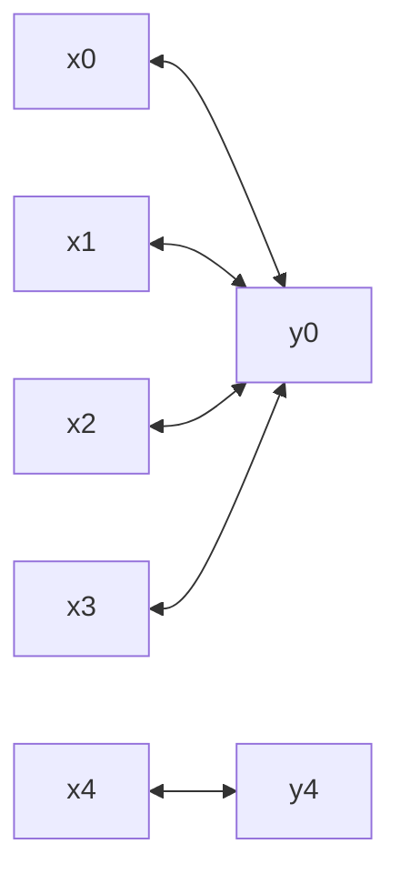

$S(y, z)$:

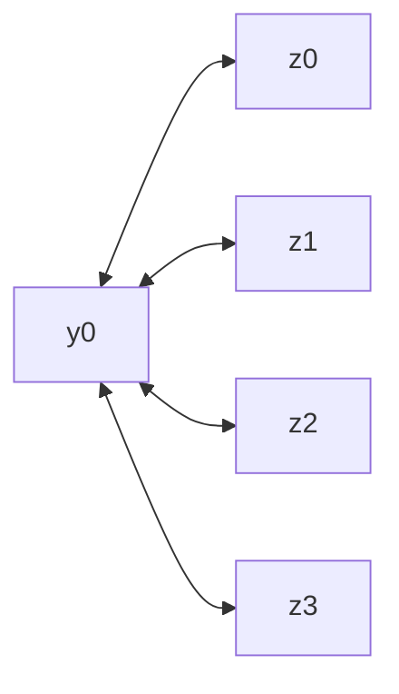

$T(z, w)$:

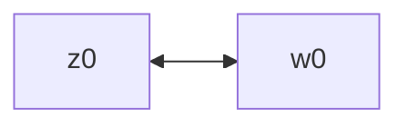

> [!NOTE]
>
> The edges are **undirected**. I use double arrows in the diagrams because Mermaid does not seem to natively support undirected edges.

Combining these graphs, we have:

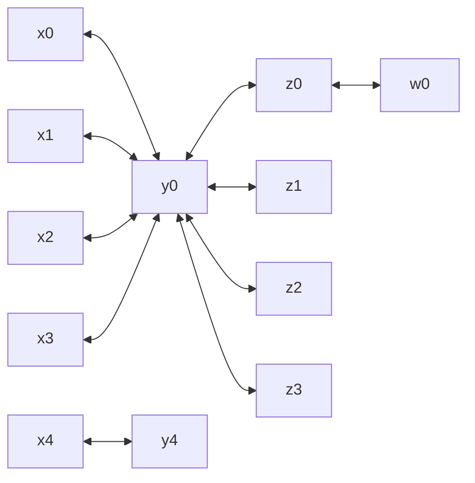

What if we add more tuples? Suppose we add more $(y, z)$ tuples, namely $(y_1, z_4), (y_2, z_4), (y_3, z_4), (y_4, z_4)$. That's just a matter of updating nodes and edges like before:

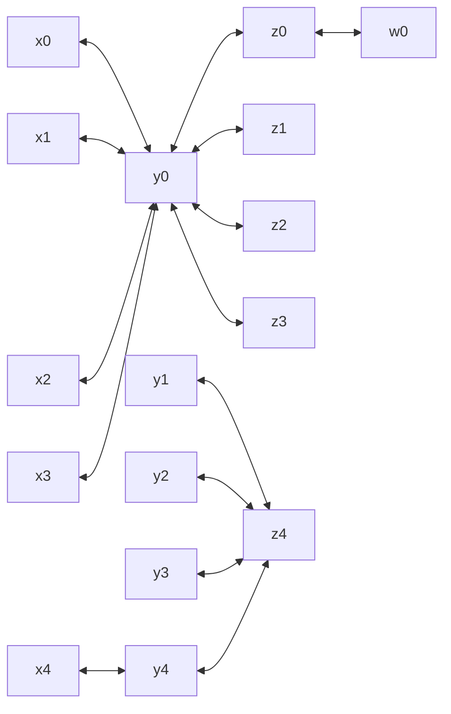

Here's where the power of this formulation comes into play. Suppose we're interested in the number of elements in the $S(y, z)$ relation. This is just a matter of counting the **number of edges** between $y$ values and $z$ values. This comes out to be 8.

Now let's add more stuff:

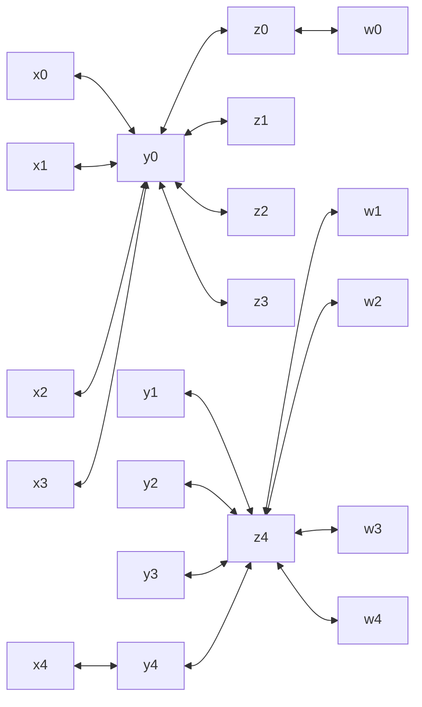

Now how many rows does $T(z, w)$ have? Same thing: count edges between $z$ and $w$, so 5.

### Join Explosion

This formulation also helps us visualize the order of growth in the output of join operations. Remember that we're ultimately interested in $R(x, y) \bowtie S(y, z) \bowtie T(z, w)$. Suppose we're interested in one part of that expression first, $S(y, z) \bowtie T(z, w) = S(y, z) \bowtie_{S.z=T.z} T(z, w)$. Consider the matching $z=z_4$ value. Focus on its **subgraph** rooted at $z_4$ for now:

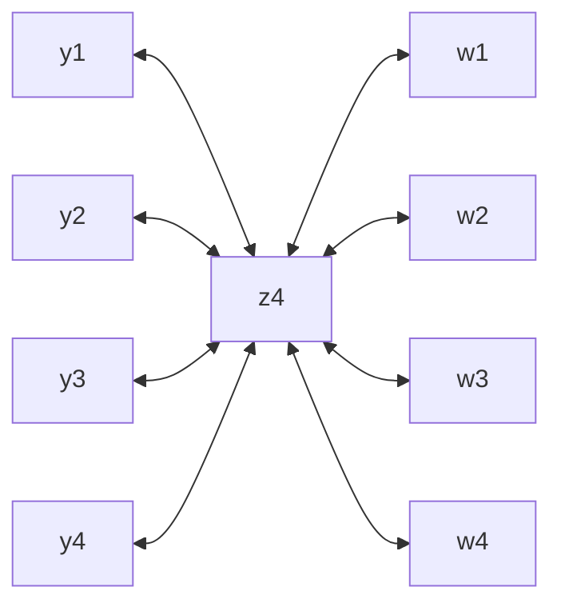

There are 4 edges on either side of $z_4$, meaning there are $4 \times 4 = 16$ ways we can join $(y, z_4)$ and $(z_4, w)$ tuples. This means that this $z=z_4$ part of the join contributes 16 rows to the joined table.

Let's take the size of $\lbrace y_1, y_2, y_3, y_4 \rbrace$ and $\lbrace w_1, w_2, w_3, w_4 \rbrace$ (i.e. number of edges with $z_4$) as some abstract workload size $n$. In this case, $n = 4$. We see that the number of output rows scales with $4^2$, or $n^2$.

$$|S \bowtie_{S.z=T.z} T| = 16 \in O(n^2)$$

And this is just for one match on the join key too. Suppose we had other matching values (like $z=z_0$). They will similarly each scale quadratically within their subproblem space, so overall we still produce **quadratically** many joined rows. This is consistent with our prior intuition involving joins (think loop semantics).

### Linear Approach

However, we know from intuition that in the *overall* natural join $R \bowtie S \bowtie T$ across the *three* relations, we're not going to be keeping all of those $n^2$ intermediate rows. Isn't this wasteful?

The graph formulation gives us a way to visualize a more efficient approach. Since we're interested in the three-way join, we output rows with attributes from all three relations ($x, y, z, w$). Furthermore, the relations are joined on their *common* attributes. This corresponds to enumerating paths snaking through our graph that span some $R.x \to R.y=S.y \to S.z=T.z \to T.w$. All attributes are covered, and the path only goes through nodes that represent where the tables are joined together (on both $R.y=S.y$ and $S.z=T.z$). One such path is:

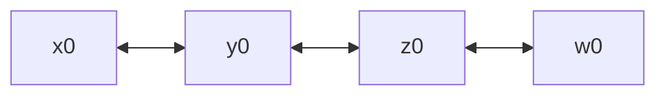

If you exhaustively enumerate all such paths, we have these highlighted paths (sorry, I'm not writing Mermaid for all of these 💀):

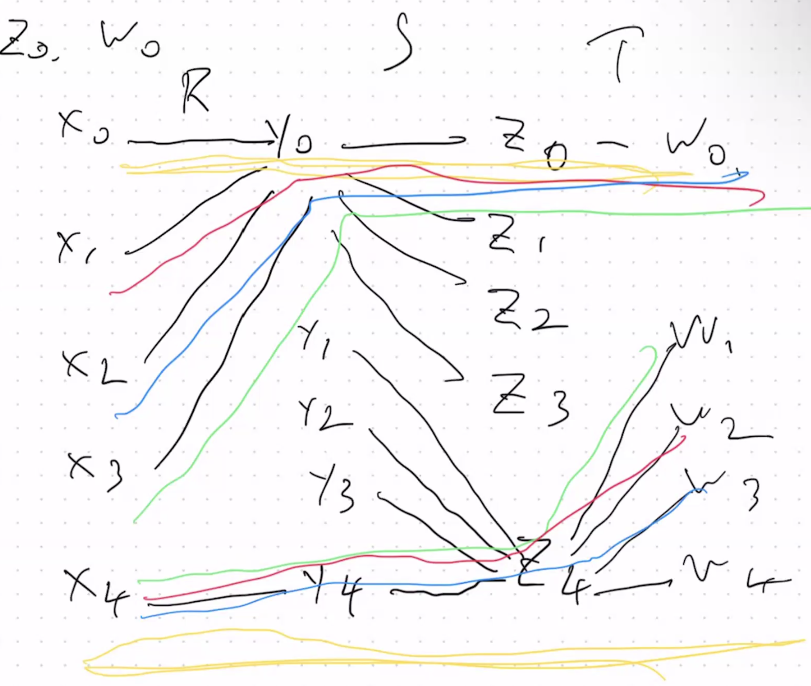

Notice that we don't have any quadratic scaling anywhere. Intuitively, the number of paths snaking through $R, S, T$ in this way is necessarily bounded by the the total number of paths, which scales *linearly* with the number of tuples you introduce into the relations.

There exists a join algorithm called [**Yannakakis Algorithm**](https://en.wikipedia.org/wiki/Yannakakis_algorithm) that runs in linear time of $O(|\text{input}| + |\text{output}|)$.

### Predicate Graphs

As part of a quick introduction to Yannakakis Algorithm (covered more in future lectures), we need one final prerequisite topic.

Yannakakis Algorithm doesn't work for *all* SQL queries in theory, but it pretty much does in practice. Specifically, this algorithm requires that the query be "**acyclic**". What does that mean in this context?

Suppose we have a SQL query for the three-way join [introduced earlier](#graph-formulation-of-relations):

```sql
SELECT * FROM R, S, T
WHERE R.y = S.y AND S.z = T.z;
```

Let's define a "graphical" view of the query *itself*. We construct a **predicate graph** like so:

- Create a node for each relation, so $R, S, T$ in this case.
- Create an edge for each pair of relations mentioned in the join predicate. In this example, those would be:
  - $(R, S)$ from the predicate $R.y=S.y$.
  - $(S, T)$ from the predicate $S.z=T.z$.

The predicate graph looks like:

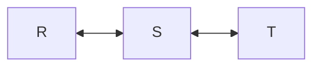

This graph has no cycles, so we say that the *query* is **acyclic**.

> [!IMPORTANT]
>
> A SQL query is acyclic iff the predicate graph is acyclic.
>
> <sup><sub>Almost. This definition isn't precise enough. Read on.</sub><sup>

However, consider this other example, where we're kind of taking the three-way "intersection" on attribute $x$:

```sql
SELECT * FROM R, S, T
WHERE R.x = S.x AND R.x = T.X AND S.x = T.x;
```

If we dutifully build the predicate graph using the same process as before, using nodes $R, S, T$ and edges $(R, S), (R, T), (S, T)$, we get:

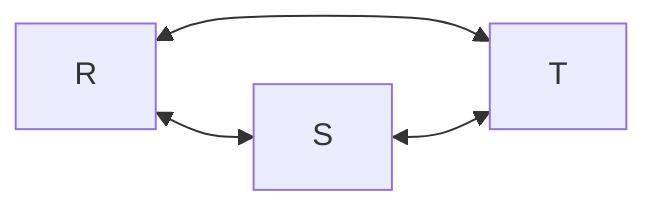

We see that the predicate graph is cyclic. By our previous definition, we would say that the query is cyclic. However, this isn't the case. `S.x = T.x` is already implied via *transitivity* by the other conditions `R.x = S.x` and `R.x = T.x`, so we can drop the redundant  `S.x = T.x` and still preserve the meaning of the query:

```sql
SELECT * FROM R, S, T
WHERE R.x = S.x AND R.x = T.X;
```

Now the predicate graph is no longer cyclic:

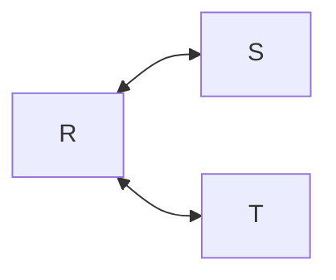

So a better definition is:

> [!IMPORTANT]
>
> A query $Q$ is **acyclic** iff $Q$ can be *rewritten* to $Q'$ such that $Q'$ has an **acyclic predicate graph**.

That is, first try to drop redundant predicates, then create the predicate graph and check for cycles.

We'll look more into detail of Yannakakis Algorithm next lecture, which allows us to run a query in the best possible time complexity, linear time in both input and output.
