# 2025-05-15/Lecture 14: Join Algorithms (Continued)

## Hash Join (Continued)

### Review: Graph Representation of Binary Relations

Suppose we have these relations and their graph representation:

$$R(x, y), S(y, z)$$

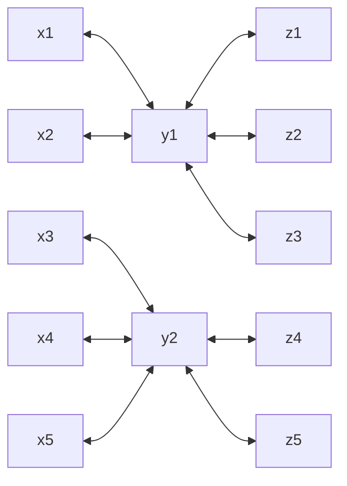

> [!NOTE]
>
> **Reminder:** This is an *undirected* graph, but due to the limitation of the Mermaid diagramming tool, the best I can do is draw double-ended arrows.

**Review:** How many tuples are there in $R$?

<details>
<summary>Expand for answer.</summary>

Count the number of edges under that relation. There are 5 edges, so $R$ has 5 tuples. Similarly, $S$ has 5 tuples. Namely, they are:

| $R$      | $S$      |
| -------- | -------- |
| $(1, 1)$ | $(1, 1)$ |
| $(2, 1)$ | $(1, 2)$ |
| $(3, 2)$ | $(1, 3)$ |
| $(4, 2)$ | $(2, 4)$ |
| $(5, 2)$ | $(2, 5)$ |

</details>

Which relation you choose to build the hashmap matters for performance (typically you choose the *smaller* relation). In this case, they are the same size, so suppose we arbitrarily choose $S$.

That is, we prepare a hashmap $H_S: y \to [z]$. From last lecture, we know that initializing $H_S$ looks something like (using Python syntax, close enough to pseudocode 😌):

```python
for s in S:
    if S.y not in H_S:
        H_S[S.y] = []
    H_S[S.y].append(S.z)
```

### Hashmap Initialization & Lookup Walkthrough

Suppose for simplicity the hash function used is just the identity function $f(x) = x$. Also assume we are using a **closed addressing** (linked lists) hashmap. (see: Lecture 12) and that the buckets are 1-indexed, to be consistent with the lecture examples.

The initialization of $H_S$ looks like:

Inserting $s = (1, 1)$:

```
1 -> [1]
2 -> /
```

Remember the relation is $S(y, z)$, and we're using $y$ as the **key** and $z$ as the **value**.

Inserting $s = (1, 2)$:

```
1 -> [1, 2]
2 -> /
```

Inserting $s = (1, 3)$:

```
1 -> [1, 2, 3]
2 -> /
```

Inserting $s = (2, 4)$:

```
1 -> [1, 2, 3]
2 -> [4]
```

Inserting $s = (2, 5)$:

```
1 -> [1, 2, 3]
2 -> [4, 5]
```

You might notice that this mapping directly corresponds to the edge relationships under $S$ in the graph representation! This is no coincidence&mdash;it's basically by construction. The graph formulation defines an edge between values that appear in the same tuple, so if a same value appears in tuples of different relations, there will be an edge connecting those relations.

Now we iterate through $R$ to perform the join, using our initialized hashmap to assist us. From last lecture, we know the algorithm looks something like:

```python
for r in R:
    s_z_vec = H_S[r.y]
    for s_z in s_z_vec:
        print(r.x, r.y, s_z)
```

Processing $r = (1, 1)$:

We look up $R.y = 1$ and get back a *vector* of values, $[s_z] = [1, 2, 3]$. Thus, we output $(1, 1, z)$ for each $z \in \lbrace 1, 2, 3 \rbrace$:

| $R.x$ | $R.y$ | $S.z$ |
| ----- | ----- | ----- |
| 1     | 1     | 2     |
| 1     | 1     | 1     |
| 1     | 1     | 3     |

Processing $r = (2, 1)$:

We look up $R.y = 1$ and get back again $[1, 2, 3]$. We output:

| $R.x$ | $R.y$ | $S.z$ |
| ----- | ----- | ----- |
| 2     | 1     | 2     |
| 2     | 1     | 1     |
| 2     | 1     | 3     |

Processing $r = (3, 2)$:

We look up $R.y = 2$ and get back the vector $[4, 5]$. Thus, we output $(3, 2, z)$ for each $z \in \lbrace 4, 5 \rbrace$:

| $R.x$ | $R.y$ | $S.z$ |
| ----- | ----- | ----- |
| 3     | 2     | 5     |
| 3     | 2     | 4     |

Processing $r = (4, 2)$:

We look up $R.y = 2$ and get back again $[4, 5]$. We output:

| $R.x$ | $R.y$ | $S.z$ |
| ----- | ----- | ----- |
| 4     | 2     | 5     |
| 4     | 2     | 4     |

Processing $r = (5, 2)$:

We look up $R.y = 2$ and get back again $[4, 5]$. We output:

| $R.x$ | $R.y$ | $S.z$ |
| ----- | ----- | ----- |
| 5     | 2     | 5     |
| 5     | 2     | 4     |

## ASIDE: Linear vs. Quadratic Scaling

### Example with Linear Scaling

We'll ease into a treatment of Yannakaki's Algorithm by first considering the graphs discussed in a student question on Ed (#87).

Suppose we have these binary relations:

$$R(x, y), S(y, z), T(z, w)$$

With this graph representation:

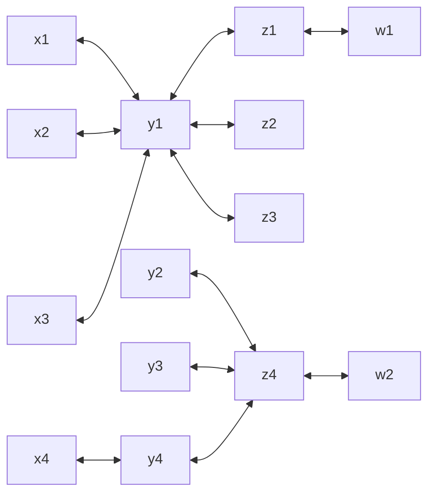

We claim that these two **join orders** will produce the same result but have different performance:

$$(R \bowtie S) \bowtie T$$
$$(S \bowtie T) \bowtie R$$

Let's focus on $(R \bowtie S) \bowtie T$ first. Specifically, let's look at the first computed sub-expression $(R \bowtie S)$. How many tuples would this join produce?

From last lecture, we know that with the graph formulation, this is a matter of looking at the nodes on the common attribute ($y$) and the number of edges coming out of them:

- Using edges out of $y_1$: $3 \times 3 = 9$
- Using edges out of $y_4$: $1 \times 1 = 1$

$9 + 1 = 10$ output tuples.

From inspection, we know that the full three-way join $(R \bowtie S) \bowtie T$ will only output 2 tuples. There are only two "full" paths from $x \to y \to z \to w$ (see: Lecture 13). Thus, our initial computation of $R \bowtie S$ produced 8 wasted tuples.

Now let's look at $(S \bowtie T) \bowtie T$. Specifically, the first computed sub-expression $(S \bowtie T)$. How many tuples would this join produce?

Using the same techniques (either counting edges or paths):

- Using edges out of $z_1$: $1 \times 1 = 1$
- Using edges out of $z_4$: $3 \times 1 = 3$

$1 + 3 = 4$ output tuples. We see that this join order has seemingly *linear* scaling as opposed to quadratic. This comes from the fact that all $z$ have at most edge coming out of it on the $T$ side, so we don't have the quadratic explosion associated with computing all combinations of some many tuples on the left with some many tuples on the right.

Computing $S \bowtie T$ first is better, so $(R \bowtie S) \bowtie T$ is the better join order.

### General Case with Quadratic Scaling

However, the [above example](#example-with-linear-scaling) is not general. In the worst case, we would have quadratic scaling. Suppose we add more edges (corresponding to more tuples in the relations):

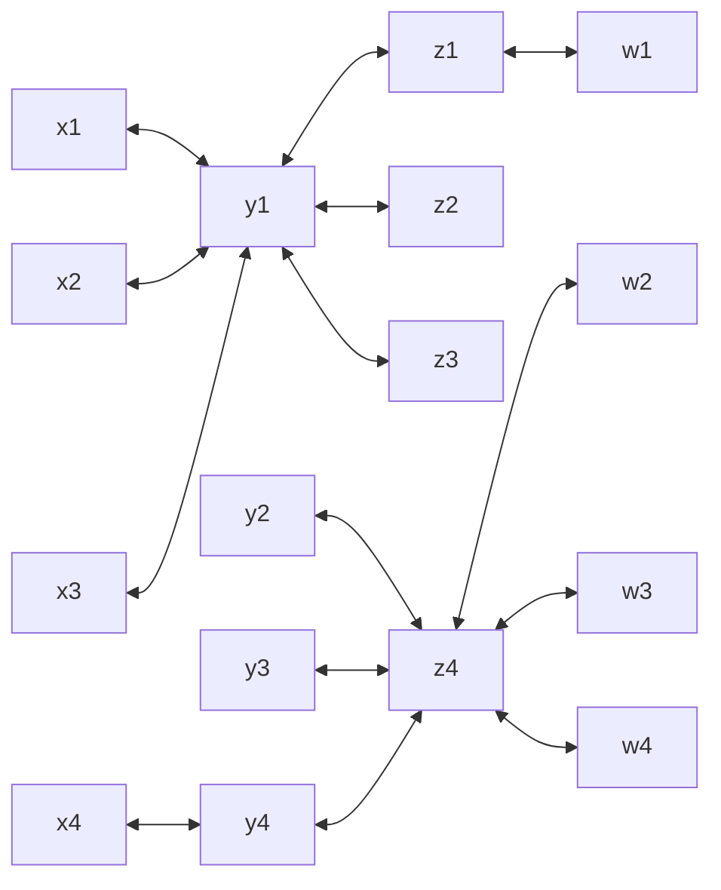

By inspection, we see that both $(R \bowtie S)$ and $(S \bowtie T)$ will now have quadratic scaling. Look at some values on the common attribute ($y_1$ in the case of $R \bowtie S$ or $z_4$ in the case of $S \bowtie T$) and you see that there is more than one edge on both sides of them, meaning the join on that value will produce $N \cdot M$ tuples (where $N$ is the number of tuples on the LHS and $M$ is the number of tuples on the RHS&mdash;for simplicity, assume $N \approx M$, so we get that "quadratic" $N^2$).

### Early Probing

We claim that we can use **hashmaps** to make this faster.

First we build $H_R: y \to [x]$. From inspection on the graph edges, we know that $H_R$ will look like:

```
1 -> [1, 2, 3]
4 -> [4]
```

Then we build $H_T: z \to [w]$. From inspection on the graph edges, we know that $H_T$ will look like:

```
1 -> [1]
4 -> [2, 3, 4]
```

Now we'll iterate over each edge in $S$ and use lookups on our hashmaps, and only if a value appears on "both sides" of our lookups, we'll output it.

Processing $s = (1, 1)$:

We look up $H_R[1] = [1, 2, 3]$ and $H_T[1] = [1]$. We see that there *was* a match, so we'll output $s$ alongside every combination (i.e. Cartesian product) of the two vectors (think a simple nested `for` loop):

| $R.x$ | $S.y$ | $S.z$ | $T.w$ |
| ----- | ----- | ----- | ----- |
| **1** | 1     | 1     | **1** |
| **2** | 1     | 1     | **1** |
| **3** | 1     | 1     | **1** |


Processing $s = (1, 2)$:

We look up $H_R[1] = [1, 2, 3]$, but $2$ doesn't exist in $H_T$'s keys.  There's *no* match, so we skip outputting anything for this $s$. We're starting to see the value of this method. By doing a simple key lookup before doing any expensive outputting, we skip a lot of unnecessary work.

Processing $s = (1, 3)$:

Similarly, $3$ doesn't exist in $H_T$'s keys, so we skip this $s$.

Processing $s = (2, 4)$ and $s = (3, 4)$:

This time, $2$ and $3$ don't exist in $H_R$'s keys, so we skip these as well.

Processing $s = (4, 4)$:

We look up $H_R[4] = [4]$ and $H_T[4] = [2, 3, 4]$. We output:

| $R.x$ | $S.y$ | $S.z$ | $T.w$ |
| ----- | ----- | ----- | ----- |
| **4** | 4     | 4     | **2** |
| **4** | 4     | 4     | **3** |
| **4** | 4     | 4     | **4** |

We notice that we're doing constant work per *edge*. We also produce outputs in linear time with the number of neighbors (number of values in the linked lists in the hashmap). This gets us a runtime of $O(|IN| + |OUT|)$. This approach is also known as **early probing** (see: Professor's answer to Ed #87).

## Yannakakis Algorithm

Now we'll introduce **Yannakakis Algorithm**. Revisiting this graph for $R(x, y), S(y, z), T(z, w)$:


The **predicate graph** (see: Lecture 13) for their three-way natural join is:

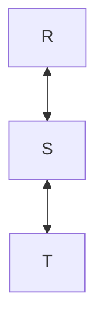

This is acyclic as we expect. This is required for Yannakakis Algorithm to work.

As you may recall from discrete math, an acyclic graph is also known as a **tree**. Thus, we'll call this a tree from here on. Specifically, this is called a **join tree**.

### Algorithm

We'll traverse the join tree with 3 passes. From [Professor's notes](https://remy.wang/cs143/notes/lec13.html):

> [!IMPORTANT]
>
> Assume a query is acyclic, and we have rewritten it into one with an acyclic predicate graph. Then the **Yannakakis algorithm** works as follows:
>
> 1. Traverse the tree bottom-up. For each internal node $R$, replace $R$ with $R ⋉ S_i$, for each child $S_i$ of $R$.
> 2. Traverse the tree top-down. For each internal node $R$, replace $R$ with $R ⋉ T$, where $T$ is the parent of $R$.
> 3. Compute the final result using binary hash join bottom-up.

$⋉$ is the **semijoin** (briefly introduced back in Lecture 6):

> [!IMPORTANT]
>
> The **semijoin** $S ⋉ R$ returns a *subset* of the left table $S$, the rows that match with the right table $R$.

> [!WARNING]
> It follows that the semijoin is *not* commutative. That is:
>
> $$R ⋉ S \ne S ⋉ R$$
>
> This is because we're only keeping a subset of the LHS.

You can think of this the reason we need both a [bottom-up](#bottom-up-semijoin-reduction) and [top-down](#top-down-semijoin-reduction) pass in Yannakakis Algorithm. Intuitively, one "discards junk" from children and the other discards junk from the parents, so putting it together we'll have discarded all unnecessary tuples before computing the final, now much less expensive traditional hash join.

How do we do the semijoin in actual code implementation? Essentially, we loop over the relation on the LHS of the semijoin and perform a lookup on the **hashmap** for the RHS table, similar to [what we've been doing before](#hashmap-initialization--lookup-walkthrough).

What's the time complexity of this? $O(N)$ (linear) because for each tuple of the LHS, we have a constant-time look up on the RHS.

> [!IMPORTANT]
>
> Every semijoin takes **linear** time with its input.

To give a meaning to "child"/"bottom-up" and "parent"/"top-down", we'll arbitrarily designate a root node in the tree (recall that in an acyclic graph, *any* node can be chosen as a "root"&mdash;it doesn't change the fact that it's a tree and the algorithm still applies). I drew the graph earlier as $R$ above $S$ above $T$, so following [the convention of upside-down trees in computer science](https://www.reddit.com/r/ProgrammerHumor/comments/8ek3ot/shots_were_fired_in_my_discrete_math_textbook/?utm_source=share&utm_medium=web3x&utm_name=web3xcss&utm_term=1&utm_content=share_button), let's suppose $R$ the root of the join tree for the following walkthrough.

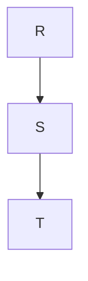

### Bottom-up Semijoin Reduction

The first step is doing a bottom-up **semijoin reduction**, replacing each internal node in the **join tree** with its semijoin on its child.

We'll visualize the reduction as *removing edges* for tuples that get discarded from the semijoin. The initial graph for your inspection again:


We work our way upwards in the **join tree**: $T \to S \to R$. First, we skip over the leaf node $T$ since it has no child to semijoin with.

We then process the internal node $S$ of the join tree, which has one child $T$. $S$ and $T$ share the attribute $z$, so we're computing and replacing:

$$S = S ⋉_z T$$

Iterate through the tuples $s \in S(y, z)$. Does each of them semijoin with $T(z, w)$? That is, is $s.z$ found in any tuple in $T$ (i.e. a match for the join)?

$$s = (1, 1), 1 \in T.z$$
$$s = (1, 2), 2 \not\in T.z$$
$$s = (1, 3), 3 \not\in T.z$$
$$s = (2, 4), 4 \in T.z$$
$$s = (3, 4), 4 \in T.z$$
$$s = (4, 4), 4 \in T.z$$

The tuples $s = (1, 2)$ and $s = (1, 2)$ get discarded, so we remove their edges from the graph representation as well:

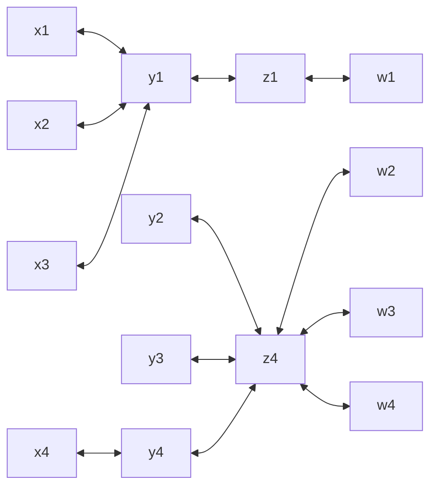

Next, we process the internal node $R$ of the join tree, which has one child $S$. $R$ and $S$ share the attribute $y$, so we're computing and replacing:

$$R = R ⋉_y S$$

Note that we're using the $S$ we just reduced (that is, consider the updated graph above, not the initial one).

Iterate through the tuples $r \in R(x, y)$. Does each of them semijoin with $S(y, z)$? That is, is $r.y$ found in any tuple in $S$ (i.e. a match for the join)?

$$r = (1, 1), 1 \in S.y$$
$$r = (2, 1), 1 \in S.y$$
$$r = (3, 1), 1 \in S.y$$
$$r = (4, 4), 4 \in S.y$$

All of these tuples are kept. Thus, we don't remove any edges from our graph. That is, $R$ is *already* reduced.

### Proof by Picture

Notice an important property: every edge in $R(x, y)$ now joins "all the way" to the right, through $S.z$ and $T.w$:

- $(1 \to 1) \to 1 \to 1$
- $(2 \to 1) \to 1 \to 1$
- $(3 \to 1) \to 1 \to 1$
- $(4 \to 4) \to 4 \to 4$

That is, every tuple that's left after the reduction is guaranteed to have a path to the other end of the graph.

A proof by picture is to "inject a virus" at the terminal nodes of the other side and simulate it spreading via all remaining edges. For example, infect all $T.w$. As the virus spreads through the edges, it eventually infects every terminal node in $R.x$.

What this means that every tuple that's left in $R$ will have matches all the way down the join tree. We've discarded tuples that are guaranteed to not be included in the final join (we haven't discarded *all* of the junk yet though, we still have the [second pass](#top-down-semijoin-reduction)).

### Top-Down Semijoin Reduction

The bottom-up pass guarantees that "everyone below joins with everyone above". Recall that the semijoin is *not* commutative, so we still need to separately ensure that "everyone above joins with everyone below". Putting these two passes together then guarantees that all remaining tuples join with each other&mdash;no unnecessary tuples exacerbating performance.

We perform another pass of **semijoin reduction**, this time working top-down the join tree and replacing each non-root node with its semijoin on its *parent*.

We first skip over the root node $R'$ (it doesn't have a parent to semijoin with).

Now we process the node $S$ of the join tree, which has parent $R$. $S$ and $R$ share the attribute $y$, so we're computing and replacing:

$$S = S ⋉_y R$$

Iterate through the tuples $s \in S(y, z)$. Does each of them semijoin with $R(x, y)$? That is, is $s.y$ found in any tuple in $R$ (i.e. a match for the join)?

$$s = (1, 1), 1 \in R.y$$
$$s = (2, 4), 2 \not\in R.y$$
$$s = (3, 4), 3 \not\in R.y$$
$$s = (4, 4), 4 \in R.y$$

We remove the tuples $s = (2, 4)$ and $s = (3, 4)$ and their corresponding edges:

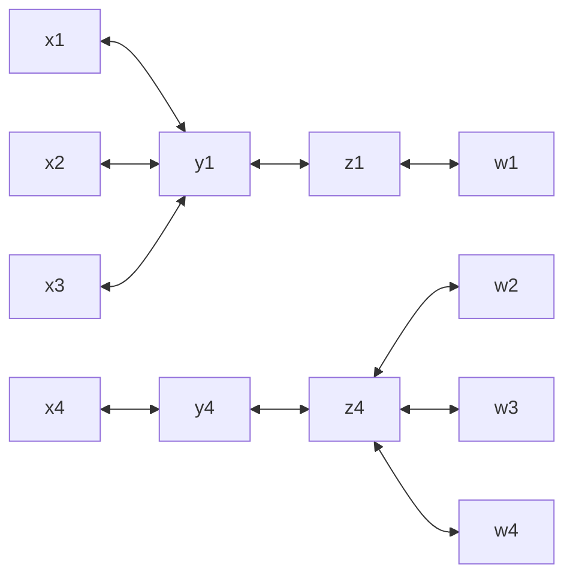

Now we process the node $T$ of the join tree, which has parent $S$. $T$ and $S$ share the attribute $z$, so we're computing and replacing:

$$T = T ⋉_z S$$

Iterate through the tuples $t \in T(z, w)$. Does each of them semijoin with $S(y, z)$? That is, is $t.z$ found in any tuple in $S$ (i.e. a match for the join)?

$$t = (1, 1), 1 \in S.z$$
$$t = (4, 2), 4 \in S.z$$
$$t = (4, 3), 4 \in S.z$$
$$t = (4, 4), 4 \in S.z$$

All tuples are kept, so we don't remove any edges. $T$ is already reduced.

We can similarly apply the [virus injection proof](#proof-by-picture) for this pass. All $T$ edges on the right find a path to the left side of the graph. Once again, every tuple that's left after the reduction is guaranteed to have a path to the other end of the graph.

### Final Hash Join

The last pass is the [traditional hash join like we've covered above](#hashmap-initialization--lookup-walkthrough). However, now we can compute the join $(S \bowtie T) \bowtie R$ (on the reduced relations) without [quadratic blowup only to throw away intermediates](#general-case-with-quadratic-scaling). The first two passes already "threw away the junk". The only tuples remaining are the ones guaranteed to show up in the output.

The final runtime is $O(|IN| + OUT|)$.

### Join Trees with Multiple Children

The walkthrough above considered a strictly linear join tree. However, a tree can have multiple children. Consider these relations and a predicate graph/join tree from this lecture's quiz:

$$R(x, y), S(y, i, j), T(i, a), U(j, b)$$

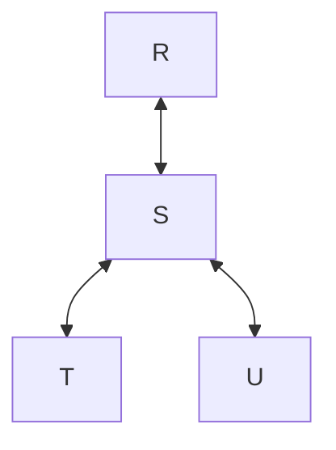

How does Yannakakis Algorithm work in the bottom-up path when there are multiple children in the tree? You simply semijoin each parent with each of its children, in sequence:

1. $S = S ⋉ T$ ("get rid of the junk in $T$")
2. $S = S ⋉ U$ ("get rid of the junk in $U$")

In the top-down path, each child by definition can only have one parent, so we just do what we normally do, processing each node in BFS order:

1. $S = S ⋉ R$
2. $T = T ⋉ S$
3. $U = U ⋉ S$

### Recap

1. First, we need an **acyclic query**, which is a query that can be rewritten to have an acyclic **predicate graph**.
2. The predicate graph also serves as a **join tree**.
3. We then run **Yannakakis Algorithm** on the join tree using **semijoins**, which is implemented using **hashmaps**.

The different notations:

- Natural join notation:
  $$R(x, y) \bowtie S(y, i, j) \bowtie T(i, a) \bowtie U(j, b)$$
- SQL query:
   ```sql
   SELECT *
   FROM R, S, T, U
   WHERE R.y=S.y
     AND S.i=T.i
     AND S.j=U.j;
   ```
- Predicate graph:
   ```mermaid
   graph TD;
     R<-->S;
     S<-->T;
     S<-->U;
   ```

## Hypergraph Generalization

In the [above example](#join-trees-with-multiple-children), notice that we no longer have a binary relation. $S(y, i, j)$ has *three* attributes. The graph formulation we've used so far seems to only works with *binary* relations (*two* attributes). However, it can actually be generalized to a **hypergraph** formulation.

A [**hypergraph**](https://en.wikipedia.org/wiki/Hypergraph) is itself a generalization of a graph. In a graph, an **edge** only connects two nodes. In a hypergraph, an edge can connect any number of nodes&mdash;a **hyperedge**. This allows us to connect tuples with size greater than 2, like some $(y, i, j) \in S$.

Constructing a hypergraph from a set of relations is slightly different from before:

Firstly, we have one node per *unique* variable.

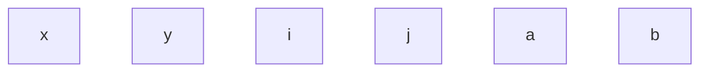

Then, we add the **hyperedges**. We start with what we previously considered normal edges (connecting two nodes), from relations $R(x, y), T(i, a), U(j, b)$:

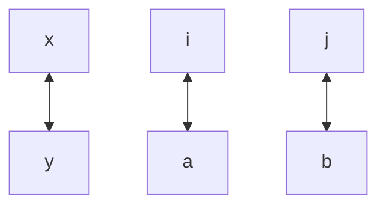

But hyperedges can have $> 2$ nodes per edge. For example, among attributes $i, j, y$ in $S$. To illustrate this, we draw *circles* instead of edges:

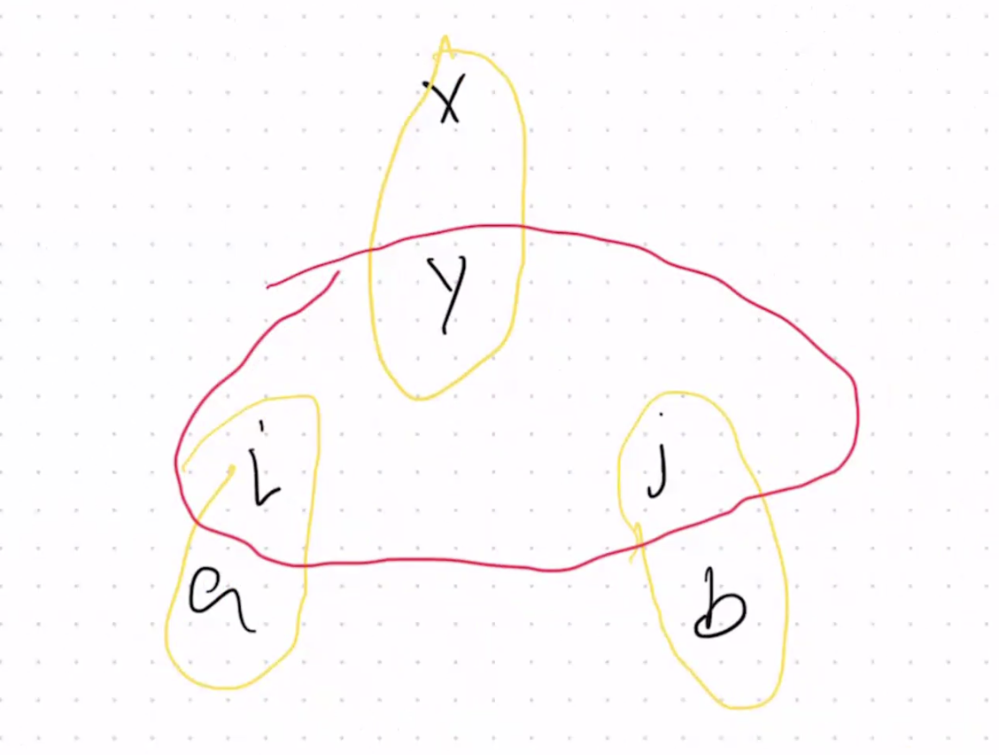

What we're interested in: can we run an algorithm on the hypergraph to produce an acyclic join tree like before (with binary edges) we can then run Yannakakis Algorithm on? Stay tuned.
