# 2025-05-20/Lecture 15: Hypergraphs and Introduction to Indices

## Review

### Predicate Graphs

Suppose we have this query:

```sql
SELECT *
FROM R, S, T
WHERE R.x = S.x
  AND S.X = T.x
```

The predicate graph as you know can be constructed by inspection on the `WHERE` clause:

<details>
<summary>Expand for answer.</summary>

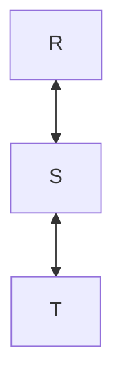

</details>

This predicate graph is acyclic, so it can be used as a join tree for Yannakakis Algorithm (see: Lecture 14). If we add another predicate however:

```sql
SELECT *
FROM R, S, T
WHERE R.x = S.x
  AND S.X = T.x
  AND R.x = T.x;
```

The predicate graph now has a cycle:

<details>
<summary>Expand for answer.</summary>

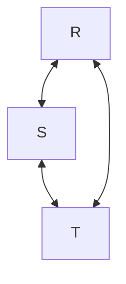

</details>

Of course, we know that in this trivial example, the last predicate is redundant and can be removed to restore acyclic-ness. But what if the query/predicate graph were more complex? We don't want to have to brute-force remove every subset of predicates to see if we can get an acyclic predicate graph.

Today we tackle the more *general* problem of: given some **hypergraph**, how do we efficiently get an acyclic predicate graph?

### Hypergraphs

Recall that a **hypergraph** is the generalization of a graph. In graphs, edges are **binary**, meaning they connect two vertices. In hypergraphs, hyperedges can connect an arbitrary number of vertices. This allows us to generalize our graph representation of relations beyond those with only two attributes.

Consider these relations, where one is no longer just a binary relation:

$$R(a, x), S(x, i, j), T(i, b), U(j, c)$$

What are the vertices?

<details>
<summary>Expand for answer.</summary>

The unique attributes: $a, x, i, j, b, c$.

</details>

What are the hyperedges?

<details>
<summary>Expand for answer.</summary>

Those connecting attributes in the same relation:

- $(a, x)$
- $(x, i, j)$
- $(i, b)$
- $(j, c)$

</details>

## GYO Reduction Algorithm

We'll first introduce an algorithm that can check in polynomial time *whether* a given hypergraph is acylic (and thus has an acyclic predicate graph). We'll then augment it to actually *produce* that acyclic predicate graph. The overall process is called [**GYO Reduction**](https://en.wikipedia.org/wiki/GYO_algorithm), named after their inventors: [Graham](https://en.wikipedia.org/wiki/Martin_H._Graham), Yu, and [Özsoyoğlu](https://en.wikipedia.org/wiki/Meral_Özsoyoglu).

**ASIDE:** Unlike simple graphs, hypergraphs have *multiple* notions of cyclic-ness. We're interested in a specific type of acyclic-ness called **$\alpha$-acyclic**. Don't worry about the different types of cyclic-ness. We'll just call it acyclic all the same for the purposes of this class.

### Hypergraph Concept: Key Attributes

Before we introduce the algorithm, we need some prerequisite concepts.

> [!IMPORTANT]
>
> We define the **key attributes** of the relation $R$ with respect to the current query as:
>
> $$\text{keyattr}_Q(R) = R \cap (Q - R)$$

Here $R$ denotes the *attributes* of $R$ and $(Q - R)$ denotes "attributes of all other relations in the query". Thus, more intuitively:

- $\text{keyattr}_Q(R)$ is all the attributes of $R$ that aren't unique to it in the query, or equivalently:
- $\text{keyattr}_Q(R)$ is the attributes of $R$ that are also shared with any other relation.

This makes $\text{keyattr}_Q(R)$ very easy to answer by simple inspection on the hypergraph drawing.

Note that "key attribute" here is not to be conflated with **keys** discussed before (primary keys, superkeys, candidate keys). Professor just chose this term because it reflects what you would choose as a *hashmap key* if we were to join multiple relations like we did in previous lectures on hashing. It follows that such attributes would be the ones that are *shared* by other relations, such that when processing relations, they can key by the shared attribute into the hashmap of other relations to get back tuples for the joined rows. If that confused you, don't worry about it&mdash;I was just trying to justify the naming choice; we don't actually do any hashing in the algorithm we're introducing.

> [!NOTE]
>
> This is a definition/formulation created by Professor to make it easier to teach. It is not part of standard hypergraph theory.

Walking through this example hypergraph:

$$R(a, x), S(x, i, j), T(i, b), U(j, c)$$

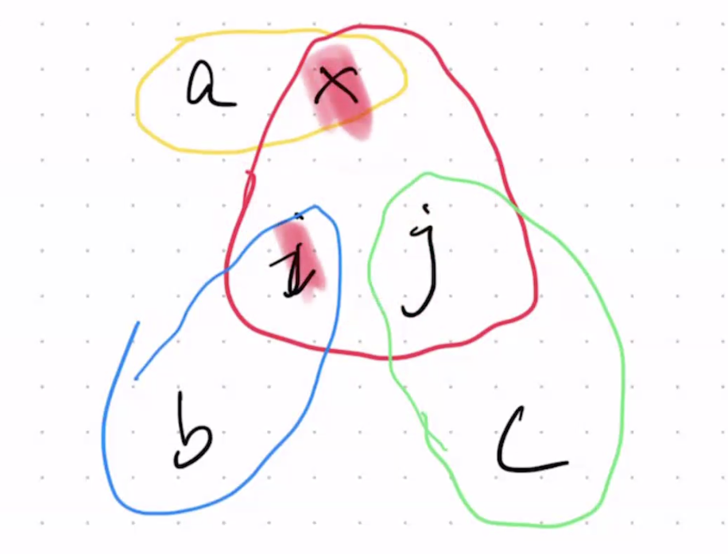

What attributes of $R$ are shared by other relations? $R.x$ is shared via $S.x$, so:

$$\text{keyattr}_Q(R) = \lbrace x \rbrace$$

<!-- What's the significance of this? To build a hash table on $R$, it'll be keyed on $x$. We don't actually do this for the algorithms we will discuss, it was just a way to reason about what a "key attribute" is? -->

What attributes of $S$ are shared by other relations? $S.x$ is shared via $R.x$; $S.i$ is shared via $T.i$; $S.j$ is shared via $U.j$. Thus:

$$\text{keyattr}_Q(S) = \lbrace x, i, j \rbrace$$

What attributes of $T$ are shared by other relations? $T.i$ is shared via $S.i$, so:

$$\text{keyattr}_Q(T) = \lbrace i \rbrace$$

What attributes of $U$ are shared by other relations? $U.j$ is shared via $S.j$, so:

$$\text{keyattr}_Q(U) = \lbrace j \rbrace$$

### Hypergraph Concept: Ears

The second definition we need is the concept of an **ear**.

> [!IMPORTANT]
>
> The hyperedge representing relation $R$ in query $Q$ is an **ear** if $\exists P \ne R: \text{keyattr}_Q(R) \subseteq P$.
>
> Such a $P$ is called a **parent** of $R$.

The notion of "parent" will be important [later](#building-predicate-graph-from-hypergraph). Since we're building predicate graphs (join trees), you probably have an idea already too 😌.

Walking through the [same hypergraph from above](#hypergraph-concept-key-attributes):

Is $R$ an **ear**? Yes.

$$\text{keyattr}_Q(R) = \lbrace x \rbrace \subseteq \lbrace x, i, j \rbrace = S$$

Thus, $S$ is a **parent** of $R$.

Is $S$ an **ear**? No.

There does not exist a relation $P$ such that $\text{keyattr}_Q(S) = \lbrace x, i, j \rbrace \subseteq P$. Or equivalently, there's no parent whose attributes are a *superset* of $S$'s key attributes.

Is $T$ an **ear**? Yes.

$$\text{keyattr}_Q(T) = \lbrace i \rbrace \subseteq \lbrace x, i, j \rbrace = S$$

Thus, $S$ is a **parent** of $T$.

Is $U$ an **ear**? Yes.

$$\text{keyattr}_Q(U) = \lbrace j \rbrace \subseteq \lbrace x, i, j \rbrace = S$$

Thus, $S$ is a parent of $U$.

In total, we have 3 **ears**: $R, T, U$. They all happen to have the same **parent** $S$ too.

### Algorithm: Check If Hypergraph Is Acyclic

Now we're ready to introduce the first version of our algorithm, which simply takes in some hypergraph $HG$ and returns a Boolean yes/no on whether $HG$ is acylic.

> [!IMPORTANT]
>
> **ALGORITHM:** Check if a hypergraph is acyclic.
>
> ```
> While HG still has ears:
>   1. Pick any ear, or if there's only one hyperedge left, pick that.
>   2. Remove it. That is:
>     i. Remove any vertex exclusive to the ear.
>     ii. Remove the hyperedge itself (keeping any vertices still in other hyperedges).
> If HG is now empty <=> original HG is acyclic.
> ```

Let's walk through the example from above with 3 ears: $\lbrace R, T, U \rbrace$.

Suppose we arbitrarily pick $U$ to remove. Find all the exclusive vertices. In this case, it's $c \in U$. Thus, we remove $c$. Then, we remove the $U$ hyperedge itself.

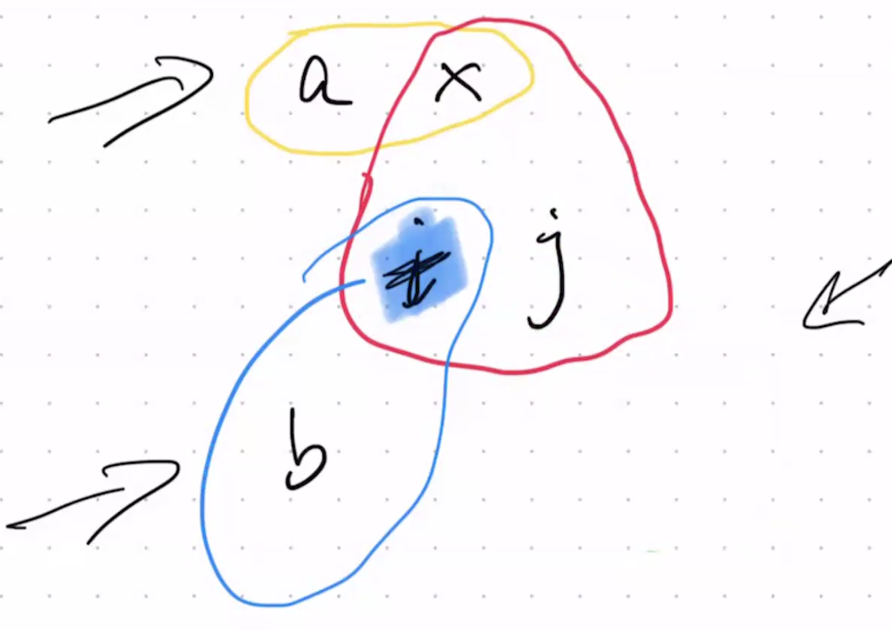

The remaining ears are $\lbrace R, T \rbrace$.

Next, suppose we arbitrarily pick $T$ to remove. We remove the lone vertex $b \in T$. Then, we remove the $T$ hyperedge itself.

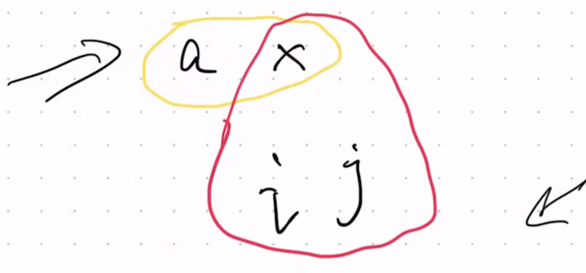

Note that something interesting now happens. Because we've removed $T$ and $U$, now $S$ *becomes* one of the ears as well. Convince yourself why:

- $\text{keyattr}_Q(S) = \lbrace x \rbrace$ only now, since the only other relation remaining is $R(a, x)$.
- Thus, $\text{keyattr}_Q(S) = \lbrace x \rbrace \subseteq \lbrace a, x \rbrace = R$. $S$ is now an **ear**, with **parent** $R$ (and vice versa, actually).

This emphasizes an important point. Remember that your sets of key attributes and ears are *dynamic* as the algorithm progresses. As you remove vertices and hyperedges from the hypergraph, you may introduce *more* ears that are candidates for removal.

The remaining ears are $\lbrace R, S \rbrace$ (*not* just $\lbrace R \rbrace$ this time). Thus, we now have a choice between removing $R$ or $S$.

Suppose we arbitrarily choose $S$. We remove $i, j \in S$. Then, we remove the $S$ hyperedge itself.

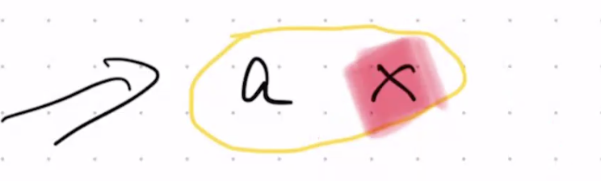

$R$ is the only hyperedge left. We remove it, leaving behind an empty hypergraph.

Because we were able to remove all hyperedges, the original hypergraph is acylic. This further means that an acyclic predicate graph exists for this hypergraph.

### Making Hypergraphs Acyclic

Now consider these relations:

$$R(x, y), S(y, z), T(z, x)$$

Its hypergraph looks like this (because the relations are all binary, it happens to just be a simple graph):

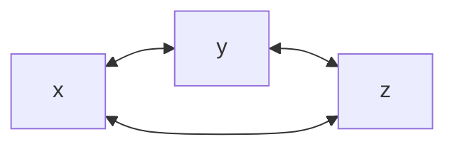

If we work through our definitions from earlier, we notice that this hypergraph actually has *no* ears!

- $\text{keyattr}_Q(R) = \lbrace x, y \rbrace$
- $\text{keyattr}_Q(S) = \lbrace y, z \rbrace$
- $\text{keyattr}_Q(T) = \lbrace z, x \rbrace$
- None of these have a relation besides itself whose attributes are a superset of their key attribute set. There are no ears.

Thus, when we run the algorithm, we have no ears to remove, and the algorithm terminates without removing the entire hypergraph. Because we are left with a non-empty hypergraph, the query is cyclic.

This should make sense. The hypergraph we constructed is simple enough that we can clearly see a cycle by inspection.

Now consider what happens if we add a new relation $U$, which contains *all* attributes referenced in the query:

$$R(x, y), S(y, z), T(z, x), U(x, y, z)$$

The hypergraph now looks like (the green circle is the hyperedge for $U$):

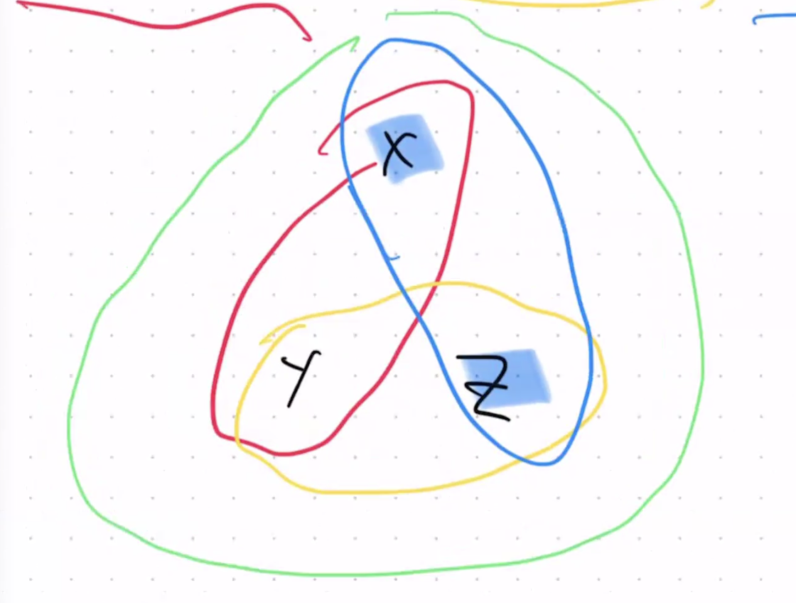

Is this query still cyclic? Let's check the key attributes and see if parents exist.

$$\text{keyattr}_Q(R) = \lbrace x, y \rbrace \subseteq \lbrace x, y, z \rbrace = U$$

Notice that *because* we've added $U$ which covers all attributes, $R$ now *becomes* an **ear**, with $U$ as its **parent**. The same thing happens with $S$ and $T$:

$$\text{keyattr}_Q(S) = \lbrace y, z \rbrace \subseteq \lbrace x, y, z \rbrace = U$$
$$\text{keyattr}_Q(T) = \lbrace z, x \rbrace \subseteq \lbrace x, y, z \rbrace = U$$

We can now remove ears in an example order of $R \to S \to T \to U$ (draw the process out for yourself if you need convincing).

By *adding* $U$, the algorithm now results in an empty hypergraph, meaning it's acyclic!

> [!IMPORTANT]
>
> There exists a trivial way to make any cyclic hypergraph acyclic. Simply add one relation with *every* attribute in the query.

### Another Example: Turkey Hypergraph

Suppose it's Thanksgiving. Further suppose we have this hypergraph:

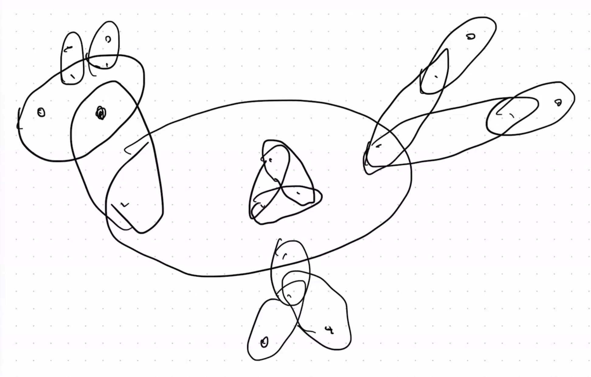

Each dot is a vertex (some unique attribute&mdash;notice that we don't actually need to know any concrete names). The ovals are hyperedges like before. Also suppose the turkey is injured, so it only has one leg.

If we want to start removing hyperedges, where should we start? Intuitively, from the outside. Why? Because with a structure like this, they are guaranteed to be **ears**. Think about it: the key attributes of outermost hyperedges be the attributes "connecting" them to the inner hyperedges. Those attributes are then also subsets of those inner hyperedges, so the outermost hyperedges are ears.

<sup><sub>Unfortunately, I will not be pasting a million screenshots for the many stages of the removal, but you can draw it out and follow my written description and draw along as practice.</sub><sup>

Thus, we can start with the "foot". Remove one finger. Then remove the other finger. The leg now *becomes* an ear because its key attribute is now exclusively shared with the torso. We remove the leg.

Then we remove the tail feathers, outside to inside.

Then we remove the things (???) on the head. The head is now an ear since its key is shared exclusively with the neck. Remove the head. The neck now becomes an ear. Remove the neck.

The remaining torso is now identical to [the example above](#making-hypergraphs-acyclic). We already know how to solve this subproblem: remove the internal ears and then finally the torso itself.

We're left with an empty hypergraph, so the original turkey is an acyclic hypergraph.

### Building Predicate Graph from Hypergraph

Finally, we get to the main point. We have a way to [check *if* a given hypergraph is acyclic](#algorithm-check-if-hypergraph-is-acyclic), but what we ultimately want is to *get* a predicate graph from an acyclic hypergraph. Recall that it is that predicate graph that we then pass off as the **join tree** to **Yannakakis Algorithm** (see: Lecture 14).

It turns out, all we need to do is update the [algorithm above](#algorithm-check-if-hypergraph-is-acyclic) to connect ears to parents. This final algorithm is the [**GYO Reduction**](https://en.wikipedia.org/wiki/GYO_algorithm) (or you can simply think of it as "ear reduction").

> [!IMPORTANT]
>
> **ALGORITHM:** GYO Reduction.
>
> ```
> Initialize predicate graph with (disconnected) nodes for each relation.
> While HG still has ears:
>   1. Pick any ear, of if there's only one hyperedge left, pick that.
>   2. Remove it. That is:
>     i. Remove any vertex exclusive to the ear.
>     ii. Remove the hyperedge itself (keeping any vertices still in other hyperedges).
>   3. Connect the removed ear to its parent in the predicate graph.
> Return predicate graph.
> ```

Consider these relations again and its hypergraph:

$$R(x, y), S(y, z), T(z, x), U(x, y, z)$$


The predicate graph starts off as a disconnected set of nodes, one for each relation:

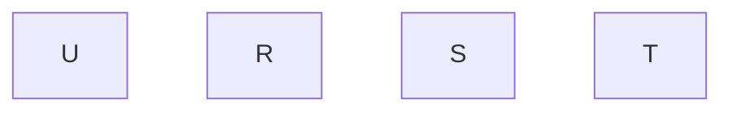

Suppose we remove in the order $R \to S \to T \to U$ like we did [above](#making-hypergraphs-acyclic).

Start with $R$, whose parent is $U$. Remove $R$ from the hypergraph, but connect $R$ to $U$ in the predicate graph:

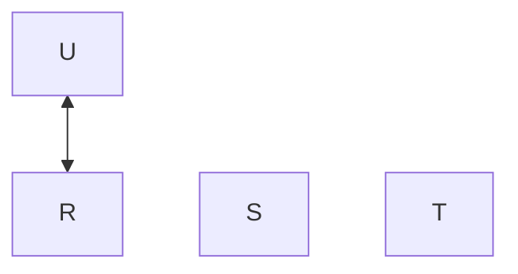

Pick $S$, whose parent is $U$. Remove $S$ from the hypergraph, but connect $S$ to $U$ in the predicate graph:

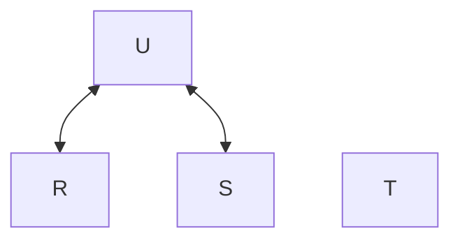

Pick $T$, whose parent is $T$. Remove $T$ from the hypergraph, but connect $T$ to $U$ in the predicate graph:

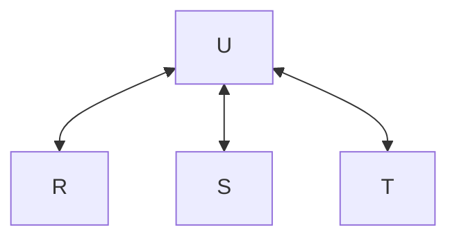

Finally, pick $U$. It has no parent. We remove it anyway. Nothing to update in the predicate graph.

The above predicate graph is an acyclic join tree that can then be used for Yannakakis algorithm!

## Indices

### Recap & Motivation

For the last few lectures, we've been focusing on the **join** operation because:

1. It's *useful*. It's needed to reconcile data back from multiple relations, which you recall are *decomposed* in the first place to reduce *redundancy* (see: Lecture 7).
2. It's *expensive*. If not handled carefully, joins can result in quadratic explosion of rows processed.

Also recall that we have two main types of workload in databases:

- **OLAP**: online **analytical** processing.
- **OLTP**: online **transactional** processing.

Optimizing joins is very important for analytical queries, which are likely to touch a large portion of if not all our data. Now we're interested in optimizing queries other than joins. Consider this much simpler query, which is representative of a very common pattern in transactional queries (just selecting some tuples, or more likely, *the* tuple that matches some predicate):

```sql
SELECT * FROM R
WHERE R.id = 12345;
```

| id  | content | ... |
| --- | ------- | --- |
| 1   | ...     | ... |
| 2   | ...     | ... |
| 3   | ...     | ... |
| 4   | ...     | ... |
| 5   | ...     | ... |
| ... | ...     | ... |

How do we optimize this query?

### Why Not Hashing? Disk Review

Ordinarily, finding the tuple that matches the predicate would take a linear scan, $O(N)$ time. However, we know from our basic data structures knowledge that if we need to do repeated scans like this, we can just pre-process with a hashmap once to enable $O(1)$ lookup later.

$$H_R: id \mapsto (id, content, ...)$$

However, recall that data is stored on **disk**. Thus, using hashmaps the way we do in software programming is not actually a good idea. Why? As a continuation from the videos about disk we saw in Lecture 9, this is a nice resource to get a feel for how *slow* operations can get relative to the CPU: [Latency Numbers Every Programmer Should Know](https://gist.github.com/jboner/2841832).

Notice that a disk seek can take around 10 ms. That's *orders of magnitude* slower than cache or memory access. Recall that this is due to the very *physical* nature of the disk. The arm/read head needs to move such that the correct bit is in position. This latency in **seek time** makes disk access so much slower than the world of CPU logic gates and even main memory access.

The main insight is: if you have to sit through all that time to get the arm in position, you're better off reading a bunch of data in one go (the data next to the originally requested data). Accessing the surrounding data is much faster because you only need to rotate the platter once the head is in position, which is much faster than moving the arm. This is exactly what disk reads do. This is why **sequential access** is much more performant than **random access**.

**ASIDE:** Sequential access is also advantageous in *memory* access. As you recall from CS 33/111/M151B/etc., when you read memory, you bring data next to the requested data (data belonging to the same **cache line**) up into cache. This is why sequential access exhibits great **spatial locality** as compared to random access. Although the physics are different, the underlying principle is the same as with disk: individual reads from somewhere lower in the cache hierarchy is *slow*, so we make the most of them by bringing up "bursts" of data each time.

Recall that hashing in general maps values of its domain to seemingly random (ideally evenly distributed) values. If we use those hash values as means for addressing reads/writes on disk, it would result in a lot of random access, which would incur a lot of seek time latency.

### Introduction to B+ Trees

How do databases get around this? They organize records in a data structure called a [**B+ Tree**](https://en.wikipedia.org/wiki/B%2B_tree).

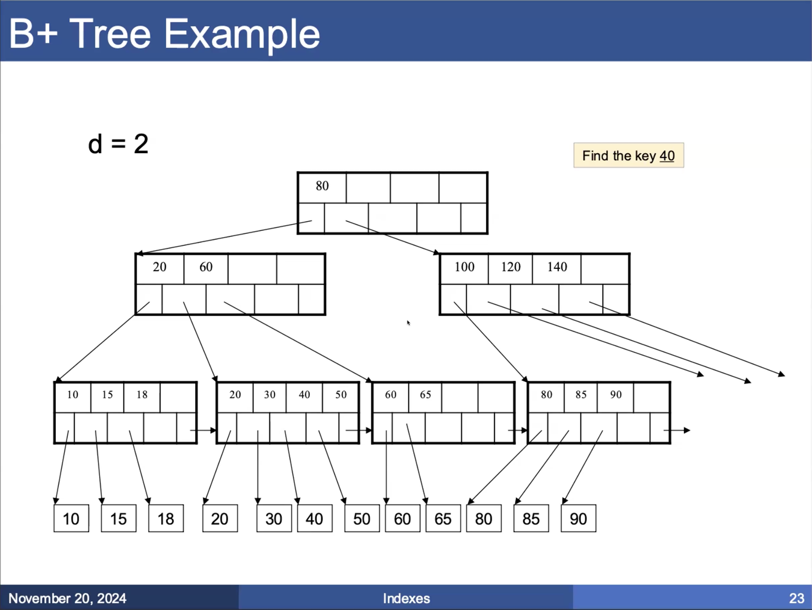

Actual keys from the relation (e.g. `id` values) are stored in the last level (leaf nodes) of the B+ tree. The leaf nodes also store pointers to the actual *data* (records) associated with the keys. The internal nodes form a hierarchical structure of pointers that direct *ranges* of key values down the correct sub-trees and ultimately to the correct leaf nodes.

The process of finding a key is very similar in principle to searching **binary search trees (BSTs)** in that we recursively make comparisons on the search value to determine which pointer to follow. Suppose we're interesting in some key value $k$. At each internal node, we find the pointer that corresponds to some `[inclusive, exclusive)` range that includes our key value $k$ and follow that pointer to the next node. We then repeat until the leaf node, at which point the key's pointer points to the actual record we want to retrieve.

> [!WARNING]
>
> Remember that ranges represented by each internal node pointer are `[inclusive, exclusive)`. This is a common pitfall when hand-tracing B+ tree examples.

<!-- We typically align the B+-tree node sizes with the size of data we can read at once (so typically a **page**)? -->

Another important characteristic of a B+ tree (and what further sets it apart from BSTs) is that all nodes of the last level are connected as a linked list. This enables **range queries** e.g. "find the keys between 40 and 62". We can traverse down the tree to first find the lower bound, and then instead of walking the full tree for other keys in the range, we can just traverse the leaf node pointers horizontally until we reach the upper bound:

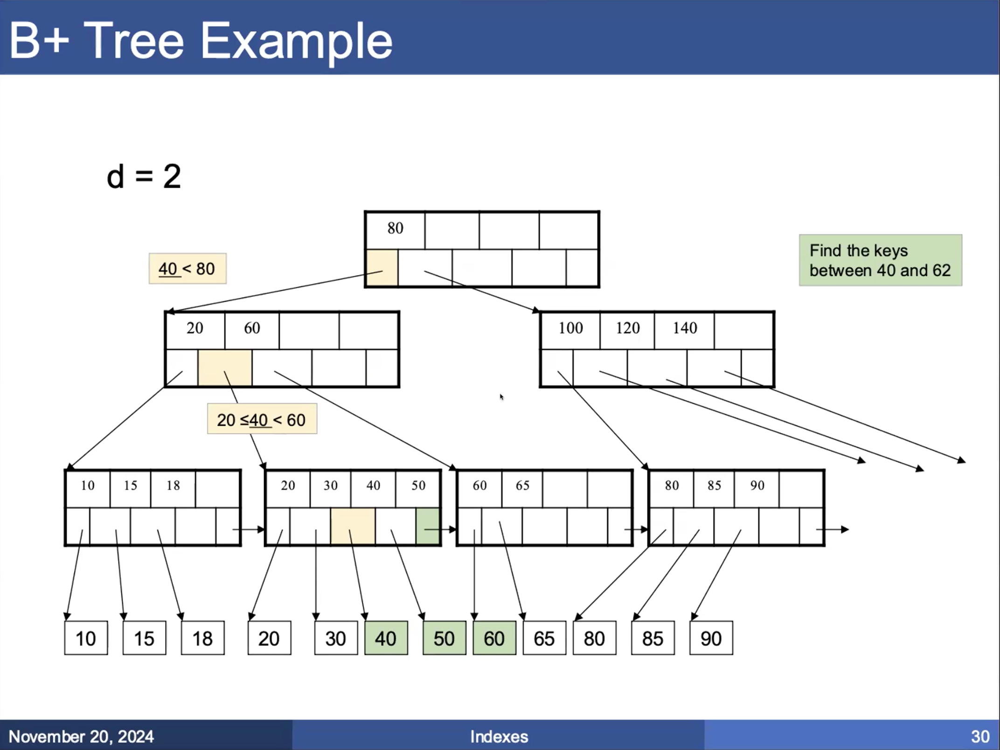

This was a brief introduction to B+ trees. We'll also look at insertion and deletion operations later.
