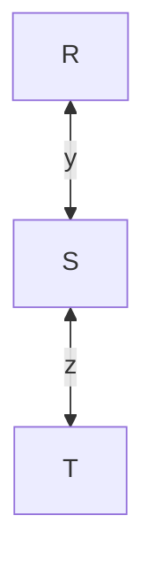
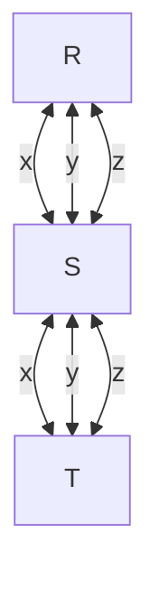
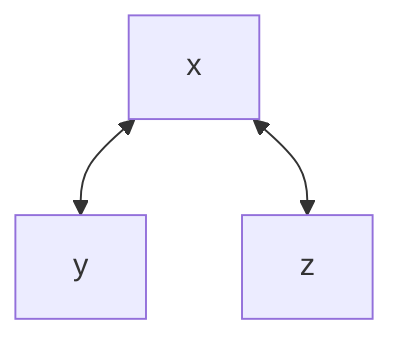
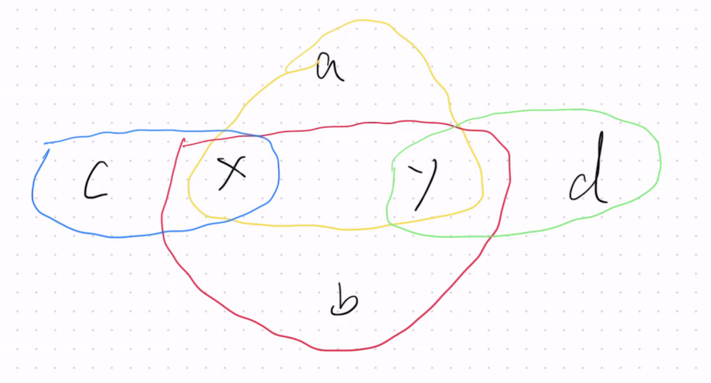
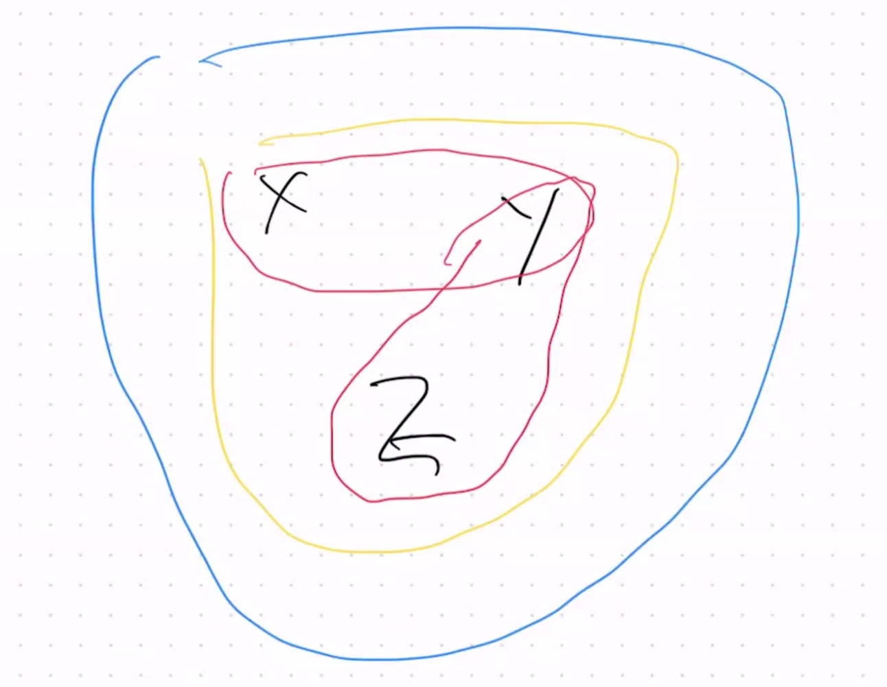
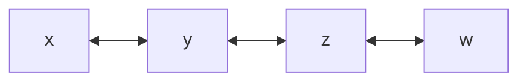

# 2025-05-22/Lecture 16: B+ Trees Continued

## Lecture Quiz

### Question 1

> Consider the natural join of R(x, y), S(y, z, w), T(z, w, i), U(z, w, j).
>
> In the hypergraph for the join, which relations are ears? Choose all that apply.
>
> - [ ] R
> - [ ] S
> - [ ] U
> - [ ] None of the above

Expand for answer.

CORRECT: **R, S, U**

$\text{keyattr}_Q(R) = \lbrace y \rbrace \subseteq S$. Thus, $R$ is an ear.

There is no other relation that contains all of $\text{keyattr}_Q(S) = \lbrace y, z, w \rbrace$. Thus, $S$ is not an ear.

$\text{keyattr}_Q(T) = \lbrace z, w \rbrace \subseteq S, U$ both. Thus, $T$ is an ear.

$\text{keyattr}_Q(U) = \lbrace z, w \rbrace \subseteq S, T$ both. Thus, $U$ is an ear.

### Question 2

> For the same query above, which relations can be a parent of T? Choose all that apply.
>
> - [ ] R
> - [ ] S
> - [ ] U
> - [ ] None of the above

Expand for answer.

CORRECT: **S, U**

From the explanation for [Question 1](#question-1), we see that because the key attributes of $T$ are a subset of both $S$ and $U$, the possible parents of $T$ are $S$ and $U$.

### Question 3

> For the same query above, what are the key attributes of S? Choose all that apply.
>
> - [ ] z
> - [ ] y
> - [ ] w
> - [ ] None of the above

Expand for answer.

CORRECT: **z, y, w**

$z \in S$ is shared with $T$ and $U$. $y \in S$ is shared with $R$. $w \in S$ is shared with $T$ and $U$. Thus:

$$\text{keyattr}_Q(S) = \lbrace z, y, w \rbrace$$

### Question 4

> Consider the following natural join queries:
>
> Q1: R(x, y, z) ⋈ S(x, a) ⋈ T (y, b) ⋈ U (z, c)
> Q2: R(x, y) ⋈ S(y, z) ⋈ T(z, w)
> Q3: R(x, y, z) ⋈ S(x, y, z) ⋈ T(x, y, z)
>
> Which of the queries are acyclic? Choose all that apply.
>
> - [ ] Q1
> - [ ] Q2
> - [ ] Q3
> - [ ] None of the above

Expand for answer.

CORRECT: **Q1, Q2, Q3**

$Q_1$: This graph is [isomorphic](https://en.wikipedia.org/wiki/Graph_isomorphism) to the first hypergraph we considered last lecture. We already know such a hypergraph is acyclic. We can remove ears in an example order of $U \to R \to T \to S$.

This kind of hypergraph shape actually has a special name: it's a **star query**. You can think of $S$ as a huge table that corresponds to all the "objects" in your database, also known as the **fact table**. The other tables $S, T, U$ are **dimension tables**. For example, a fact table might consolidate "student" objects, and the other dimension tables are interested in only a particular attribute of each student and relate that to possibly other attributes.

$Q_2$: If you work through GYO reduction, you get the predicate graph:

This kind of hypergraph also has a name: it's known as a **chain schema**. Such a pattern is studied extensively in research, but probably not that practical in real world settings.

$Q_3$: The hypergraph is simply 3 circles around all of $x, y, z$. This is kind of a degenerate case. For all of $R, S, T$, their key attributes are the entire set of attributes $\lbrace x, y, z \rbrace$, which is also equal to the set of their own attributes. For this reason, every hyperedge is an ear, with any other hyperedge as a parent. This relationship continues to hold as you go through GYO reduction. You'll ultimately get the predicate graph:

This also has a name: a **clique query**.

All of $Q_1, Q_2, Q_3$ are acyclic.

### Question 5

> Which of the following statements are true? Choose all that apply.
>
> - [ ] An acyclic hypergraph remains acyclic after adding any hyperedges
> - [ ] An acyclic hypergraph remains acyclic after removing any hyperedges
> - [ ] An ear remains an ear after any other ears are removed
> - [ ] A non-ear remains a non-ear after other ears are removed
> - [ ] None of the above

Expand for answer.

CORRECT: **None of the above**

> An acyclic hypergraph remains acyclic after adding any hyperedges

Consider the hypergraph:

Adding `y<-->z` makes it cyclic. Thus, this statement is false.

> An acyclic hypergraph remains acyclic after removing any hyperedges

Consider the technique described last lecture where we *made* a cyclic hypergraph acyclic by adding one giant relation that covers all attributes of the other relations. If we go *backwards* (i.e. *remove* that giant hyperedge), we go from having an acyclic hypergraph back to a cyclic one. Thus, this statement is false.

> An ear remains an ear after any other ears are removed

Consider this hypergraph:

All of $(y, d), (c, x), (x, y, b), and (a, x, y)$ are ears. If we remove $(x, y, b)$, then $(a, x, y)$ is no longer an ear because we removed its parent.

Thus, we removing an ear can actually make other hyperedges *stop* being an ear. Namely, when the ear we remove happens to be the only **parent** of another hyperedge.

We can see this with a simpler example too (as provided by one of the students in lecture):

The blue and yellow hyperedges are both ears *because* of each other (the fact that they contain all attributes means they must be supersets of the other relation's key attributes). It follows that they are also each other's parent. However, if we remove one (e.g. the blue hyperedge), the other hyperedge is no longer an ear because their parent is now gone.

> A non-ear remains a non-ear after other ears are removed

In general, we've seen in previous examples that we can start with a hypergraph where not everyone is an ear to start with, yet we're able to reduce the hypergraph to an empty hypergraph anyway. That must mean that in the process, non-ears can *become* ears at some point. The statement is false.

You can also consider a concrete example. Take this chain query for example:

$(y, z)$ starts as a non-ear, but after removing the ear $(z, w)$, it turns $(y, z)$ *into* an ear.

## TODO

TODO: notes for this lecture coming soon.
