# 2025-05-22/Lecture 16: B+ Trees Continued

> [!NOTE]
>
> Some of the content regarding B+ tree [insertion](#inserting-into-a-b-tree) and [deletion](#deleting-from-a-b-tree) was clarified in **2025-05-27/Lecture 17**, but I just included/updated the existing notes here for those topics.

## Lecture Quiz

### Question 1

> Consider the natural join of R(x, y), S(y, z, w), T(z, w, i), U(z, w, j).
>
> In the hypergraph for the join, which relations are ears? Choose all that apply.
>
> - [ ] R
> - [ ] S
> - [ ] U
> - [ ] None of the above

<details>
<summary>Expand for answer.</summary>

CORRECT: **R, S, U**

$\text{keyattr}_Q(R) = \lbrace y \rbrace \subseteq S$. Thus, $R$ is an ear.

There is no other relation that contains all of $\text{keyattr}_Q(S) = \lbrace y, z, w \rbrace$. Thus, $S$ is not an ear.

$\text{keyattr}_Q(T) = \lbrace z, w \rbrace \subseteq S, U$ both. Thus, $T$ is an ear.

$\text{keyattr}_Q(U) = \lbrace z, w \rbrace \subseteq S, T$ both. Thus, $U$ is an ear.

</details>

### Question 2

> For the same query above, which relations can be a parent of T? Choose all that apply.
>
> - [ ] R
> - [ ] S
> - [ ] U
> - [ ] None of the above

<details>
<summary>Expand for answer.</summary>

CORRECT: **S, U**

From the explanation for [Question 1](#question-1), we see that because the key attributes of $T$ are a subset of both $S$ and $U$, the possible parents of $T$ are $S$ and $U$.

</details>

### Question 3

> For the same query above, what are the key attributes of S? Choose all that apply.
>
> - [ ] z
> - [ ] y
> - [ ] w
> - [ ] None of the above

<details>
<summary>Expand for answer.</summary>

CORRECT: **z, y, w**

$z \in S$ is shared with $T$ and $U$. $y \in S$ is shared with $R$. $w \in S$ is shared with $T$ and $U$. Thus:

$$\text{keyattr}_Q(S) = \lbrace z, y, w \rbrace$$

</details>

### Question 4

> Consider the following natural join queries:
>
> Q1: R(x, y, z) ⋈ S(x, a) ⋈ T (y, b) ⋈ U (z, c)
> Q2: R(x, y) ⋈ S(y, z) ⋈ T(z, w)
> Q3: R(x, y, z) ⋈ S(x, y, z) ⋈ T(x, y, z)
>
> Which of the queries are acyclic? Choose all that apply.
>
> - [ ] Q1
> - [ ] Q2
> - [ ] Q3
> - [ ] None of the above

<details>
<summary>Expand for answer.</summary>

CORRECT: **Q1, Q2, Q3**

$Q_1$: This graph is [isomorphic](https://en.wikipedia.org/wiki/Graph_isomorphism) to the first hypergraph we considered last lecture. We already know such a hypergraph is acyclic. We can remove ears in an example order of $U \to R \to T \to S$.

This kind of hypergraph shape actually has a special name: it's a **star query**. You can think of $S$ as a huge table that corresponds to all the "objects" in your database, also known as the **fact table**. The other tables $S, T, U$ are **dimension tables**. For example, a fact table might consolidate "student" objects, and the other dimension tables are interested in only a particular attribute of each student and relate that to possibly other attributes.

$Q_2$: If you work through GYO reduction, you get the predicate graph:

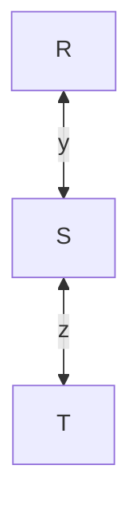

This kind of hypergraph also has a name: it's known as a **chain schema**. Such a pattern is studied extensively in research, but probably not that practical in real world settings.

$Q_3$: The hypergraph is simply 3 circles around all of $x, y, z$. This is kind of a degenerate case. For all of $R, S, T$, their key attributes are the entire set of attributes $\lbrace x, y, z \rbrace$, which is also equal to the set of their own attributes. For this reason, every hyperedge is an ear, with any other hyperedge as a parent. This relationship continues to hold as you go through GYO reduction. You'll ultimately get the predicate graph:

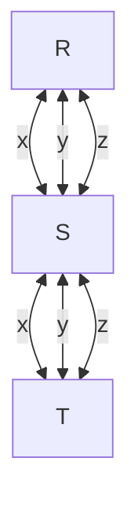

This also has a name: a **clique query**.

All of $Q_1, Q_2, Q_3$ are acyclic.

</details>

### Question 5

> Which of the following statements are true? Choose all that apply.
>
> - [ ] An acyclic hypergraph remains acyclic after adding any hyperedges
> - [ ] An acyclic hypergraph remains acyclic after removing any hyperedges
> - [ ] An ear remains an ear after any other ears are removed
> - [ ] A non-ear remains a non-ear after other ears are removed
> - [ ] None of the above

<details>
<summary>Expand for answer.</summary>

CORRECT: **None of the above**

> An acyclic hypergraph remains acyclic after adding any hyperedges

Consider the hypergraph:

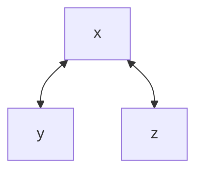

Adding `y<-->z` makes it cyclic. Thus, this statement is false.

> An acyclic hypergraph remains acyclic after removing any hyperedges

Consider the technique described last lecture where we *made* a cyclic hypergraph acyclic by adding one giant relation that covers all attributes of the other relations. If we go *backwards* (i.e. *remove* that giant hyperedge), we go from having an acyclic hypergraph back to a cyclic one. Thus, this statement is false.

> An ear remains an ear after any other ears are removed

Consider this hypergraph:


All of $(y, d), (c, x), (x, y, b), and (a, x, y)$ are ears. If we remove $(x, y, b)$, then $(a, x, y)$ is no longer an ear because we removed its parent.

Thus, we removing an ear can actually make other hyperedges *stop* being an ear. Namely, when the ear we remove happens to be the only **parent** of another hyperedge.

We can see this with a simpler example too (as provided by one of the students in lecture):


The blue and yellow hyperedges are both ears *because* of each other (the fact that they contain all attributes means they must be supersets of the other relation's key attributes). It follows that they are also each other's parent. However, if we remove one (e.g. the blue hyperedge), the other hyperedge is no longer an ear because their parent is now gone.

> A non-ear remains a non-ear after other ears are removed

In general, we've seen in previous examples that we can start with a hypergraph where not everyone is an ear to start with, yet we're able to reduce the hypergraph to an empty hypergraph anyway. That must mean that in the process, non-ears can *become* ears at some point. The statement is false.

You can also consider a concrete example. Take this chain query for example:

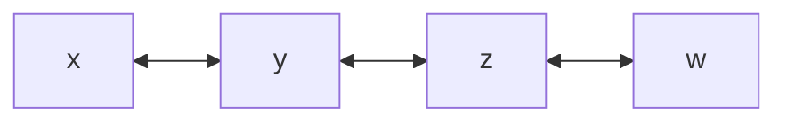

$(y, z)$ starts as a non-ear, but after removing the ear $(z, w)$, it turns $(y, z)$ *into* an ear.

</details>

## B+ Tree Node Structure

Last lecture, we introduced the **B+ tree**, which is actually an extension of the **B-tree** data structure specialized for database applications. In a B+ tree, we only store table keys in the **leaf nodes** and also connect the leaf nodes as a linked list.

> [!WARNING]
>
> From here on out, Professor may use B-tree and B+ tree interchangeably. Know that he's always referring to B+ trees unless specified otherwise.

Internal nodes store **node keys**. These values encode *ranges* of table keys that their subtrees ultimately contain at their leaves.

Leaf nodes store **table keys**. These are actual key values from database tables e.g. `student_id`.

Every node has a *fixed* length. We'll define the number of keys stored as **capacity**. In standard terminology, we also have this definition:

$$\text{degree} = \frac{\text{capacity}}{2}$$

This comes from another invariant of the B+ tree:

> [!IMPORTANT]
>
> Every B+ tree node except for the root is always at least half full.

Thus, you can think of the **degree** as at least how many entries you want to have in a node. It follows then that the capacity is just double that.

The number of *pointers* stored in **internal nodes** is the $\text{capacity} + 1$. Each pointer sits "between" an adjacent pair of keys, with pointers at the the two edges as well. Each pointer points to a subtree containing table keys in the interval $[\text{left}, \text{right})$, where $\text{left}$ is the node key on the pointer's left and $\text{right}$ is the node key on the pointer's right. The pointers on the edges simply use their respective infinity as the other bound.

Consider this example internal node with $\text{capacity} = 4$, with node keys $10, 20, 30, 40$ (B+ trees rendered using the [B-Sketcher online tool](https://projects.calebevans.me/b-sketcher/)):

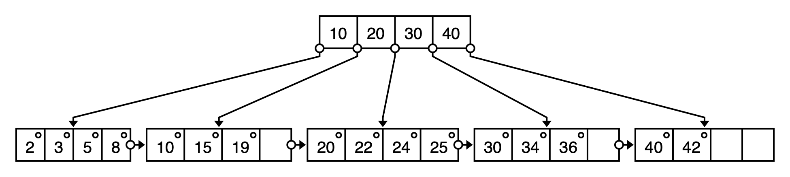

There are $4 + 1 = 5$ pointers. From left to right, they direct to subtrees with key values:

- $k < 10$
- $10 \le k < 20$
- $20 \le k < 30$
- $30 \le k < 40$
- $k \ge 40$

> [!WARNING]
>
> Remember that the intervals are **closed** on the **lower** end and **open** on the **upper** end.

**Leaf nodes** instead store a pointer per table key, namely to the actual record associated with the table key.

Other important properties:

- All keys within a B+ tree node are **sorted**.
- A B+ tree by nature is **balanced**. All leaves are always at the same level.
- All node keys occupying an internal node must have pointers on *both* sides of it (for example, we can't have something like a $20$ and a pointer to the left of it but no pointer to the right of it).
- In practice, we align the size of each node with the size of data we read from disk, which is typically in units of **pages**. Thus the capacity of each node is set such that the entire node fits in one disk page.

## Searching a B+ Tree

Searching a B+ tree is very similar in nature to searching a **binary search tree (BST)** in that we compare the queried value $k$ to the current node to decide which pointer to follow. In the case of a B+ tree internal node, we have multiple node keys to test. Because they are stored in sorted order, we can simply sweep the node keys until we reach one that is $\ge k$. We then follow the pointer that sits just before that node key (or use the last pointer if $k$ happens to be $\ge$ every node key).

For example, suppose we're searching for $k=12$ in this B+ tree:

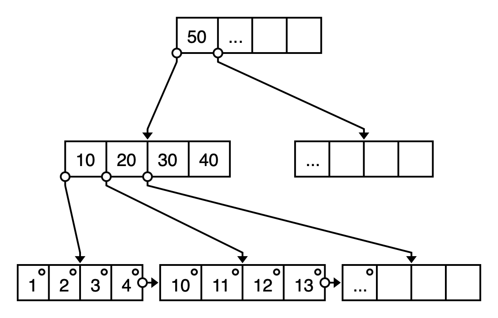

1. We start at the root node and linearly scan the node keys until we reach a node key $K$ such that $k < K$. In this case, $k = 12 < 50$, so we follow the first pointer down the tree.
2. We then linearly scan node keys again. $12 \ge 10$, so we move on. $12 < 20$, so we follow the second pointer down the tree.
3. Now we're at the last level, so we just linearly scan the table keys until we find $k$, or declare that $k$ is not in the tree if we reach the end of the node. We check $10$, $11$, and then finally $12 = k$, so we've found our table key.

Leaf nodes store pointers to the actual records associated with the table keys, so if we want to retrieve the actual data for $k = 12$, we can now do that through the pointer.

### Range Queries

Notice that the sorted nature of the keys as well as the pointers between leaf nodes make **range queries** similarly easy to implement. Suppose we're interested in all keys in the range $[3, 13]$.

1. We'll first traverse down the tree as outlined above to locate $k = 3$. Then, we simply continue the linear scan down the leaf node to collect $k = 4 \le 13$.
2. We still have leaf nodes left and have not reached our upper bound $13$ yet, so we can follow the horizontal pointer to the next leaf node and continue our linear scan. We collect $k = 10, 11, 12, 13 \le 13$. Now at this point, we can stop.
3. We've found the keys $\lbrace 3, 4, 10, 11, 12, 13 \rbrace \in [3, 13]$. If we want the data associated with those keys, we can access them through the stored pointers.

## Inserting into a B+ Tree

Insertion is a lot more involved because of the tricky invariants we need to maintain at all times in the B+ tree. Namely, every node has a *fixed* length (capacity), and parent node keys have to be kept in lock step with their children key ranges.

There are three cases we'll consider:

### CASE I: Just Insert

We traverse down the B+ tree to the correct leaf node, and if the node still has vacancy, just insert that key into the node.

Suppose we want to insert $k=14$ into this (abbreviated, note the missing pointers) B+ tree:

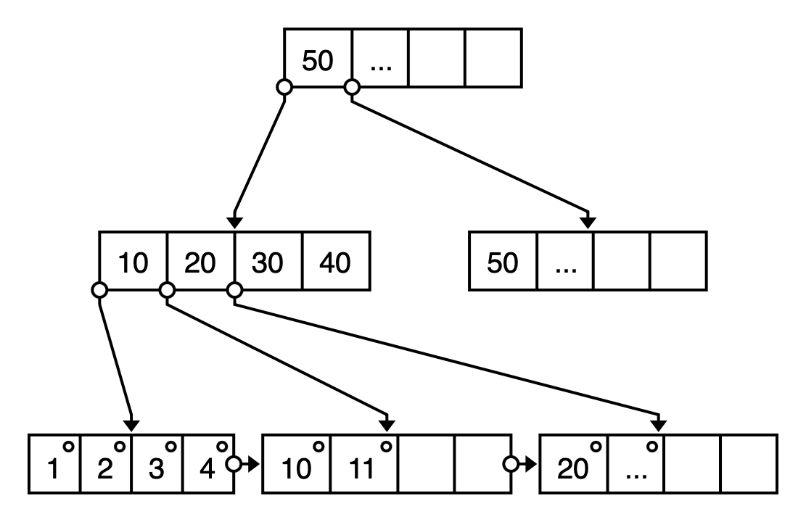

We would simply insert it right after $11$ in its leaf node:

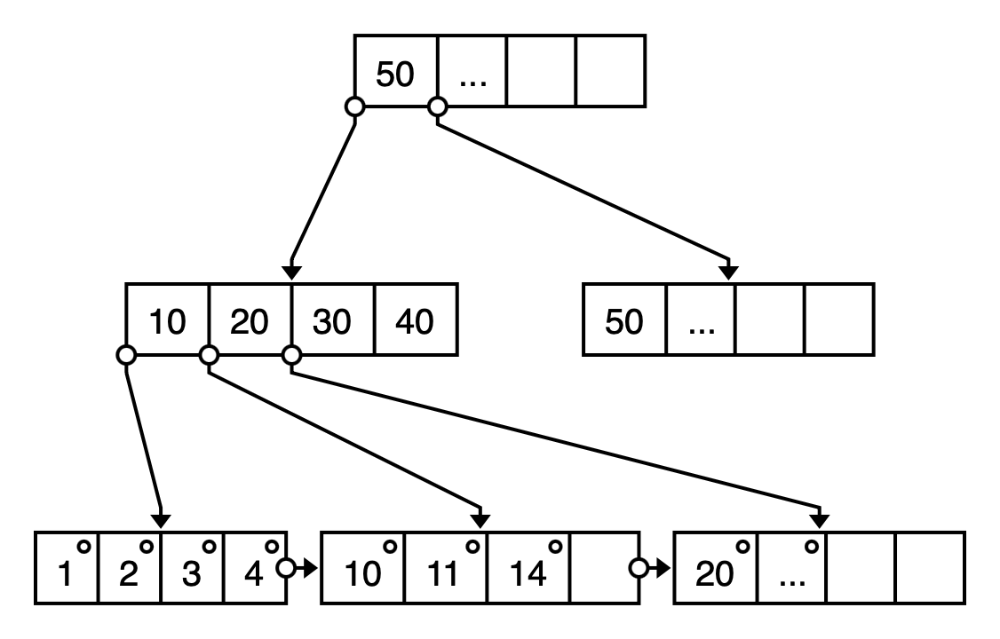

### Case II: Splitting a Leaf at Capacity

If the correct leaf node is already at capacity:

1. We first pretend to insert $k$ anyway, "overflowing" it.
2. We then *split* the leaf node into two halves. The existing leaf node just drops the greater half of its keys, keeping the lesser half. The greater half of the keys get assigned to a newly allocated leaf node (with the original node connecting to the new node to close the linked list).
3. Update the parent. Shift over its keys & pointers and insert the lower bound of the new node as the key for the new vacancy, directing a new pointer down to the new node.

Suppose we want to insert $k=16$ into this (abbreviated, note the missing pointers) B+ tree:


First we pretend like we inserted $16$ right after $15$ in its node:


We then split the node into halves and connect them:


Pretend that the `|-->|` in the middle of the leaf node represents a splitting into two leaf nodes and a pointer connecting them. I can't draw them as separate nodes or the online tool will automatically connect parent pointers, which we haven't gotten to yet.

We now need to update the parent because we have a new node with table keys $(14, 15, 16)$ that needs a pointer down to it. Namely, the parent should have a pointer just after a new node key of $14$, since the new node contains values $\ge 14$. We can fix this by copying that lower bound $14$ and inserting it into the parent:


Or more generally:

> [!IMPORTANT]
>
> When splitting a **leaf node**, copy the leftmost key of the new node and insert it into the parent.

### Case III: Splitting a Leaf at Capacity with Parent at Capacity

Note that this is really just a generalization of [**Case II**](#case-ii-splitting-a-leaf-at-capacity).

Now what happens if we follow [**Case II**](#case-ii-splitting-a-leaf-at-capacity) but then the *parent* is also at capacity? We treat it like an insertion on the parent node, which we will then recursively split to resolve overflows. However, when splitting an **internal node**, we follow a slightly different algorithm:

> [!IMPORTANT]
>
> When splitting an **internal node**, *don't* copy any keys; instead, *promote* the midpoint into its parent.
>
> Note that this process is recursive: if the internal node's parent is also at capacity, we repeat. If this reaches the root node, we can ultimately *create a new root* for the promoted value.

Suppose we want to insert $k=16$ into this (abbreviated, note the missing pointers) B+ tree:

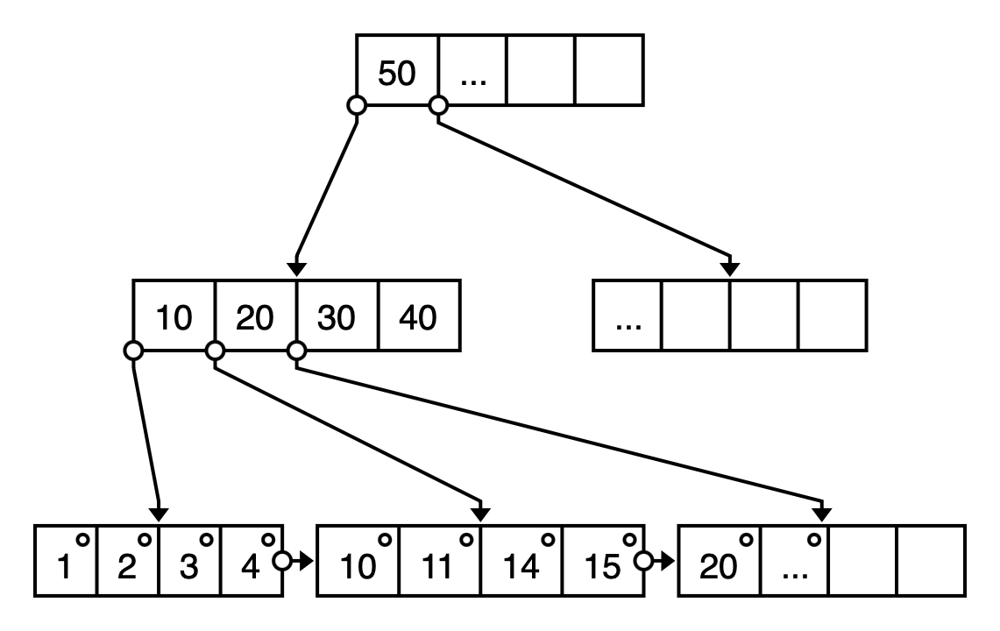

First we pretend to insert $k=16$ anyway, then split the node, then copy $14$ up into the parent like we did [before](#case-ii-splitting-a-leaf-at-capacity):

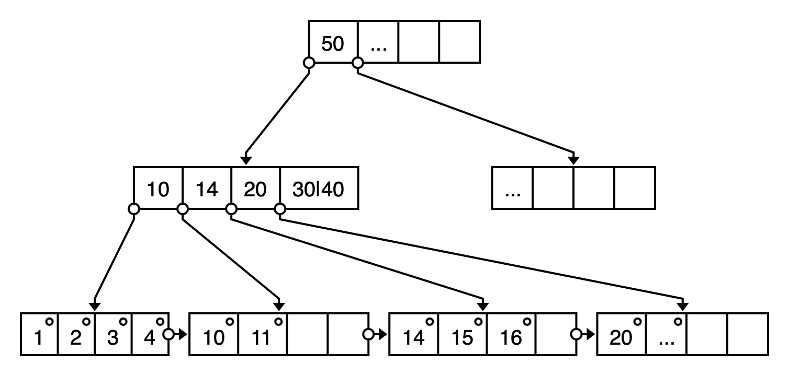

The parent node is currently overflowing, so we need to split it as well. This time, we'll split it into *three* parts: a lesser half, the midpoint key, and the greater half. We keep the two halves around (which become siblings) and promote the midpoint ($20$ in this case) up into the grandparent:

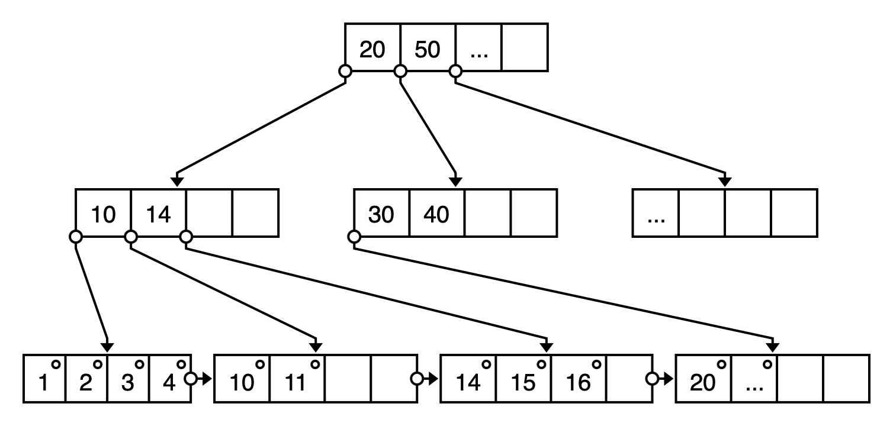

Convince yourself this B+ tree still upholds its invariants. All nodes are at least half capacity, and all pointers point to subtrees with keys in their ranges.

### ASIDE: Why Promote Instead of Copy When Splitting Internal Nodes

If you're curious about why we need to promote instead of copy, see the discussion on Ed #107. Basically, when we just split internal nodes without moving up one of its keys, it leaves the tree in an invalid state. Consider this example where we need to insert a new leaf node lower bound of $14$ into a parent node of $(10, 20, 30, 40)$. Suppose we just split the internal node into $(10, 14)$ and $(20, 30, 40)$:

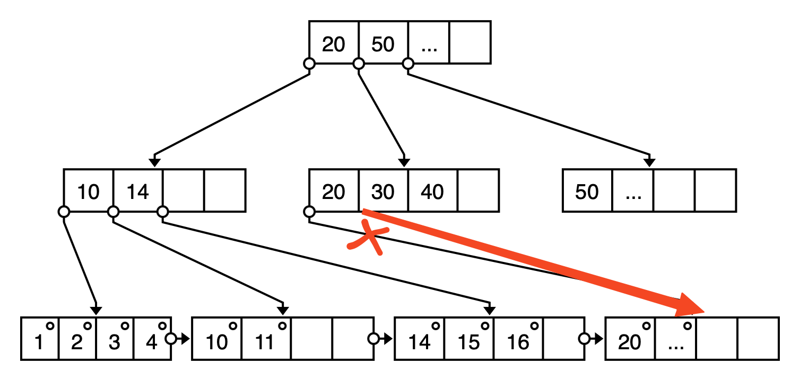

Notice how there's no way to arrange our pointers such that they make sense. If we connect the node to the left of $20$ (the edge with an X on it) to the $(20, ...)$ leaf node, it would be invalid because such a pointer needs keys $< 20$, and $20 \ge 20$. If we instead use the pointer to the right of $20$ (the red edge), the pointer itself would be correct, but then our internal node would be missing a pointer on its left edge. [Recall](#b-tree-node-structure) that node keys must have pointers on *both* sides of them.

This is caused by the fact that we've introduced one "extra" pointer in the internal node layer. Splitting up the node exposes an "edge" on the key that ends up as the leftmost key in the new node, and that edge requires a new pointer. To fix this, we need to instead send that conflicting key somewhere else. Where? We can just send it *upwards*. Hence, we get the algorithm described earlier.

## Deleting from a B+ Tree

Deletion is similarly involved because of the aforementioned invariants but also the one where every node needs to be at least half full at all times.

We'll consider three cases:

### Case I: Just Delete

If deleting an entry would *not* cause a node to go below half its capacity, just delete it, and you're done.

For example, we can simply delete $k=16$ from its node here:

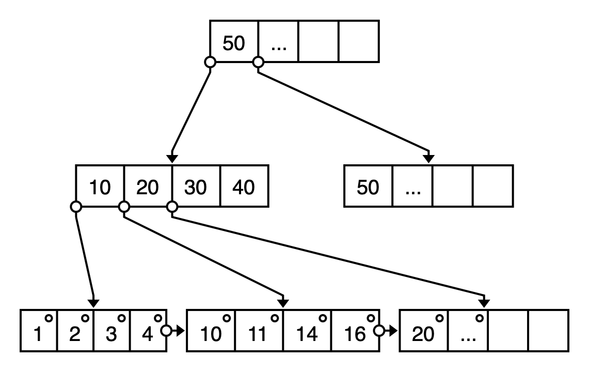

### Case II: Steal from Sibling

If deleting *would* cause the node to fall below the capacity invariant, you "steal" from an adjacent sibling.

For example, suppose we delete $k=22$ from this B+ tree:

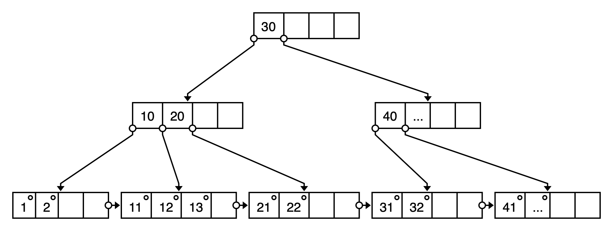

The node would fall below half capacity, so we can "steal" $13$ from its left sibling:


But that also means we need to update the parent because the parent's node key needs to reflect the child's new lower bound. Similarly to [insertion](#case-ii-splitting-a-leaf-at-capacity), we copy the new lower bound of the leaf node into the parent. However, instead of *inserting* that key, we *overwrite* the key that was already at that position (since we didn't create any new leaf nodes, just updated the current one):

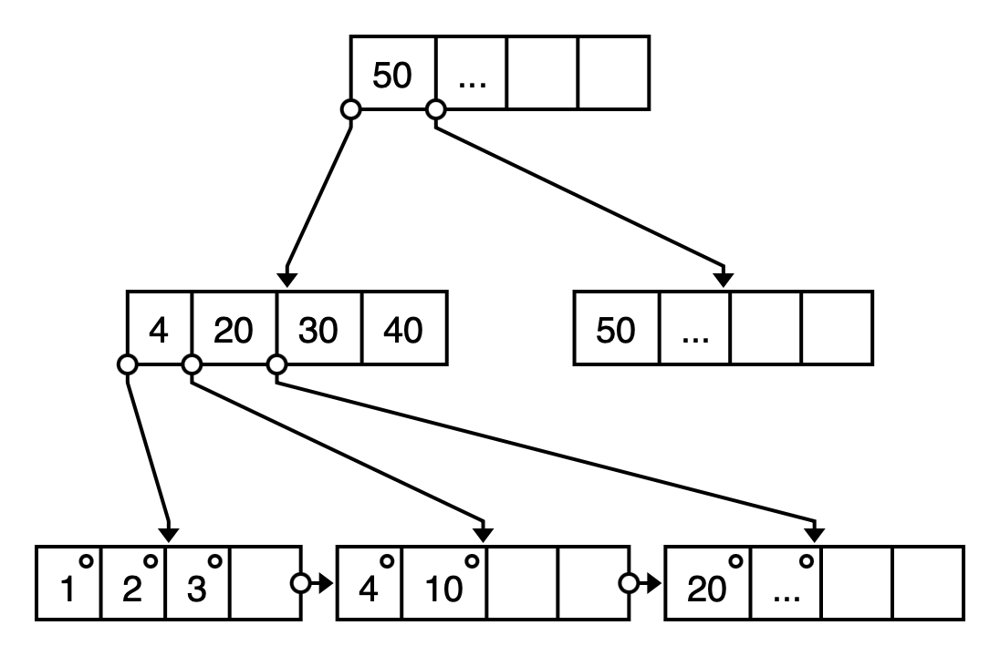

### ASIDE: Steal from Your Siblings, Not Cousins

> [!WARNING]
>
> Note that we use the term **sibling** instead of **neighbor**. Two nodes are **siblings** if they share the same **parent**. Two neighboring nodes are not necessarily siblings. They could be **cousins** instead.

Why? Suppose we steal from a cousin instead. Starting with this B+ tree, we remove $k=22$:

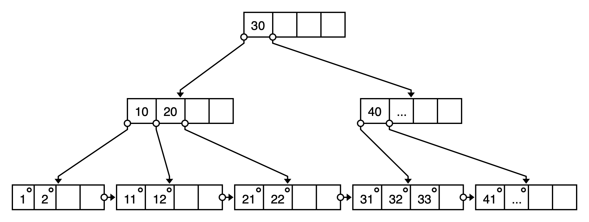

Suppose we reach across to the cousin on the right, stealing $31$:

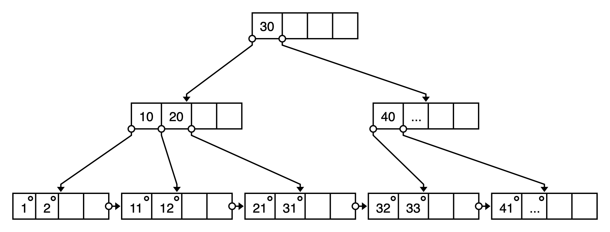

See a problem? Look up&mdash;even higher than the parents. The *root* has been invalidated (31 appears to the left of 30 now!). More generally, it will invalidate the cousins' [**lowest common ancestor**](https://en.wikipedia.org/wiki/Lowest_common_ancestor). Thus, stealing from a cousin is incorrect. Only steal from your siblings.

### Case III: Both Siblings Are Also Broke

What if both of your adjacent siblings would also fall below capacity if we steal from them? For insertion, the recursive chain reaction can be done in $\log(N)$ steps because it goes upwards into parent levels. If we were to chain react *horizontally* (among leaf nodes), it could take $\frac{N}{2} \in O(N)$ steps. This is no bueno. Instead, we can borrow the same principle from insertion, but in reverse this time. Like how we split in insertion, we can analogously *merge* nodes together:

1. Delete the key.
2. Then merge the leaf node with its neighbor.
3. Update parent.

Note that this case is only taken if the nodes involved are already at half capacity, so merging the nodes is always valid (it won't cause the newly merged node to overflow; the invariants are maintained).

For example, suppose we want to remove $k=21$ from this B+ tree:

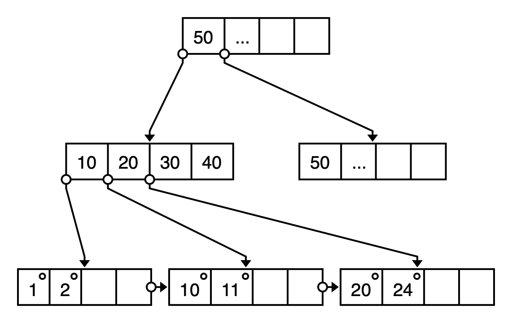

We can't steal from either sibling because they're already at half capacity. Let's first delete $21$ anyway. Then, *merge* the node with its left sibling:

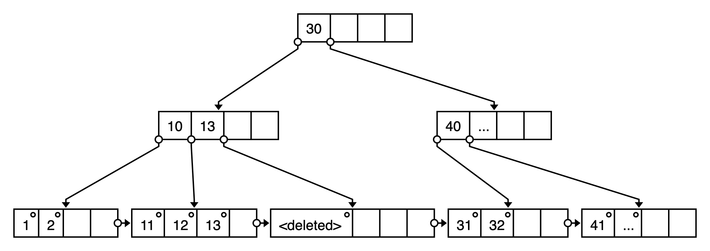

Notice that the parent's node key is now outdated&mdash;the node key $13$ implies that all table keys below the leftmost pointer are $< 13$, but that's no longer true because we now have table key $13$ from the merge. The pointer to the right of the node key is now also missing/dangling. We fix the parent by just deleting that node key as well:

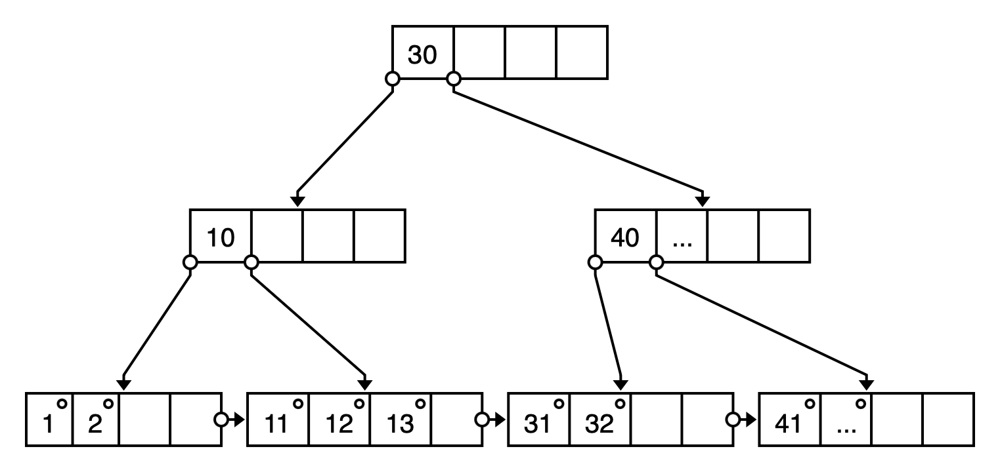

If the parent did not fall below half capacity, we would be done here. However, in this example, the parent node is now in an invalid state because it fell below half capacity. Similar to insertion, the solution is to repeat a similar process for internal nodes as well. That is, see if the internal node can *steal* a value to get back to half capacity. However, the rules are slightly different for them:

> [!IMPORTANT]
>
> Leaf nodes steal from adjacent **siblings**. Internal nodes steal from **parents**.

The stealing from the parent is actually a **rotation**: keys move in a circular fashion within the local family (node, parent, sibling):

1. Steal the leftmost value of the parent.
2. Promote the leftmost value of the right sibling up into the parent to replace that stolen value.
3. Move the pointer over from the right sibling.

Before:

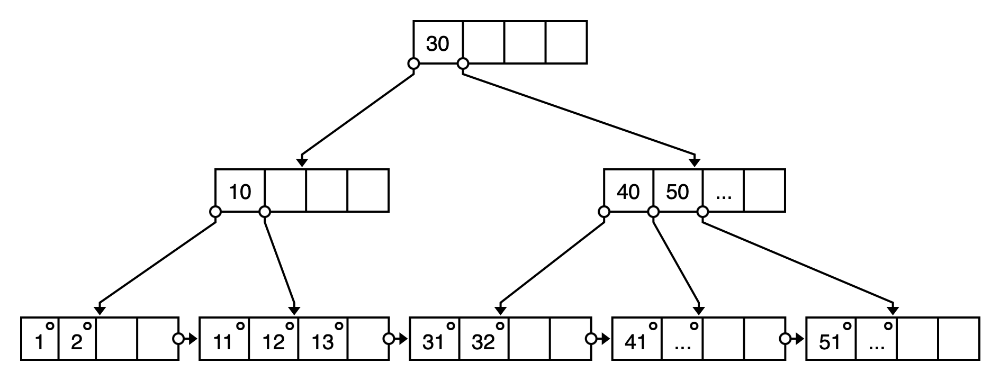

After:

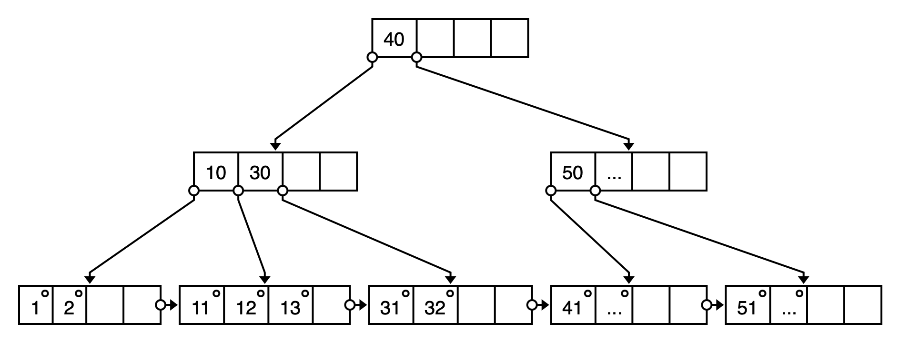

Once again, convince yourself that this is still a valid B+ tree.

Finally, if the sibling cannot afford to lose a key for the rotation, the internal nodes themselves need to merge. We didn't explicitly cover this case in lecture, but I encourage you to [try it out online](#online-tools-for-b-tree-visualization). It's a little tricky&mdash;analogous to how we need to promote a value to the parent when splitting internal nodes, we demote a value from the parent when merging internal nodes, which *could* ultimately *remove* (replace) the original root node.

### ASIDE: How Do B+ Trees Stay Balanced Despite Insertions/Deletions?

From Ed: How do we ensure the tree is balanced even throughout insertions and deletions?

In short: The splitting and merging themselves are always done *horizontally*. The higher levels might need to split/merge themselves, but that's fine because they also do so within their level. Even if a new root node is created/deleted, the existing nodes still remain on the same level relative to each other.

## Online Tools for B+ Tree Visualization

> [!TIP]
>
> Me manually drawing and pasting the B+ trees above is a bit clunky and may not make the process completely clear. If you want a more interactive resource to visualize B+ tree optimizations, definitely check out the online tools I list here.

From my post on Ed:

This online tool is great for B+ tree visualization: https://www.cs.usfca.edu/~galles/visualization/BPlusTree.html

One caveat is that it uses the term **degree** differently from how it's usually defined. In the tool, I believe they use it to refer to the number of internal node pointers (so select **5** if you want node capacity of **4** like used in the lecture examples).

Other than that, it seems to **search**, **insert**, and **delete** as consistent with what we taught. You can also use the controls to pause and step forward/backwards through the animations. You can also play around with other cases we didn't explicitly cover in lecture, like:

- What does it look like when we search for a value that doesn't exist in the tree?
- What if we insert duplicate values? What if we search for/delete a value with duplicates?
- What if the insertion splitting recurses up to the top? How is a new root node created?
- What if deletion causes the *parent* to fall below half capacity? You can infer what will happen based on how we handle insertion (hint: recursion).

This tool has much a much smoother interface and animations and also lets you visualize **range queries**: https://bplustree.app

However, this tool does not merge deletions (to respect the invariant of internal nodes being at least half full), so be wary of that.

This tool lets you draw B+ trees from a text format: https://projects.calebevans.me/b-sketcher/

This lets you draw the nodes the way you want from the get-go instead of tediously sitting through insertions (note that it's on *you* to draw one that respects the invariants though). It also has convenient support for exporting/copying the rendered B+ tree, so it's great for generating and pasting B+ trees into your notes (it's what I used in my notes as well).

## Indices in SQLs

How do we add an index in SQL?

From https://www.sqlitetutorial.net/sqlite-index/:

```sql
CREATE INDEX index_name
ON table_name(column_list);
```

There are two types of indices:

- **Clustered** indices: in addition to creating the index, the records themselves are also stored contiguously in memory.
- **Unclustered** indices: the records might not be in contiguous in record.

To be continued.
